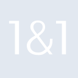

# 1and1

[← Back to main README](../../README.md)

<table><tr>
  <td></td>
  <td></td>
  <td></td>
</tr></table>

## 16 px

### black
```
https://georgegach.github.io/compatible-icons/simple-icons/compat/1and1/16/black.png
```

### slate
```
https://georgegach.github.io/compatible-icons/simple-icons/compat/1and1/16/slate.png
```

### white
```
https://georgegach.github.io/compatible-icons/simple-icons/compat/1and1/16/white.png
```

## 64 px

### black
```
https://georgegach.github.io/compatible-icons/simple-icons/compat/1and1/64/black.png
```

### slate
```
https://georgegach.github.io/compatible-icons/simple-icons/compat/1and1/64/slate.png
```

### white
```
https://georgegach.github.io/compatible-icons/simple-icons/compat/1and1/64/white.png
```

## 128 px

### black
```
https://georgegach.github.io/compatible-icons/simple-icons/compat/1and1/128/black.png
```

### slate
```
https://georgegach.github.io/compatible-icons/simple-icons/compat/1and1/128/slate.png
```

### white
```
https://georgegach.github.io/compatible-icons/simple-icons/compat/1and1/128/white.png
```

## 512 px

### black
```
https://georgegach.github.io/compatible-icons/simple-icons/compat/1and1/512/black.png
```

### slate
```
https://georgegach.github.io/compatible-icons/simple-icons/compat/1and1/512/slate.png
```

### white
```
https://georgegach.github.io/compatible-icons/simple-icons/compat/1and1/512/white.png
```

## 1024 px

### black
```
https://georgegach.github.io/compatible-icons/simple-icons/compat/1and1/1024/black.png
```

### slate
```
https://georgegach.github.io/compatible-icons/simple-icons/compat/1and1/1024/slate.png
```

### white
```
https://georgegach.github.io/compatible-icons/simple-icons/compat/1and1/1024/white.png
```

## 16 px in base64

### black
```
data:image/png;base64,iVBORw0KGgoAAAANSUhEUgAAABAAAAAQCAYAAAAf8/9hAAAABmJLR0QA/wD/AP+gvaeTAAAA9ElEQVQ4jcXTzypFURQG8N+5XFwDEmFgZOYRDDyHjBgYm5jekZESHsITmEqZilJMDIyEIkRE9ySOwVlyHOqWo6xarT977W9/e629E2QqSK3K5j8B6Az7Egrd6Aj/ET2oR9zCGxI0igzOsYR5XEXuAOtYxWUht4jNIosMT7jGBC7wjBncYAdHUXePXSxHnH0w6EVaAG1gLk7cwmDk+4P+tx6UJcUAprGNIZxitFz40xRqOMEG9rGGVzTDtgWo4xCzQX0h/Cn5VdsCpJjECvZwHLlx+Qi/SOLzKd/Juz6MPpzhFl0YwUOstULHygC/kv//C5UB3gGOejbtxohH3QAAAABJRU5ErkJggg==
```

### slate
```
data:image/png;base64,iVBORw0KGgoAAAANSUhEUgAAABAAAAAQCAYAAAAf8/9hAAAABmJLR0QA/wD/AP+gvaeTAAABLUlEQVQ4jcWTuy4EUBCGv3/WbRVEVpZCpfUCFJ5DuVvoJBpKldbtITyBVjwByYZKoXIpVhBCYTcb8yvWJbtbSKzE30zy55xvzpyZ0VX9yfSh6OfynwAGAJBbmFbb0jBQABC8WB7BGgSwaUhOkIDi9wusG1ubEMvg27ZHLe09WzuGOkBINaS1hIPOEuwpifXMOP3I/Iq0HdJK4HnhO4DEc5hqwVx2AqRRcPPTNBTBVYta4kOI0gd4vB26/6BHakJOpLUUiiOnJ0NcGk1DZ9d7umAiIC8M+2FOMrUb8hvShvBb9/keQMCgkzNJFUQp8KpCFexFw+iPAJNNBQsFsSU4xj7PdNMwC2RPsV+jLD1i3yPKmDHgWuLB1hDOKaRnQRlo2G4gzXQCfqn/34W+Ae/DAoQB8OrOFQAAAABJRU5ErkJggg==
```

### white
```
data:image/png;base64,iVBORw0KGgoAAAANSUhEUgAAABAAAAAQCAYAAAAf8/9hAAAABmJLR0QA/wD/AP+gvaeTAAABCklEQVQ4jcXTsUocQBQF0LOrG90UEYmohZVdPiFFviOkSgrrNLZWVoKoH+EX2ErAVhQCprFIFZKAISuKwbBLiDfFvoTNKixkhVwY5s2dN3fuzJtpJIkx0Bxn8b0ITFb/oxpMYaLib5hGq8Zd3KCB9qCDT1jHCr4U9xY72MLZALeKvT8W0sd1kq9JniT5nOR7khdJOkkOkryrvMskh0k2apzfDh6iN3C0Nl7Vjvt4XPxM2b91B8PoYRbP8QZz+IDF4cS7qtDEe+ziGNv4ibXqRwq0cIKXZf11xc/0jzpSoIen2MQRTotb1i/hX2gMPOULdDCPR/iIczzAAq5qrlttaVjgn/D//8LYAr8ADQ5vtAh7J6MAAAAASUVORK5CYII=
```

