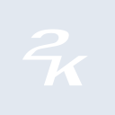

# 2k

[← Back to main README](../../README.md)





## 16 px

### black
```
https://georgegach.github.io/compatible-icons/simple-icons/2k/16/black.png
```

### slate
```
https://georgegach.github.io/compatible-icons/simple-icons/2k/16/slate.png
```

### white
```
https://georgegach.github.io/compatible-icons/simple-icons/2k/16/white.png
```

## 64 px

### black
```
https://georgegach.github.io/compatible-icons/simple-icons/2k/64/black.png
```

### slate
```
https://georgegach.github.io/compatible-icons/simple-icons/2k/64/slate.png
```

### white
```
https://georgegach.github.io/compatible-icons/simple-icons/2k/64/white.png
```

## 128 px

### black
```
https://georgegach.github.io/compatible-icons/simple-icons/2k/128/black.png
```

### slate
```
https://georgegach.github.io/compatible-icons/simple-icons/2k/128/slate.png
```

### white
```
https://georgegach.github.io/compatible-icons/simple-icons/2k/128/white.png
```

## 512 px

### black
```
https://georgegach.github.io/compatible-icons/simple-icons/2k/512/black.png
```

### slate
```
https://georgegach.github.io/compatible-icons/simple-icons/2k/512/slate.png
```

### white
```
https://georgegach.github.io/compatible-icons/simple-icons/2k/512/white.png
```

## 1024 px

### black
```
https://georgegach.github.io/compatible-icons/simple-icons/2k/1024/black.png
```

### slate
```
https://georgegach.github.io/compatible-icons/simple-icons/2k/1024/slate.png
```

### white
```
https://georgegach.github.io/compatible-icons/simple-icons/2k/1024/white.png
```

## 16 px in base64

### black
```
data:image/png;base64,iVBORw0KGgoAAAANSUhEUgAAABAAAAAQCAYAAAAf8/9hAAAABmJLR0QA/wD/AP+gvaeTAAAA5klEQVQ4jcXTMUqDQRAF4O9XUbFKIamsArmBpLXyEoEcJq2tR7DwAhaprFJYpQgYEUSJpgoYxaAkGhOLbGT5YeGHCA5MsbNv3ns7u5thYY3YWKf5Twi2EvUvPOMb29hHVpTgESehYYornOIo5WIR5RRP6OMTL9jDZQ73m3kHc4zRxgRldHCQUo8dzIPSMXqRk4ewN0AXI8xWffEtjINiE6+4Qw03uEcD75Zz20zNIM7bAG5iB60ELklwhmo4QhWHGBYlGKGOi7A+RwXXeWy2YsnFB96wi1KYycTy5ZZjYIqgcPz/Z/oBWoFdWbXPZqsAAAAASUVORK5CYII=
```

### slate
```
data:image/png;base64,iVBORw0KGgoAAAANSUhEUgAAABAAAAAQCAYAAAAf8/9hAAAABmJLR0QA/wD/AP+gvaeTAAABOUlEQVQ4jcWTwSqEURiGn/fMYIyMWegvmcTaXnauwQVwGVY2bJSN5Eqs3IAiylZJFhOlZPxmjMZM/3ktRINfFOXsvtP3Pt/XOe+r+nVqfnHCb8R/AijmXRp6wK1wJoVB43GMfgQQquNsUxSEeMLZIWgHtPA9wOoaBymsGE8A7WLsTPbCcMwd/wkgItBC7MvqGCeZRk6Ea1/o+wGyiQdIG5htyaMxOkrEgMomXklqGGoyFUMB+n7BuAUkAa1JSm2fxzAwF6RT8EUwS460bYqv4ncbCCqgWfvFV1I4m0lGbuvX6XH3obo4VLnfxcx/fIsvfRDN0eVNc0ZouTTWnCJjVdLNx758gHQXYC9GthDTxusu0LDjJ4Bys2A/EkITXMJUDamkjuxgSPpbc52IVMYuv5VQxSYvdf8fpmdvOYjsxvpk3QAAAABJRU5ErkJggg==
```

### white
```
data:image/png;base64,iVBORw0KGgoAAAANSUhEUgAAABAAAAAQCAYAAAAf8/9hAAAABmJLR0QA/wD/AP+gvaeTAAAA40lEQVQ4jcXTzyrEURjG8c8wIUUWmhILG3cgW1fiNuzHRtlILsFFcAGKla2UKGVD/mSiQeaxmGNh8tOvRnk2p07v83173nPeRpIYQiPDmP8E0Ky4f8cdPjCGWTTqAq6wVQyvOMYuVusA3vRjrWMOz5hHr26EHjo4RBctnGChDiA4wiZ2MFWAPUziGvcFNo1Rvr9Cp3Rs4xHnWMEpLrBWIjW/zP221TpL0kzSTjKe5OCnot8Ae0mWklyWcznJzWBR1Ud6wD62sYiNkv92sLBRsQsveMIEZspMumVmrTqA2vr/ZfoEruCrK2U+9a4AAAAASUVORK5CYII=
```

