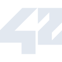
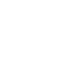

# 42

[← Back to main README](../../README.md)





## 16 px

### black
```
https://georgegach.github.io/compatible-icons/simple-icons/42/16/black.png
```

### slate
```
https://georgegach.github.io/compatible-icons/simple-icons/42/16/slate.png
```

### white
```
https://georgegach.github.io/compatible-icons/simple-icons/42/16/white.png
```

## 64 px

### black
```
https://georgegach.github.io/compatible-icons/simple-icons/42/64/black.png
```

### slate
```
https://georgegach.github.io/compatible-icons/simple-icons/42/64/slate.png
```

### white
```
https://georgegach.github.io/compatible-icons/simple-icons/42/64/white.png
```

## 128 px

### black
```
https://georgegach.github.io/compatible-icons/simple-icons/42/128/black.png
```

### slate
```
https://georgegach.github.io/compatible-icons/simple-icons/42/128/slate.png
```

### white
```
https://georgegach.github.io/compatible-icons/simple-icons/42/128/white.png
```

## 512 px

### black
```
https://georgegach.github.io/compatible-icons/simple-icons/42/512/black.png
```

### slate
```
https://georgegach.github.io/compatible-icons/simple-icons/42/512/slate.png
```

### white
```
https://georgegach.github.io/compatible-icons/simple-icons/42/512/white.png
```

## 1024 px

### black
```
https://georgegach.github.io/compatible-icons/simple-icons/42/1024/black.png
```

### slate
```
https://georgegach.github.io/compatible-icons/simple-icons/42/1024/slate.png
```

### white
```
https://georgegach.github.io/compatible-icons/simple-icons/42/1024/white.png
```

## 16 px in base64

### black
```
data:image/png;base64,iVBORw0KGgoAAAANSUhEUgAAABAAAAAQCAYAAAAf8/9hAAAABmJLR0QA/wD/AP+gvaeTAAAA50lEQVQ4jc3QvUoDURCG4SfmLFjYCDbeSSy1sbfVysbazkZB8F4E6xQiVt6HIGLWn1WECIlEJRZO4LBuYDv9YGBmzrzfMIf/qALnuMYNKuxhEL0hysjLJvgCY0xxjw2s4RXP6GMU79M2sDAY4QCbTQYFLvEezTKDoYd9dHCGj5h7mrd5vXbaQsCneIu5R2yrwQ/YwnIt0hy4gEl2T4m7WlTYxUs2dxLwVZq5hFb9VoVunJH3+uilcB7XoG6DWSfLD7GEImGlYesxjrJ6EBtT1J+zPGmnW+w0PcwzGPr5wAkW8dVy0R/oG5buTqnRKOaLAAAAAElFTkSuQmCC
```

### slate
```
data:image/png;base64,iVBORw0KGgoAAAANSUhEUgAAABAAAAAQCAYAAAAf8/9hAAAABmJLR0QA/wD/AP+gvaeTAAABeElEQVQ4jcWRP2tTYRyFn/PeGxK12D94mwZCNr+DSzt0dhe0m5uji4Na6NCh1M2PIDi4WhEELXT2S6RUcm/S0iYKkda+x+XWppdA3XrG877POQd+cNNS1fhu15r90Ufb9wWJ0R3Lr4TWsX8bZ8K/IIyRbqVVeLEYfjJaBhqGPOBHEMaReFtQF+xBWDW0sAlVGLQMbiDyAE/aS3PfAIiuE3hjhbeTpeECzoqTz0gr4Aa4F88mYNuk4WU7m91S9FOgVvIDTW0OftzO5ncvWmwHwN3i+H1CeGiYMfSt+Fz7+cmXfzAqYozPdKbdyZmdzuzPbnH8rgofLs5/UDcfngqXk9SDGCuHqoNfCG0bFkpvs9+8u5Hlo6/pJQzgVvWykgaYxCLg8ldgkBXDHYIepMAR8vgKZRJQq7JElAmKvAbNYNfSztLcPSrq9o42pGT9MlA/JHYMaRn1x3YKpXGdrPP9TnNhbdrb1ACFMCJygDg1sRFj7fx/im5GfwFPKK9hXeH/NgAAAABJRU5ErkJggg==
```

### white
```
data:image/png;base64,iVBORw0KGgoAAAANSUhEUgAAABAAAAAQCAYAAAAf8/9hAAAABmJLR0QA/wD/AP+gvaeTAAABBklEQVQ4jcWSvUpDQRCFv03uBUUbQQsfwHdISm3sbbXyDewsVBB8l4CtqcTKR5EYf2IQVEyIymeRCV5ubjBdDgzszpkzZ5ZZWDRSOaHmwBWwBdSBFeAEOAOGwAbwAQyA5Smxeq0OHONB3VGb6qv6orbVz+D9VxxcM0TH6u5UgxDfqMPIdyfi4BvqkZrUS/Ur6p5nOW+XnlYLcUt9j7ondZ+S+FHdU9dKkVWJ1Rx15B+6aqcUPfVQ7RfqLmLy2wzIC9NuVqy6F+uslXJtoJEB/dhpEfWKZsU/cwqsAnmWUlovW6rnjD/OBPfhmMX9e3LOmA93KaWDKmJWgzegA4yAJeBnTqMF4BcLO0t6uWukJwAAAABJRU5ErkJggg==
```

