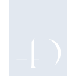
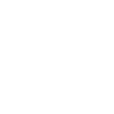

# 4d

[← Back to main README](../../README.md)





## 16 px

### black
```
https://georgegach.github.io/compatible-icons/simple-icons/4d/16/black.png
```

### slate
```
https://georgegach.github.io/compatible-icons/simple-icons/4d/16/slate.png
```

### white
```
https://georgegach.github.io/compatible-icons/simple-icons/4d/16/white.png
```

## 64 px

### black
```
https://georgegach.github.io/compatible-icons/simple-icons/4d/64/black.png
```

### slate
```
https://georgegach.github.io/compatible-icons/simple-icons/4d/64/slate.png
```

### white
```
https://georgegach.github.io/compatible-icons/simple-icons/4d/64/white.png
```

## 128 px

### black
```
https://georgegach.github.io/compatible-icons/simple-icons/4d/128/black.png
```

### slate
```
https://georgegach.github.io/compatible-icons/simple-icons/4d/128/slate.png
```

### white
```
https://georgegach.github.io/compatible-icons/simple-icons/4d/128/white.png
```

## 512 px

### black
```
https://georgegach.github.io/compatible-icons/simple-icons/4d/512/black.png
```

### slate
```
https://georgegach.github.io/compatible-icons/simple-icons/4d/512/slate.png
```

### white
```
https://georgegach.github.io/compatible-icons/simple-icons/4d/512/white.png
```

## 1024 px

### black
```
https://georgegach.github.io/compatible-icons/simple-icons/4d/1024/black.png
```

### slate
```
https://georgegach.github.io/compatible-icons/simple-icons/4d/1024/slate.png
```

### white
```
https://georgegach.github.io/compatible-icons/simple-icons/4d/1024/white.png
```

## 16 px in base64

### black
```
data:image/png;base64,iVBORw0KGgoAAAANSUhEUgAAABAAAAAQCAYAAAAf8/9hAAAABmJLR0QA/wD/AP+gvaeTAAAAx0lEQVQ4je3STUoDQRAF4C8xBsYfCCbizz4HyAHceEsvJd7ArWAyihLEaDIuuhKbwQx9AB8UdHW9eryqbhIuUaMpjDp69P3iQzl23H4XqwT/Agw6ahs8ZbzjiGIHj3hHDyu84B7LEgeLELiKgDUe8Ilpl4PnsH/auj/ADHcY7ROYR+N55Iet+gBHeV8uMMIJvqWv2kjz1hlnhVtpNzvFLV5xneVN1M8if0OFG9ki973CUlrUJBP7whAX7Zm2qLJz+817GP/F/QGqDC1i1xHdYwAAAABJRU5ErkJggg==
```

### slate
```
data:image/png;base64,iVBORw0KGgoAAAANSUhEUgAAABAAAAAQCAYAAAAf8/9hAAAABmJLR0QA/wD/AP+gvaeTAAABAklEQVQ4je2QvU4CURSEvzksJriQ4L/YWdDY+QA2vqUvZahstyX+YURCBLljgbCbNZh9AE917zkzk5kRQPH4cR6r5YOkAxqM7Ulqta8uT7vj2Cwl5k3IdWz8BWwy/wKQ7ToIJZPGAEaZRI7JGzswLqSYQijEAphY3INnTRy8gAo7DUADG8CrIEbAJzDc6UDwBErCvdqlZdJ1Ct8Z9XcJPBv1wCfrHGrXEmey9sFbXlWgD+pC+gLmRjaeYV4rzSyUfGuY/u5A8YZ9AVp/hUEZcAhg/B5Ex8GNXBZZOnCq9jBz8tDy8ZqMZS0t72HOqqG2Dmw60s8bckQuayMoxBEusRveNxK8aWBRCvfjAAAAAElFTkSuQmCC
```

### white
```
data:image/png;base64,iVBORw0KGgoAAAANSUhEUgAAABAAAAAQCAYAAAAf8/9hAAAABmJLR0QA/wD/AP+gvaeTAAAAyklEQVQ4je3STUoDQRAF4C8xCuMPBDUY3XuAHMCNt8ylgjdwK5iMQQli1JSL6cRmMEMfwAcFXV2vHq+qG0TEOCLqKEcdEWPo+8W7cuy4/S5WCf4FGHTUNnjKeCcpih084g09rPGCGVYlDhZJ4DoFfOMBH7jtcvCc7J+17g8wwRTDfQLz1DhK+WGrPsBx3pcLDHGKL81XDc28dcZZ416zm53iFkvcZHmk+nnKX1HhTrbIfa+w0izqMhP7xBGu2jNtUWXn9pv3cPEX9wduV1c4spT8qQAAAABJRU5ErkJggg==
```

