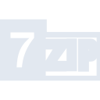
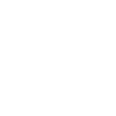

# 7zip

[← Back to main README](../../README.md)

<table><tr>
  <td></td>
  <td></td>
  <td></td>
</tr></table>

## 16 px

### black
```
https://georgegach.github.io/compatible-icons/simple-icons/compat/7zip/16/black.png
```

### slate
```
https://georgegach.github.io/compatible-icons/simple-icons/compat/7zip/16/slate.png
```

### white
```
https://georgegach.github.io/compatible-icons/simple-icons/compat/7zip/16/white.png
```

## 64 px

### black
```
https://georgegach.github.io/compatible-icons/simple-icons/compat/7zip/64/black.png
```

### slate
```
https://georgegach.github.io/compatible-icons/simple-icons/compat/7zip/64/slate.png
```

### white
```
https://georgegach.github.io/compatible-icons/simple-icons/compat/7zip/64/white.png
```

## 128 px

### black
```
https://georgegach.github.io/compatible-icons/simple-icons/compat/7zip/128/black.png
```

### slate
```
https://georgegach.github.io/compatible-icons/simple-icons/compat/7zip/128/slate.png
```

### white
```
https://georgegach.github.io/compatible-icons/simple-icons/compat/7zip/128/white.png
```

## 512 px

### black
```
https://georgegach.github.io/compatible-icons/simple-icons/compat/7zip/512/black.png
```

### slate
```
https://georgegach.github.io/compatible-icons/simple-icons/compat/7zip/512/slate.png
```

### white
```
https://georgegach.github.io/compatible-icons/simple-icons/compat/7zip/512/white.png
```

## 1024 px

### black
```
https://georgegach.github.io/compatible-icons/simple-icons/compat/7zip/1024/black.png
```

### slate
```
https://georgegach.github.io/compatible-icons/simple-icons/compat/7zip/1024/slate.png
```

### white
```
https://georgegach.github.io/compatible-icons/simple-icons/compat/7zip/1024/white.png
```

## 16 px in base64

### black
```
data:image/png;base64,iVBORw0KGgoAAAANSUhEUgAAABAAAAAQCAYAAAAf8/9hAAAABmJLR0QA/wD/AP+gvaeTAAAA7ElEQVQ4jdXSMUpDURAF0JMQEQmIoIhphFjZprfPJmwEV2EnugCxsbC0cwlZg5U2dgaRaKWiQT/mm6TI/PAU/aTNNO/NnTd37h0ecx8V9PD5R20B5zgqI6ihgT6+fuHLWJlFwQg32EvwY7SD+K2kv1qLSwOXMXEfWxjiOSFYDFVXaCJHVSgYYYATnMY9xyseot7HN25NdvYUb6YE99hAN/Icu7gzWfRBQpDhEYPCgpjWwlqCHWI97NUTvIL36JkquMZZkud4iTOLnQwTCzu4SBU0selndMKSIMti6naBl32kJXz8UytitaQ2LzEGLUdH8cVtaAIAAAAASUVORK5CYII=
```

### slate
```
data:image/png;base64,iVBORw0KGgoAAAANSUhEUgAAABAAAAAQCAYAAAAf8/9hAAAABmJLR0QA/wD/AP+gvaeTAAABL0lEQVQ4jdWSzS5DcRTEf/PvRaQJDQ0RSUUTia1HsLLr3pJIbLyEEPECVt7AI3gGOy/QWCgbivpIuWcs2lw3Qa3N8sycOZPJgX8PXd0+XGO/fmPMGEmnjfnpg1EGGfYC0MP0v3bJJKaA2t8JbroGLh1sFUNxCGxY9IQff19PKQMQLJA4A2qSdxxqSoThDhgYWBOIKVsXEsuSP3AMDAx1QY2kkwivSzSHSWqCzNYi8AxMklghvBTmQVI9lUrrfFA5TqQWMEymPVvvxh3EUakjkbCEs2Iouhn5mnH9S+h98FxF6Szsark7wVME3cJAgHO3gCoqHGaQJsJsAuN4IJQIK7aRdrPStWVLDZXO4Di3UhsZHPeo8qZQNydfHeu7nWca8UhoUvKLf+QKzI7g/gs+AQZPg5L3ySgkAAAAAElFTkSuQmCC
```

### white
```
data:image/png;base64,iVBORw0KGgoAAAANSUhEUgAAABAAAAAQCAYAAAAf8/9hAAAABmJLR0QA/wD/AP+gvaeTAAAA50lEQVQ4jdXSPUoEQRDF8d8Mo7IIIroIi6CskamnMDM3VAQR9hKiiBcw8gYewTOYGZoYaaarrh+obJvUQDPoYLoVFe91/+tV00x8FSmlO7z/4k3hvCiKozZAhR5G+Gzoc5j/T4KEa+xk+jE2A/zccr+sounhIibuYQ1jPGSAmUh1hT6+UdYJhHCGEgcoIsEIy3hFBzdYxRO6ZRbnHqfYijeAAb7CO8lXR0KqMnGIDXQz7RBLsd5sA/CCYQ4Q0/ODC7H7NqYzfYxd7OeAPlYawEvcRv+Ij0i6XuttH6mDtz+8uhZbvEmpH7MEO4OYSh8OAAAAAElFTkSuQmCC
```

