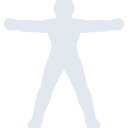
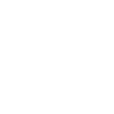

# actigraph

[← Back to main README](../../README.md)





## 16 px

### black
```
https://georgegach.github.io/compatible-icons/simple-icons/actigraph/16/black.png
```

### slate
```
https://georgegach.github.io/compatible-icons/simple-icons/actigraph/16/slate.png
```

### white
```
https://georgegach.github.io/compatible-icons/simple-icons/actigraph/16/white.png
```

## 64 px

### black
```
https://georgegach.github.io/compatible-icons/simple-icons/actigraph/64/black.png
```

### slate
```
https://georgegach.github.io/compatible-icons/simple-icons/actigraph/64/slate.png
```

### white
```
https://georgegach.github.io/compatible-icons/simple-icons/actigraph/64/white.png
```

## 128 px

### black
```
https://georgegach.github.io/compatible-icons/simple-icons/actigraph/128/black.png
```

### slate
```
https://georgegach.github.io/compatible-icons/simple-icons/actigraph/128/slate.png
```

### white
```
https://georgegach.github.io/compatible-icons/simple-icons/actigraph/128/white.png
```

## 512 px

### black
```
https://georgegach.github.io/compatible-icons/simple-icons/actigraph/512/black.png
```

### slate
```
https://georgegach.github.io/compatible-icons/simple-icons/actigraph/512/slate.png
```

### white
```
https://georgegach.github.io/compatible-icons/simple-icons/actigraph/512/white.png
```

## 1024 px

### black
```
https://georgegach.github.io/compatible-icons/simple-icons/actigraph/1024/black.png
```

### slate
```
https://georgegach.github.io/compatible-icons/simple-icons/actigraph/1024/slate.png
```

### white
```
https://georgegach.github.io/compatible-icons/simple-icons/actigraph/1024/white.png
```

## 16 px in base64

### black
```
data:image/png;base64,iVBORw0KGgoAAAANSUhEUgAAABAAAAAQCAYAAAAf8/9hAAAABmJLR0QA/wD/AP+gvaeTAAABEElEQVQ4jZXTvS5EQRjG8d+utZEgWd8iETQkWhKRKEl0KNR6tUbpBtyBCyBuQLiDTXRbUBCbEIWGxFfBKmbEsXvO5uyTnGTOO0/+M/PMO2RrBg94jONUFdsA+tGNAnqyTAWsYx9V9OIFo5jHFBq4Qw1P6MMHFnFQioYR7KAUd/UVYeW40CBm0YVvfCZgLTsawDRuIryBW0yi0ubILbpIAM6zTO1CrGSMcwHGMN70P9QJYCsC7uM3ge1OABtCoGdCFkVsZnhTVUMdw8IV12Mtl5aFZjpJ1E7xjJU8gEO8YS1RW8UrjvIAqrj2P58CrnDZbG4OsSy8gWOhZX/VEI4x56+9U7WHdyykzC0Jj2g3WfwBtmQyCu2NfXQAAAAASUVORK5CYII=
```

### slate
```
data:image/png;base64,iVBORw0KGgoAAAANSUhEUgAAABAAAAAQCAYAAAAf8/9hAAAABmJLR0QA/wD/AP+gvaeTAAABpUlEQVQ4jZWSvWtTURjGn+c9xyCmNWmKaZraaBaFboJLQR2c3NShswjOruLofyH4FwgO4iZYN0F0vlvpV27EaCRNdNA2930cQuEqNzae7fx4zu/94BBTzu7ng7aB7ySZiPWLjepOUc6mCQJ9HtApIwkPp6fl2Pn07ZZojwF+BFCWYRTAuktrIC9AEsk9yRORfQJzcP6E+VUXn8QQoo6kcwTuAYgEzF0ZiDKkEgDIVYPZJUIBgov6RVnf4HPMtyOJ+/vDqpdUCbS3gNoTjt3o2Y3DM/a9vbBwkH8T/5iHFIABgEGnN9yW0J5wbK2sLHb+a4nuquau1Wm5QsF278cSqUZutqU0HS3OLIjZ4V2ADQBdAF2QTbfxxswChHAbAmF4DfENABPtTmGxQoHQAtSN4/CIJI+U3SS5OlMHaW+0LmhVxvfN5tn+8vL8Vxk+CDq/92V07USBQxtGRADPcvipQZGe3T9RINd1CWmrXtk8Zq16ZVNiSvHKPwVJopIRa2Z6TtKPOUlBeCHqcpJMvnehoFwbPnTBsjFf/l2JxleAhXJt8CDPfwMukrGbqtQt1AAAAABJRU5ErkJggg==
```

### white
```
data:image/png;base64,iVBORw0KGgoAAAANSUhEUgAAABAAAAAQCAYAAAAf8/9hAAAABmJLR0QA/wD/AP+gvaeTAAABK0lEQVQ4jZWTPy/DURSGn1vVSJDUn6pIhC4kVhKRGElsGMx2s8XoC/gGPgDpFxD9Bk1sHRgICTFYNEEN+hhc8Wv5VfsmNzl5z3vec869uZACtaQ+qI9qKU2XSUsAw0A/EICBNFFQN4ADoAoMAnVgAlgAZgCBW6AGPAFDQANYAg6zUVAAdoFsnOojmuVio1FgDugDmsB7wqxl76COqLPqtT+4UafVfIeVW6FWEgbnabpOl5hPif83UIvAZIIqqmO9TLAdDe7jmQJ2ejHY5Ov9z4BK1G2laH9Dral36rhaiHGt2+IVta6eJriy+qyudmNwpL6q6wluTX1Rj7sxqKpXaibBBfVSvWjXZ9qKc3z9gZMQQvObDyEIlIH5qEntvq++qYt/5JbVhrqX5D8BngPNdF2maUkAAAAASUVORK5CYII=
```

