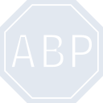
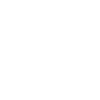

# adblockplus

[← Back to main README](../../README.md)

<table><tr>
  <td></td>
  <td></td>
  <td></td>
</tr></table>

## 16 px

### black
```
https://georgegach.github.io/compatible-icons/simple-icons/compat/adblockplus/16/black.png
```

### slate
```
https://georgegach.github.io/compatible-icons/simple-icons/compat/adblockplus/16/slate.png
```

### white
```
https://georgegach.github.io/compatible-icons/simple-icons/compat/adblockplus/16/white.png
```

## 64 px

### black
```
https://georgegach.github.io/compatible-icons/simple-icons/compat/adblockplus/64/black.png
```

### slate
```
https://georgegach.github.io/compatible-icons/simple-icons/compat/adblockplus/64/slate.png
```

### white
```
https://georgegach.github.io/compatible-icons/simple-icons/compat/adblockplus/64/white.png
```

## 128 px

### black
```
https://georgegach.github.io/compatible-icons/simple-icons/compat/adblockplus/128/black.png
```

### slate
```
https://georgegach.github.io/compatible-icons/simple-icons/compat/adblockplus/128/slate.png
```

### white
```
https://georgegach.github.io/compatible-icons/simple-icons/compat/adblockplus/128/white.png
```

## 512 px

### black
```
https://georgegach.github.io/compatible-icons/simple-icons/compat/adblockplus/512/black.png
```

### slate
```
https://georgegach.github.io/compatible-icons/simple-icons/compat/adblockplus/512/slate.png
```

### white
```
https://georgegach.github.io/compatible-icons/simple-icons/compat/adblockplus/512/white.png
```

## 1024 px

### black
```
https://georgegach.github.io/compatible-icons/simple-icons/compat/adblockplus/1024/black.png
```

### slate
```
https://georgegach.github.io/compatible-icons/simple-icons/compat/adblockplus/1024/slate.png
```

### white
```
https://georgegach.github.io/compatible-icons/simple-icons/compat/adblockplus/1024/white.png
```

## 16 px in base64

### black
```
data:image/png;base64,iVBORw0KGgoAAAANSUhEUgAAABAAAAAQCAYAAAAf8/9hAAAABmJLR0QA/wD/AP+gvaeTAAABFklEQVQ4jZ3TzStEYRQG8N+dKNSUhbIgEmGvlKysrEmGf9TCykpMkpUphpXJyEdjzBJjMedm5jY3M06d+97O6XnOec57XnqthHdUcZfxauRKcqyEBs5Qx2PG65Fr9CPZDfbTONs53sR5kBwOC84lSdtuDQBOvZXKSVDBJEZwhVXM4iEqJVjDFE7whSI2cV8IGe3oZBkvEXvDCjZwhILOTWxhFDURFNVfMROJdsRvcYO9qAyfeMZEN0ERF7hGuauLRSzhOIrUQtZclmAsNBaxHpNO7TuIk+hwO2bSEsEKFmIG0zpLMx65y9A7HwWe4j/RWayG+JTxYfBrbPrdSjv+v0gHqc5BSfqCUxvmMe1nwd0kfz3nHvAPYn6cmnkriIAAAAAASUVORK5CYII=
```

### slate
```
data:image/png;base64,iVBORw0KGgoAAAANSUhEUgAAABAAAAAQCAYAAAAf8/9hAAAABmJLR0QA/wD/AP+gvaeTAAABo0lEQVQ4jZ2TTW8MUBiFn+dmxGdFqmjSZkiIjrBrIhEbVpZCJNYWqn4SG3Y+foCFlV1TERu0TYlIKU3aMikiEr3HwoxOE5Vylu/NOTn3vOeVHswtLF+GchNdJNj7hoRkH9Sx5uDee2vj9eQbUmZCDqFZJ5Aovgm1BfVaV0SAt+8/XUzhlviikuPibv6AkM/iNGQEcr052H/HzZI3EnFuod0WZ0I9Ae7cmLj235CvhfI8pNUwfEAOAt8CEyYtdJjwLoVJK2pGxYFKHgmrQF9NThd4XTrqgdI2ORpd6sT70ZoRzKnoA6QUyqvAWS1blHmA0nHV0CyjQ+B8xzEUX4KzhksJqwDqD8hiYMdvAaEPfEIyhTwGlgAMhyFHKnkINEjmqUyCTXoFauq2JAPBPsJJwkpPflWcIooOIedIRsUvAI1ftsr3kDPKAaxb0e0hAwlPDSvKeEytcL67CTtLcW6h3QZmIcfAXX/rQG8XCmUqpFWsuQIZEZ+FrGyGLE53Kj3erfKFFG7/Y5XHm4P9d//rmEpxbHj/nvudLNawmXMuxatdMsBPWwDo1lqVcSgAAAAASUVORK5CYII=
```

### white
```
data:image/png;base64,iVBORw0KGgoAAAANSUhEUgAAABAAAAAQCAYAAAAf8/9hAAAABmJLR0QA/wD/AP+gvaeTAAABSklEQVQ4jZ3TzatNYRgF8N97onydMiADIhFHmSklIyNjksvQgPxN/gP+AAMjI7mSFLm6V0Zu98hH28UMy+A8p87Zro9r1W7vnre11vOsZ7/NDJIs4BbeoZlHsBc3Wmu39ZFkIUmX5GGScZK13jOus66M5sgXk3xK8qDev8N6ksUSubpZ8oYiLUmHlziJnb/MtjG+4jlGLckSdmMLnmKEA3iDxQrzFPbgPr5jiLN4PZhJuMMxvK/aRxzHGdzFAK9wDluxqorK/QP210GqvoJlXCpn+Gay5h2zAkM8xgs8muniCI7iXpms1lgH+wLbasYhTmN9JrAfJdyqw/OVyReYhni4MtiHNWwvwpOa91AZvK3vhjG66RqXcQK7/Bs+V1ejAa6ZpP2s1/qfyEsm674Jklz4j1/5ypzsJi/T5Smv9UX8/Tpfb63dmRZ/Ajw/UlilJ0s0AAAAAElFTkSuQmCC
```

