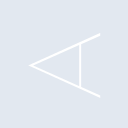
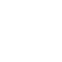

# aerospike

[← Back to main README](../../README.md)





## 16 px

### black
```
https://georgegach.github.io/compatible-icons/simple-icons/aerospike/16/black.png
```

### slate
```
https://georgegach.github.io/compatible-icons/simple-icons/aerospike/16/slate.png
```

### white
```
https://georgegach.github.io/compatible-icons/simple-icons/aerospike/16/white.png
```

## 64 px

### black
```
https://georgegach.github.io/compatible-icons/simple-icons/aerospike/64/black.png
```

### slate
```
https://georgegach.github.io/compatible-icons/simple-icons/aerospike/64/slate.png
```

### white
```
https://georgegach.github.io/compatible-icons/simple-icons/aerospike/64/white.png
```

## 128 px

### black
```
https://georgegach.github.io/compatible-icons/simple-icons/aerospike/128/black.png
```

### slate
```
https://georgegach.github.io/compatible-icons/simple-icons/aerospike/128/slate.png
```

### white
```
https://georgegach.github.io/compatible-icons/simple-icons/aerospike/128/white.png
```

## 512 px

### black
```
https://georgegach.github.io/compatible-icons/simple-icons/aerospike/512/black.png
```

### slate
```
https://georgegach.github.io/compatible-icons/simple-icons/aerospike/512/slate.png
```

### white
```
https://georgegach.github.io/compatible-icons/simple-icons/aerospike/512/white.png
```

## 1024 px

### black
```
https://georgegach.github.io/compatible-icons/simple-icons/aerospike/1024/black.png
```

### slate
```
https://georgegach.github.io/compatible-icons/simple-icons/aerospike/1024/slate.png
```

### white
```
https://georgegach.github.io/compatible-icons/simple-icons/aerospike/1024/white.png
```

## 16 px in base64

### black
```
data:image/png;base64,iVBORw0KGgoAAAANSUhEUgAAABAAAAAQCAYAAAAf8/9hAAAABmJLR0QA/wD/AP+gvaeTAAAArklEQVQ4jcXTu4oCQRSE4W/UTEwGow3ERGEDow19dd/BBxBE8LbCqqwIKqKzgS0M43hZDSzo7NTfVafpCIkXVHjF/DbA4hnAAUN0soDSHeMWU3TD7Bc+0gOR/FdY4Rv9YKjiF5/ZwWyCn3DjDHW0UUHvWsT0DvbYYIAm4mC+qbwKu5BgiHKIn2CdV+HaDuCIMUbhtNBA8VFAWlNMsHSqV/sv4Kx58MTPAi70/s/0B2o4JqT4h8JUAAAAAElFTkSuQmCC
```

### slate
```
data:image/png;base64,iVBORw0KGgoAAAANSUhEUgAAABAAAAAQCAYAAAAf8/9hAAAABmJLR0QA/wD/AP+gvaeTAAAA1klEQVQ4jcWTPUsDARBE3zsjCpJGRUjUYJXOykbwr/sfLC0ECUa9BPxGUJDc2AVzmIuYIlMuO4/ZZdeb0UtYQsUy5tUAEp7+A5hAhsi5zgJazT4/NWUqLiItwwnQXQgIeTOOLLgOdCk8peIV2a/31gEPQCmMgSOSM6ANuZqXcbqDyBfkI8lA7KvbgXbziD8SGNbBQ3APqnHwMmTLsCtuBt4bAVOQ2Qj2IAcF3iFD5LaIxyETYG2m/2+nbIm5JzxD+mBvboLflQ6hAzyCNo6wQDv1wuqf6Rt2Dk2lB7/suQAAAABJRU5ErkJggg==
```

### white
```
data:image/png;base64,iVBORw0KGgoAAAANSUhEUgAAABAAAAAQCAYAAAAf8/9hAAAABmJLR0QA/wD/AP+gvaeTAAAAsElEQVQ4jcXTvWoCQQAE4O80ndhIKgtJEyGFlaWvnnfwAQQRLokKUVEEFdG1cAPH5S7xp3Bgu5nZmVk2CSEEd6Byj/hhBvNbDA5I8Z43ePpHuMUY/cjtopklJCWvsMIEwyh4xhJveWI+wXe8cYoX9FDHoCxidoM9NhihjUYU/4miCruYIEUtxg9YF1Uo2wCO+MRHPB28onqpQRZjfGHhXK91rcEPZkic97nJ4Bce/5lO9MM7j1H1oLoAAAAASUVORK5CYII=
```

