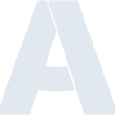

# airbrake

[← Back to main README](../../README.md)





## 16 px

### black
```
https://georgegach.github.io/compatible-icons/simple-icons/airbrake/16/black.png
```

### slate
```
https://georgegach.github.io/compatible-icons/simple-icons/airbrake/16/slate.png
```

### white
```
https://georgegach.github.io/compatible-icons/simple-icons/airbrake/16/white.png
```

## 64 px

### black
```
https://georgegach.github.io/compatible-icons/simple-icons/airbrake/64/black.png
```

### slate
```
https://georgegach.github.io/compatible-icons/simple-icons/airbrake/64/slate.png
```

### white
```
https://georgegach.github.io/compatible-icons/simple-icons/airbrake/64/white.png
```

## 128 px

### black
```
https://georgegach.github.io/compatible-icons/simple-icons/airbrake/128/black.png
```

### slate
```
https://georgegach.github.io/compatible-icons/simple-icons/airbrake/128/slate.png
```

### white
```
https://georgegach.github.io/compatible-icons/simple-icons/airbrake/128/white.png
```

## 512 px

### black
```
https://georgegach.github.io/compatible-icons/simple-icons/airbrake/512/black.png
```

### slate
```
https://georgegach.github.io/compatible-icons/simple-icons/airbrake/512/slate.png
```

### white
```
https://georgegach.github.io/compatible-icons/simple-icons/airbrake/512/white.png
```

## 1024 px

### black
```
https://georgegach.github.io/compatible-icons/simple-icons/airbrake/1024/black.png
```

### slate
```
https://georgegach.github.io/compatible-icons/simple-icons/airbrake/1024/slate.png
```

### white
```
https://georgegach.github.io/compatible-icons/simple-icons/airbrake/1024/white.png
```

## 16 px in base64

### black
```
data:image/png;base64,iVBORw0KGgoAAAANSUhEUgAAABAAAAAQCAYAAAAf8/9hAAAABmJLR0QA/wD/AP+gvaeTAAABLElEQVQ4jYXTSytFYRgF4OccR0gycIlkoiQm/gC/wICp/Bozf8DATzAiAyMyo2SocxK5k5JLbsntGJxv6/Odc1j11X7Xu9a7V+/+dk41GlHCHfrxHPgyhvFew/MLU3jEIfaDsYwnTP5nho1geMBeNKCMtVScT+o2DETPcB/1B9H+14AZ9ET1K26jugfTf8XfSSLPYSXhtuuZe3EeCa8whAmVpWb8BfpqDZjFZyQsBr4RRxH/FbRVKCZRF6LeetLbzRrZEkfQERneMI4tbAbuNep3qVyqHywkb0hPCSf1Eub8vnG1zmWIHXP7yBVC1M4ozQtWg6gbDbjGqcpXKQRdJ8ZgOZl8jGbV6MBZol3KYzQRHiQLy3ATksQYLaBF5c+DJszXMGdYDEk+Qt36DZnJbdts9co+AAAAAElFTkSuQmCC
```

### slate
```
data:image/png;base64,iVBORw0KGgoAAAANSUhEUgAAABAAAAAQCAYAAAAf8/9hAAAABmJLR0QA/wD/AP+gvaeTAAABzklEQVQ4jX2RsU/TURSFv/MKVYOACaS0FBMhMYoLC4MaTQyjDg7GwbgZY1wM/jMOTs5uTJK4OLg6uBhiIkYoCbS/WsCKJWDfcWjprxTp3c55937n3fdET32yB3Pl3RVgG3QRvNc6sSsTF2bnpcPu/tALyFV27iEmgDHJdWAGmJGUz5Xrd3v7TwAwi5jzwuOOih3bDEl+0ReQJMlwOxGjYbXsnRTuy6u12uipgMZh5rEd8p1+ed9QO9LRyg/u8+j0FRSeSs52pFkW+tLRcpYQnvwX8CPZKxBI06EcYngTzGvE79R3sVStFk8AMvHguU0hTVetWBz5upUfeY+pdoUWYjPz7ATA1kN1azU/AsxLhyJ874CR5PAg1cDaZv0aan4Q5FrX1AF4VbArydFuCN0En22FUbEzdy5NDq+0EtVcPBpuUZ0VzALXbd8IaBJiJX1McpnQfAkQbEuwQJ8ycRSoH/e8YFsDpc2d2w4aV7rTnyjeBbDtHCIDSmyvB3HFZqC95ngp2b6l9a3dJfD9lMxabIxenZ7WfnfixsavsTgYP2Omuu6xFGzPdTcG+NY7DDA1NfLTkeS4q7kBSefA7W/ymWbkVZ/neCs8ZvS3DRj6B51ExIJMptHKAAAAAElFTkSuQmCC
```

### white
```
data:image/png;base64,iVBORw0KGgoAAAANSUhEUgAAABAAAAAQCAYAAAAf8/9hAAAABmJLR0QA/wD/AP+gvaeTAAABSElEQVQ4jX2SyyrFURTGf/s4bkkGLpFMlMTECzAxNaBkIDN5EQ9h4BGMGDFRBoonQCJ3peSSg05uPwNbZ9sd55v8+771ra+11/oHMqj1wAHwAPQBL78lYCiE8J735AFTakk9UY+s4FmdrNkcA7Ziw5N66F9s5v5C1twK9EfaGr+PiWVAbfs3AJgDuhNeBu4T3g3M1gpYABoSvgHsJbwBmKca1B71KnnvjTqoTsSl/uJa7a0WsKh+Jsb9qNerp4n+pS5We8JMxrcB4t1PEj0A038C1GGgPTG9AWPqrroTtXJS71SH0vGXrY0D9TzTlgEKagDGq262gjaglGnjaigCY0BHUngF1vn597uAOuAWuAAGgWL0dQCjqGvZaGdqUz6C2q5eZt7VAjCSeY9DCOU8IIRwFydJMVIEmqmcqRFYqrGLFX6u9RF5yzfOwzMf1tMWTAAAAABJRU5ErkJggg==
```

