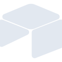
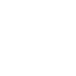

# airtable

[← Back to main README](../../README.md)

<table><tr>
  <td></td>
  <td></td>
  <td></td>
</tr></table>

## 16 px

### black
```
https://georgegach.github.io/compatible-icons/simple-icons/compat/airtable/16/black.png
```

### slate
```
https://georgegach.github.io/compatible-icons/simple-icons/compat/airtable/16/slate.png
```

### white
```
https://georgegach.github.io/compatible-icons/simple-icons/compat/airtable/16/white.png
```

## 64 px

### black
```
https://georgegach.github.io/compatible-icons/simple-icons/compat/airtable/64/black.png
```

### slate
```
https://georgegach.github.io/compatible-icons/simple-icons/compat/airtable/64/slate.png
```

### white
```
https://georgegach.github.io/compatible-icons/simple-icons/compat/airtable/64/white.png
```

## 128 px

### black
```
https://georgegach.github.io/compatible-icons/simple-icons/compat/airtable/128/black.png
```

### slate
```
https://georgegach.github.io/compatible-icons/simple-icons/compat/airtable/128/slate.png
```

### white
```
https://georgegach.github.io/compatible-icons/simple-icons/compat/airtable/128/white.png
```

## 512 px

### black
```
https://georgegach.github.io/compatible-icons/simple-icons/compat/airtable/512/black.png
```

### slate
```
https://georgegach.github.io/compatible-icons/simple-icons/compat/airtable/512/slate.png
```

### white
```
https://georgegach.github.io/compatible-icons/simple-icons/compat/airtable/512/white.png
```

## 1024 px

### black
```
https://georgegach.github.io/compatible-icons/simple-icons/compat/airtable/1024/black.png
```

### slate
```
https://georgegach.github.io/compatible-icons/simple-icons/compat/airtable/1024/slate.png
```

### white
```
https://georgegach.github.io/compatible-icons/simple-icons/compat/airtable/1024/white.png
```

## 16 px in base64

### black
```
data:image/png;base64,iVBORw0KGgoAAAANSUhEUgAAABAAAAAQCAYAAAAf8/9hAAAABmJLR0QA/wD/AP+gvaeTAAAA+ElEQVQ4jbXTPUoEQRAF4G9hxR9QUVQ08QQmCkYa7x1M9AxexRPsBUzExMADrIqBYKYoGujOKoooKwuyBlMLyzjjTKAPCprufq9eVXXzT1jHIa5xhQOslZFGsY0WEvQz0cEldjExTJxGEzfo5hCz0Y27TUzBJl4qELPxikYNt2iHmwUsYqygzE88BrmPuVos4DkiwSRmsBxnSZA+MI7ZSGZYYIAeHqJprXC0Eo1bQj1rq6jGN+zgvKQXPzaecIZGJLioKtDGKTYyDksFOjjGara2CgK9OuYLiL/hXTqZoyqXBw6+cI8TbGGEnJHk4E76T/axJ31If4dv/rx12t+ywTsAAAAASUVORK5CYII=
```

### slate
```
data:image/png;base64,iVBORw0KGgoAAAANSUhEUgAAABAAAAAQCAYAAAAf8/9hAAAABmJLR0QA/wD/AP+gvaeTAAABfElEQVQ4jaWSvYpTURSFv3XumckoGhNxLvEOzo/NIGintY9gI/gQgljY6xuIdoKNjZU+gKWFhYgOWNgMgqYw1+tkiOLPaJKzbIIEk0kGXeU5a32svdnwn9K0x3bn8wWTboLOSDLwJiXfWi8ar/YFbG+7tlj/ckX2VcGGYXncaLMjVKF0P6Yf94qi+A6gt7u7xxb62R3MRaAFXppTeg9cIj39GQfXYhzEczhdAhoHm9pLwDp2szbIHup92Xsn8xGBTS5pRgvt2S4xPTIsc0LtsufRbxfTDUGV7aNA07AKYKgk9YS/kTiUxHFBDjAOGC1Lv4Lcsfmk4OeQtRI+K/twQCcTjuP+MFFSXjSsKbCZlL2AdBp7Ezj1d3gqYDTKyz5cXsvrD2zi1GMZ6Q/RppJoZwrXV1r1ZzMyE4Adwess842VvLl10CAAUj+uthrL850T+gpUKfnJxFJmKGF/QKEzHHK7W9QfnZf6cwFCbTvVsB4P48LdjfxI+Q+N99dvN9Gd6sibElYAAAAASUVORK5CYII=
```

### white
```
data:image/png;base64,iVBORw0KGgoAAAANSUhEUgAAABAAAAAQCAYAAAAf8/9hAAAABmJLR0QA/wD/AP+gvaeTAAABEElEQVQ4jbWSMUoDURRFz4dINKCiqGjjCmwU7KyzBxvdgm7FFWQDNmJjYWkREQvBTlFiYZwoBlESAnIs/MFhkhkHwQO/enPfO//Nh/9A3VSP1Vv1Rj1SN34LVdUdtakmjtJRr9V9tZYOzqoN9U7tjQlm6cVvG+oM6pb6WiKYpavWg3oPPEWhJWAZmMy5aR9oA11AYCGoxuJLPAkwDcwBq7GWxNAHMAXMx2GkGwwZAI9AB2hGozWgBqwAlez283hTd9XLokWMa/CsXqj1OOCqqEFaJwFawF4I4SxniaP4/UBO1fWcepHBoBJCWCw97Yf3aHxSxnBo8Kk+qOfqtjoB2V8ynhZQBQ6BgxBC+w/G+XwBFjqeDcrzuFoAAAAASUVORK5CYII=
```

