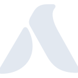

# akasaair

[← Back to main README](../../README.md)

<table><tr>
  <td></td>
  <td></td>
  <td></td>
</tr></table>

## 16 px

### black
```
https://georgegach.github.io/compatible-icons/simple-icons/compat/akasaair/16/black.png
```

### slate
```
https://georgegach.github.io/compatible-icons/simple-icons/compat/akasaair/16/slate.png
```

### white
```
https://georgegach.github.io/compatible-icons/simple-icons/compat/akasaair/16/white.png
```

## 64 px

### black
```
https://georgegach.github.io/compatible-icons/simple-icons/compat/akasaair/64/black.png
```

### slate
```
https://georgegach.github.io/compatible-icons/simple-icons/compat/akasaair/64/slate.png
```

### white
```
https://georgegach.github.io/compatible-icons/simple-icons/compat/akasaair/64/white.png
```

## 128 px

### black
```
https://georgegach.github.io/compatible-icons/simple-icons/compat/akasaair/128/black.png
```

### slate
```
https://georgegach.github.io/compatible-icons/simple-icons/compat/akasaair/128/slate.png
```

### white
```
https://georgegach.github.io/compatible-icons/simple-icons/compat/akasaair/128/white.png
```

## 512 px

### black
```
https://georgegach.github.io/compatible-icons/simple-icons/compat/akasaair/512/black.png
```

### slate
```
https://georgegach.github.io/compatible-icons/simple-icons/compat/akasaair/512/slate.png
```

### white
```
https://georgegach.github.io/compatible-icons/simple-icons/compat/akasaair/512/white.png
```

## 1024 px

### black
```
https://georgegach.github.io/compatible-icons/simple-icons/compat/akasaair/1024/black.png
```

### slate
```
https://georgegach.github.io/compatible-icons/simple-icons/compat/akasaair/1024/slate.png
```

### white
```
https://georgegach.github.io/compatible-icons/simple-icons/compat/akasaair/1024/white.png
```

## 16 px in base64

### black
```
data:image/png;base64,iVBORw0KGgoAAAANSUhEUgAAABAAAAAQCAYAAAAf8/9hAAAABmJLR0QA/wD/AP+gvaeTAAABDklEQVQ4jZXTu0qDQRQE4M9EEAwKioWI2NkKNmKVFxB8iBT6AtY+hKWVhY2WFpYKiq1FVFAQUeIN0qgIIl5i8W9gs/kTk4FtzpmZs3uYLfofg5jEBF574LdgBTd4wAvK/Yjn8IxGOFcY6MfgKBI3cJlHKnQQFzGT1EYw1cvkUSzgJLnBLzZ7MdjHIxa17qCBW4x1E5dRxwcq2EsMfrDVSVzAWUTelr25lpg8YTbPYA3vEfE41DfwlZgcpOJx3CWk3dArycIU9+qSUO2E9zUJb1iO+quyGMcmVSFY89q3fao9dYf4ToZUBHKz+Ilz2edJUQom8U2uyT5JDRdYx1COuIkClmRLrOIepjHcRdQVf07jYFAwQjWGAAAAAElFTkSuQmCC
```

### slate
```
data:image/png;base64,iVBORw0KGgoAAAANSUhEUgAAABAAAAAQCAYAAAAf8/9hAAAABmJLR0QA/wD/AP+gvaeTAAABuElEQVQ4jY2Sv2tTYRSGn/PdphWl1pYUr6WmdAiIoFCKYx0cFMW/Q1wEsZNOrp1cKuLg5qBT3QQXh246dHKpi8lN0/wwenODYEPyvQ6xMblNTd/xvOd9vnM+DoyRpIlivb7wrRIvS7K07/4XLpTje1E12aU7+dkZO9F+vJbuOUI8VFT9cVUKPoDOA3ixuxTOXDIznWgC+WDzMAwQOJQOHwuQFJgpl6pNF+v1hbGAr43G2VIlWfVob9ixC+YzT8cCptrBG5l/F+DWMaqDBC9uFgrx7LGAYq11HbgGbtbjL0v2aWgGuGiT9mwkQJIzdZ9jZEGn5LlhQfs+RinVfyuqNfNHAIVK85HE8sBzS7n5+bK8toDOv7pC3/UvhwBR1JwLjAfAmb7hbB9gyg4eY0RDY5td+btuD+AzeiFY7K9j1pLca4AwDH852ACSvg9ZfGdTktle7edKx9t7g/7RSOzkwpnVwcOJKvFHwRoQ9B6hZdJD5+VeDYTboC8+mLiTvroMv++CtjElva9gGrMnVqzEsUktmUtk/m07ObeRz9sBIyTJFb4nt62jdTOyGHOUSo3Fcrl8elTgJPoD9wXI6uazMuAAAAAASUVORK5CYII=
```

### white
```
data:image/png;base64,iVBORw0KGgoAAAANSUhEUgAAABAAAAAQCAYAAAAf8/9hAAAABmJLR0QA/wD/AP+gvaeTAAABIklEQVQ4jZXTz0pVYRQF8HU0EBQDHURetFkTB0KE0KgXCHoIB/oCjsM3CHoGJ/UADW+QMwcOKkEh4sb1HzgpcSIVPwce8fR5D0fXcO+11t7f3vur0gE8SPIoyUSSQVVVujRN8Sp+4BC/8PI+4iWcuME+qvsYfPY/9kbxxlrE40meFOFp9DoN8DDJ8ySHRWouycZdWv+II7woZgADzLR2UE95OclMksUk24X/QpK3bZXH8LVRbRM9DIsujvF0lME6zhvErTr+Dn8Kk34pnsXPgvShzk3Vx9TEqeZR4T3+NQhneN3Ir+F3YfIFVfDM7WnvKK4On/C3KLKSmnyNC3zD4xEzmqpNmp18j6tPMsQu3mBi5JpuNvUK/foJB8E8JttEXbgEzeayXh0tNEwAAAAASUVORK5CYII=
```

