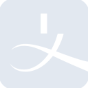
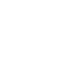

# alipay

[← Back to main README](../../README.md)

<table><tr>
  <td></td>
  <td></td>
  <td></td>
</tr></table>

## 16 px

### black
```
https://georgegach.github.io/compatible-icons/simple-icons/compat/alipay/16/black.png
```

### slate
```
https://georgegach.github.io/compatible-icons/simple-icons/compat/alipay/16/slate.png
```

### white
```
https://georgegach.github.io/compatible-icons/simple-icons/compat/alipay/16/white.png
```

## 64 px

### black
```
https://georgegach.github.io/compatible-icons/simple-icons/compat/alipay/64/black.png
```

### slate
```
https://georgegach.github.io/compatible-icons/simple-icons/compat/alipay/64/slate.png
```

### white
```
https://georgegach.github.io/compatible-icons/simple-icons/compat/alipay/64/white.png
```

## 128 px

### black
```
https://georgegach.github.io/compatible-icons/simple-icons/compat/alipay/128/black.png
```

### slate
```
https://georgegach.github.io/compatible-icons/simple-icons/compat/alipay/128/slate.png
```

### white
```
https://georgegach.github.io/compatible-icons/simple-icons/compat/alipay/128/white.png
```

## 512 px

### black
```
https://georgegach.github.io/compatible-icons/simple-icons/compat/alipay/512/black.png
```

### slate
```
https://georgegach.github.io/compatible-icons/simple-icons/compat/alipay/512/slate.png
```

### white
```
https://georgegach.github.io/compatible-icons/simple-icons/compat/alipay/512/white.png
```

## 1024 px

### black
```
https://georgegach.github.io/compatible-icons/simple-icons/compat/alipay/1024/black.png
```

### slate
```
https://georgegach.github.io/compatible-icons/simple-icons/compat/alipay/1024/slate.png
```

### white
```
https://georgegach.github.io/compatible-icons/simple-icons/compat/alipay/1024/white.png
```

## 16 px in base64

### black
```
data:image/png;base64,iVBORw0KGgoAAAANSUhEUgAAABAAAAAQCAYAAAAf8/9hAAAABmJLR0QA/wD/AP+gvaeTAAABKklEQVQ4jZXSOy+EURAG4GfXCiFxSSRL4/ITlFRqhVJJIRT+gErjr6hUKiWd+AGiIBTu90XiW3ZXQrGz8dmsL0xycs6Zd96ZOe8cWMI5Kvj846oEZxHO/kFsXmd59PrddrCbgffmUcgI2MR2Bl7IZ4BQRZIV0Fy9hsc4dwTeEb4aciimCbmo0BX3Mp5S+EfsfVjBDKZTeFkkaKh6pz6eCzyn/CfoxrGfU0gaT3jDDe7xjmvsYwST2MM8hlrpkKAU1dPZSzjAXMQtxD0dlxRCh/4Wift9i7oR5AkMYxlTGEx3cJPKXMMpZrEVYjV86xiLIsXGFAR4GXoc4iHaHkV7U3dXOMJqDi/oCeBW/fPkMaD+B7KsVGhKUMwIbmVJG14xjk60/ZFYVR/12hdTk3FhrdldCAAAAABJRU5ErkJggg==
```

### slate
```
data:image/png;base64,iVBORw0KGgoAAAANSUhEUgAAABAAAAAQCAYAAAAf8/9hAAAABmJLR0QA/wD/AP+gvaeTAAABn0lEQVQ4jY2RsW4TURREzzxv4iYiiURwUoBDxTdABQ0FBb+QIhIFPTQoFKHiNxANFV8ABRLiAxAFFBAvwd4Aho2EybIbv6HwSuAka/l2782dmTv3qtfP70jsIC4Ai8xXJeKrzK7SQZ4iLs5JnC7zOVgsN+LmJfLrRlwsB+Gk2SA+d4wvmnDhJMyaUCGUoNGsnpPuFdKw9m8rxoTQasseWqqwBXQaBQSVHcf187cU7mMTIQE/wNyWuPU/ZyqCYYRxLbdk6Bq6gmHbxVMFrpwdQRzZZDLfCBTYA9BbE7sBXQO9Kby4FewNpDN3UAiWEJexJmHMTak1iI6PuxsrT/ayfBu0B14D1v4JGAGrp9YrVoWriIfpIH8m6V2RHF9tV7qEw12k64h1pVk+kvQn2qXqDUs6tmPfjvdQsiXiDdACpi/p1Rg/3Fxf+fTx4FdHafazvrN6wBfsI4LejyPfW2IbsYlZODFeH/zBIeyol+WHgnOTfx3gWIKCrfOS26eiTZ/tRyJziGoBuwOqtTyTW9coSDzC3rcp52FMfCgR+1LY/QvNdLrkdbNp+gAAAABJRU5ErkJggg==
```

### white
```
data:image/png;base64,iVBORw0KGgoAAAANSUhEUgAAABAAAAAQCAYAAAAf8/9hAAAABmJLR0QA/wD/AP+gvaeTAAABPUlEQVQ4jZ3Sv2pUURAG8N9eVgIiRkHYWPgnVZ5BK2sLS0stgha+gJWNPoo2VlYptRMfQFJoF+OfqNkVi7sxWeGz2BEuV70EPzicM/N9M2fmnJHkbpLdJIc5Pg4r5s4oyTtc8H/YbbA6IHiBlwP8aoPxgOAZng/w42aAhCO0Q4L+7QtM67xS/Er5Fhhh0g0YJWlxsuw5vnX4n7WfwX3cwPUOP++30CJ1PoVLtaZ4go1/tXCAPXzFD3zC6wq+ile4jfP9BJK0SWZJvvSGZZZkO8mt0m2W3dW143qYs39kXvoWmCZ5im1cwUXcwzWsdSvY62ReJNlJcjPJVpJ5x/c4yXpVNfn9C7CDD/Ueb7CPTVzGiV51H/EWD0ZJvuN0EZ8th6fBOcsZGMJsjG6CyYD4b2gbPML7uvm4OKqYh78A99Ly0gVRsY8AAAAASUVORK5CYII=
```

