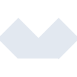

# alpinedotjs

[← Back to main README](../../README.md)





## 16 px

### black
```
https://georgegach.github.io/compatible-icons/simple-icons/alpinedotjs/16/black.png
```

### slate
```
https://georgegach.github.io/compatible-icons/simple-icons/alpinedotjs/16/slate.png
```

### white
```
https://georgegach.github.io/compatible-icons/simple-icons/alpinedotjs/16/white.png
```

## 64 px

### black
```
https://georgegach.github.io/compatible-icons/simple-icons/alpinedotjs/64/black.png
```

### slate
```
https://georgegach.github.io/compatible-icons/simple-icons/alpinedotjs/64/slate.png
```

### white
```
https://georgegach.github.io/compatible-icons/simple-icons/alpinedotjs/64/white.png
```

## 128 px

### black
```
https://georgegach.github.io/compatible-icons/simple-icons/alpinedotjs/128/black.png
```

### slate
```
https://georgegach.github.io/compatible-icons/simple-icons/alpinedotjs/128/slate.png
```

### white
```
https://georgegach.github.io/compatible-icons/simple-icons/alpinedotjs/128/white.png
```

## 512 px

### black
```
https://georgegach.github.io/compatible-icons/simple-icons/alpinedotjs/512/black.png
```

### slate
```
https://georgegach.github.io/compatible-icons/simple-icons/alpinedotjs/512/slate.png
```

### white
```
https://georgegach.github.io/compatible-icons/simple-icons/alpinedotjs/512/white.png
```

## 1024 px

### black
```
https://georgegach.github.io/compatible-icons/simple-icons/alpinedotjs/1024/black.png
```

### slate
```
https://georgegach.github.io/compatible-icons/simple-icons/alpinedotjs/1024/slate.png
```

### white
```
https://georgegach.github.io/compatible-icons/simple-icons/alpinedotjs/1024/white.png
```

## 16 px in base64

### black
```
data:image/png;base64,iVBORw0KGgoAAAANSUhEUgAAABAAAAAQCAYAAAAf8/9hAAAABmJLR0QA/wD/AP+gvaeTAAAAoklEQVQ4jd3RPQrCUBAE4E8RQREr7VQ8ir0HFfy7gScJpLC1VEGwiM17Ep9JtNWFYYudWWZ2+bsao90wbwVOZc2QYxuIVeJN4EzT4RQZClyxT5y0sMI5cHLM43BSEkdcsAtLUnGRLknFEVesa8QRWafuIOhjiS5uDbzKCGmce1MEXo/4zZKnuPyuGQ7o1TgdBByxCP3t30OMmvIGF6cPnF+qB/YLRLw8J6G3AAAAAElFTkSuQmCC
```

### slate
```
data:image/png;base64,iVBORw0KGgoAAAANSUhEUgAAABAAAAAQCAYAAAAf8/9hAAAABmJLR0QA/wD/AP+gvaeTAAABM0lEQVQ4jd2QT0sCYRjEf8+7YiVWFAkZGgl9kAqCIq99xQ5Bxw4dKjr2GQysTV0lVhMzjHZ3OvRvK+1ec3zemXlnBv4XgmBQkOQmvUuyIBgU0rcPcqvVXX12yaXf7h9KsnHiRrt/+GzxZbMZlr8YNJthOXLuFKlisHvb6R+lk0iym07/AGc7QCVy7qIe9NYArNEIS0nGOwfWUx8OTZyUluf3Ad10egcerirIp0zrCWyZ376vfRO/MXg0x7GMmIQqKXEKV5lJg2HkJPYMskIj+DHL6wYuijeBqwk2OYknzKbN7OFLQKkeS9sGryPGnnc2tgpgMJQxZTCSyL/3rxQXrj9ytVrd1cjcKaaZcSaCvGF5zPxMHG+srCz6b+afqIXhXDbylibUASCbeINicfbuN84fwwvBc49pkrzyGQAAAABJRU5ErkJggg==
```

### white
```
data:image/png;base64,iVBORw0KGgoAAAANSUhEUgAAABAAAAAQCAYAAAAf8/9hAAAABmJLR0QA/wD/AP+gvaeTAAAAuUlEQVQ4jd2Qu2oCURRF1xEREsRKOxULPyR9/E8LH52lX2KYwjalJgSCLAvvyChz1VY3nGo/OHvDa0HtqY0bfKi9HDlUC3WuRsY8S5rBNTlQN57woy6rnyTzVN0lTaGOSrJfMZfYqwu1UWMuUaijUDfAuKbVL7ACDsAEaNdovpq5wYB34BNoAX9ZVabCdZ3/XIW6ER8JOZuj8skQWANvmWfb6bbAR0RsLwJSSAfo3tgFYBcR33c0z4QjR3gU7aiN30oAAAAASUVORK5CYII=
```

