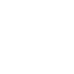

# ankermake

[← Back to main README](../../README.md)




## 16 px

### black
```
https://georgegach.github.io/compatible-icons/simple-icons/ankermake/16/black.png
```

### slate
```
https://georgegach.github.io/compatible-icons/simple-icons/ankermake/16/slate.png
```

### white
```
https://georgegach.github.io/compatible-icons/simple-icons/ankermake/16/white.png
```

## 64 px

### black
```
https://georgegach.github.io/compatible-icons/simple-icons/ankermake/64/black.png
```

### slate
```
https://georgegach.github.io/compatible-icons/simple-icons/ankermake/64/slate.png
```

### white
```
https://georgegach.github.io/compatible-icons/simple-icons/ankermake/64/white.png
```

## 128 px

### black
```
https://georgegach.github.io/compatible-icons/simple-icons/ankermake/128/black.png
```

### slate
```
https://georgegach.github.io/compatible-icons/simple-icons/ankermake/128/slate.png
```

### white
```
https://georgegach.github.io/compatible-icons/simple-icons/ankermake/128/white.png
```

## 512 px

### black
```
https://georgegach.github.io/compatible-icons/simple-icons/ankermake/512/black.png
```

### slate
```
https://georgegach.github.io/compatible-icons/simple-icons/ankermake/512/slate.png
```

### white
```
https://georgegach.github.io/compatible-icons/simple-icons/ankermake/512/white.png
```

## 1024 px

### black
```
https://georgegach.github.io/compatible-icons/simple-icons/ankermake/1024/black.png
```

### slate
```
https://georgegach.github.io/compatible-icons/simple-icons/ankermake/1024/slate.png
```

### white
```
https://georgegach.github.io/compatible-icons/simple-icons/ankermake/1024/white.png
```

## 16 px in base64

### black
```
data:image/png;base64,iVBORw0KGgoAAAANSUhEUgAAABAAAAAQCAYAAAAf8/9hAAAABmJLR0QA/wD/AP+gvaeTAAAA4klEQVQ4jaXSu0oDQRSA4c8QVwJapfIJxEps0thIGhVR8FntbbTJAyy+gMZKwQuokRgLz2jYGyMeGHbnzPn/mTm7cI9bHMmPMW6CtYhxh+MMeD82TNzPS46kCtcEXZImuFHQJGmDWwVJMsYepm11/Y77FjiN51pb0Uo6RsRzFL9ggh30UGIX63jHRgKqJ5jiOsQjbEZ+gSt8YhtbCehVBHOc4QnDpfwQj7E2r15juSll5FZxgTfMcOm3D6WMJn7gEOcxPwlRLbq+wgwHHeuo9+DP8W9BHw94jXmRwRS+f2sYfAHQzVpr6ondBQAAAABJRU5ErkJggg==
```

### slate
```
data:image/png;base64,iVBORw0KGgoAAAANSUhEUgAAABAAAAAQCAYAAAAf8/9hAAAABmJLR0QA/wD/AP+gvaeTAAABU0lEQVQ4jaWRMUubYRSFn3MTI4Eag0JJLIKLlJKpIJ2lHVooFDJ06tj2X4mD0qk/wFEKddDF0TFBqrFQJW0CbSJ5j4uBiN+XKt7t3nvOw4Gj4073HPlfcnxaqc/vcIdp/+i+jCJbmHIgFkBLkjfbnYu3/zO3Or31woy2gSeIhRg/BDUpNqZBWp3eejHSF9tL41tMCqZBssy3AHmQPDOAjs+6zoprODN80CgGKoy+gupZumLW8TpJCfxOkUqg2TzdDYBxDzQr01ewj+M9chgOZZ5bPAIPhOayE1inIY6SLCdeSNQBJBnS90ApWc8QT8eWmy3Io+VatRmKP1IsTkRbtPm9XKs2JY8mPbdaAPj5uPLRpD3QAHyJOBj2q5+ztJmANemyf159A/4G2u39qrxaXdUgS5vbQqOhIfA67z81wX3mwYAi5gL57/VeuoOnBD4BwCpfASYSh4OyTxmoAAAAAElFTkSuQmCC
```

### white
```
data:image/png;base64,iVBORw0KGgoAAAANSUhEUgAAABAAAAAQCAYAAAAf8/9hAAAABmJLR0QA/wD/AP+gvaeTAAAA9ElEQVQ4jaWRvUoDURBGz4S4QdAqlU8gVmJjYyNpVETBZ7W30SYPsPgCJlYR/AE1Eo/NXVzXvcmK0+zemTnnLt+iztSJekLHUkfqnTrD77pXTzvAh+lCVeuClZIm3CbIStrgnOCXJAcvE1SSkXqgTnNL/SV5FcB5eg5yS6FaOz+n5RdgDOwCPaAE9oAN4B3YrIDmF0yBWyCAfWCrigG4AT6BHWC7AnoNwSIiLoAnYFjrD4HHNFv8IBqZlKm3pl6pb+pcvVYHaVauDDEiPtRj4DK1ziJi3rab/QsJOMrNq2pm8Of6t6APPACv6Vx0YApgkt7XvwCuo0+Tue7B5QAAAABJRU5ErkJggg==
```

