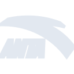
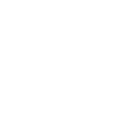

# anta

[← Back to main README](../../README.md)





## 16 px

### black
```
https://georgegach.github.io/compatible-icons/simple-icons/anta/16/black.png
```

### slate
```
https://georgegach.github.io/compatible-icons/simple-icons/anta/16/slate.png
```

### white
```
https://georgegach.github.io/compatible-icons/simple-icons/anta/16/white.png
```

## 64 px

### black
```
https://georgegach.github.io/compatible-icons/simple-icons/anta/64/black.png
```

### slate
```
https://georgegach.github.io/compatible-icons/simple-icons/anta/64/slate.png
```

### white
```
https://georgegach.github.io/compatible-icons/simple-icons/anta/64/white.png
```

## 128 px

### black
```
https://georgegach.github.io/compatible-icons/simple-icons/anta/128/black.png
```

### slate
```
https://georgegach.github.io/compatible-icons/simple-icons/anta/128/slate.png
```

### white
```
https://georgegach.github.io/compatible-icons/simple-icons/anta/128/white.png
```

## 512 px

### black
```
https://georgegach.github.io/compatible-icons/simple-icons/anta/512/black.png
```

### slate
```
https://georgegach.github.io/compatible-icons/simple-icons/anta/512/slate.png
```

### white
```
https://georgegach.github.io/compatible-icons/simple-icons/anta/512/white.png
```

## 1024 px

### black
```
https://georgegach.github.io/compatible-icons/simple-icons/anta/1024/black.png
```

### slate
```
https://georgegach.github.io/compatible-icons/simple-icons/anta/1024/slate.png
```

### white
```
https://georgegach.github.io/compatible-icons/simple-icons/anta/1024/white.png
```

## 16 px in base64

### black
```
data:image/png;base64,iVBORw0KGgoAAAANSUhEUgAAABAAAAAQCAYAAAAf8/9hAAAABmJLR0QA/wD/AP+gvaeTAAABB0lEQVQ4jdXSO0pDURAG4C8PwaDRTixSqGQB1mLjClyAlb2NG0hjlZ2IlYWFlVaKpFBQsVBBxcJXBDW+g8TizoVwiWCbgcOcx8z8//xn6HvLhR/HLGYwgVEM4AWXaGAX572KLOMa3+j8sX7QjAKrmOxmsI1hFDGCEsZQ6AL5iPfXACqhiodejCpYwh5uMkwesRFt/suqWMddpp0zTKUtwCIWcIxyJBaQD/rlaC+9hyvMwSDug+4FWpHUwhPecIQhbIYOKZsTqMXhK4I/cZoJPAzUPNaieAe3JH/dDtT32B9I1G6Hb3TpksNWANSK2A+K05J5qGAHz1GwKRmm1DqYRx0rWdX70H4BuGtVOADqtfQAAAAASUVORK5CYII=
```

### slate
```
data:image/png;base64,iVBORw0KGgoAAAANSUhEUgAAABAAAAAQCAYAAAAf8/9hAAAABmJLR0QA/wD/AP+gvaeTAAABlUlEQVQ4jdWSMWuTYRSFn/N++UJTTb9aNPkCqa2QH+Co0sVJcNHNQRd3F0UEZyfB2X/h6uqkgoqLgoskMQlYGjWNJCbU5D0OsUUpuvdZL5x7zrkXjjwCaO2M8pTZVrQugDcVQxaZp0Hhu0XbkVch4cV6Jft4SKC3PbgdrTsEVbFT76v+TZQZWOyC3kR8fzNfbQGosz14BjouUYhmBVwSVEDJHwIToIAZGfYIlIoxadRq5f6hZb3e17qLhatE37DZQOT7M9vfgJcRbp2pnWgfdPAvujvDhiOPjM8vXIFEdKTpwKWN6mpTAJ3Pg5uSroPe2y4T3AASEQJ4YlO2WZFoAAmA8Seji2q1vJSUhh2kOfYUc9KiEPDMaC5IDc0i03N7XnqC2AKO/Tb5IYTl3XvAKcwaUEGkkrpexMsMy4DzPB+v59lliaeC0cIFayFYd4GZcVx0osSOY6OiYGb4CUwX+RXrlewa8FowRn5cMLwFv5PCWdldi3qwnhsPUfgRiF8caR88juR+v39lMis+PF3NHvzvCEeEX8+gsKAPMJMMAAAAAElFTkSuQmCC
```

### white
```
data:image/png;base64,iVBORw0KGgoAAAANSUhEUgAAABAAAAAQCAYAAAAf8/9hAAAABmJLR0QA/wD/AP+gvaeTAAABKUlEQVQ4jdWSsS4DUBSGv1ttQiiLiKFDSR/AKGLxBB7AZLd4gS4mbyISicHMRKQDCRIJjaADogZVbbWaz9BLmiLpyFnuzX9uzvn+cy78+wgA6iQwD8wBWWAMSAEV4BooAAchhOK3CuqqWlKb/h5ttawW1Q116otA3QNGgCQwCgwBE8BAV596zFeBZnyTCyE8/kSUUVfUQ/Wuh+RJ3VGzfQ1Izanb6kOPnUt1unuIy8AScAakgVy0kIj46WjvUwe4ARaCOgjcAm2gAYxHv+9RSwFXwCywRWdbw7HIOWo+or2pr2pDvVCrXdgnkTShbqovUb9Hragtta7W4v04rrUVz0LXXIK6Gxvkk8ARcArMACUgA+wDz0ANKNP5TACEEFQXgXVgra9t/O34AKzhFYm0pGZzAAAAAElFTkSuQmCC
```

