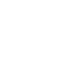

# apachecassandra

[← Back to main README](../../README.md)

<table><tr>
  <td></td>
  <td></td>
  <td></td>
</tr></table>

## 16 px

### black
```
https://georgegach.github.io/compatible-icons/simple-icons/compat/apachecassandra/16/black.png
```

### slate
```
https://georgegach.github.io/compatible-icons/simple-icons/compat/apachecassandra/16/slate.png
```

### white
```
https://georgegach.github.io/compatible-icons/simple-icons/compat/apachecassandra/16/white.png
```

## 64 px

### black
```
https://georgegach.github.io/compatible-icons/simple-icons/compat/apachecassandra/64/black.png
```

### slate
```
https://georgegach.github.io/compatible-icons/simple-icons/compat/apachecassandra/64/slate.png
```

### white
```
https://georgegach.github.io/compatible-icons/simple-icons/compat/apachecassandra/64/white.png
```

## 128 px

### black
```
https://georgegach.github.io/compatible-icons/simple-icons/compat/apachecassandra/128/black.png
```

### slate
```
https://georgegach.github.io/compatible-icons/simple-icons/compat/apachecassandra/128/slate.png
```

### white
```
https://georgegach.github.io/compatible-icons/simple-icons/compat/apachecassandra/128/white.png
```

## 512 px

### black
```
https://georgegach.github.io/compatible-icons/simple-icons/compat/apachecassandra/512/black.png
```

### slate
```
https://georgegach.github.io/compatible-icons/simple-icons/compat/apachecassandra/512/slate.png
```

### white
```
https://georgegach.github.io/compatible-icons/simple-icons/compat/apachecassandra/512/white.png
```

## 1024 px

### black
```
https://georgegach.github.io/compatible-icons/simple-icons/compat/apachecassandra/1024/black.png
```

### slate
```
https://georgegach.github.io/compatible-icons/simple-icons/compat/apachecassandra/1024/slate.png
```

### white
```
https://georgegach.github.io/compatible-icons/simple-icons/compat/apachecassandra/1024/white.png
```

## 16 px in base64

### black
```
data:image/png;base64,iVBORw0KGgoAAAANSUhEUgAAABAAAAAQCAYAAAAf8/9hAAAABmJLR0QA/wD/AP+gvaeTAAAA8klEQVQ4jdXRPy+DURTH8Y+qsvoTiUEiYRADicHAVgNDR96Jd2CzW0zegM3Yl8DCYBcsIrTR0uKp4TlPciMt1p7k5Obce77n98u5DH2M/vFewkycc5hHE1XcIusHVbCLOjp4Qxu9gFv4wDn2foJHeI7mNLOAirobd08FvI67mJ4liu94CaCHTzTwikssQQ0PuImmxwRIs3DWCYFDKOM4ijVMYbLPXr4wEQ7a4WyW/Bea2MAyVqLOomks4G7AFfn2T3EAI4nKtvzLVrGPRdyH0jiuY2gdZ7GDgbGFE2ziChfYiX1N/wamUQ6HC+Gm9F9wyOIbWdxK+hOeDs0AAAAASUVORK5CYII=
```

### slate
```
data:image/png;base64,iVBORw0KGgoAAAANSUhEUgAAABAAAAAQCAYAAAAf8/9hAAAABmJLR0QA/wD/AP+gvaeTAAABfklEQVQ4jdWSMWtTcRTFf+f+X9omaJO0+gRp6ODkolDcRAddXcXRSfwCbk6iX0Ho2C/gIiIIgqOTk3QoFDSD8lSKSRpNavL+x8VBK9W5Z733nHO558Cxh/41tB1VNV5NaTIZzxurRfhkPenuptbw6uey/eqSNPtLYHvbC8unR9dy9j3QFdkZ2aCmYN+QBAvZfgHa0u/EEyvDRwruYDqHj5GobQoAw0xQ2P4qgI9fBht19lOsrqEpmBqawAFiimkBDUm14Rs5J8NOpLgV/Wp0Y177Wbb2DS3BnqXil/Mipg00LAa2k7OXkCKleN4r27tFkB9beghclFmx1AUf/nRtaylgnuXvoKntEiAi4oHMhjLnDSV4bDMFhkCNmBkfQJ5lLKHKZrN3pnP3jxj71eC64FTOXIjgJvY5SR+MSvCixFvMNOf8EuLJ+tnOmyN70P80uhzOt0OxVTtv2v6hiPt23Ujz4vXa2vLef4tkuwDq99VgPYVSr2y/k5SP2j/G+Al20bmAL4IldAAAAABJRU5ErkJggg==
```

### white
```
data:image/png;base64,iVBORw0KGgoAAAANSUhEUgAAABAAAAAQCAYAAAAf8/9hAAAABmJLR0QA/wD/AP+gvaeTAAABE0lEQVQ4jd2RvS4DUBiGn1OtNiIRv6uBRSIkRkYJho5cg+sQm10i7sHWmHoJurBKLCSWRktVq9XH4GvS0Np5l5O8+Z73O+c98L+lZtR5dVJdVFfVgrqj5kZB4+qeWlbb6pva9EvP6qvaUUvq/nfwRH3yp3oB9fUeXrUPb6j3kd4b2NhSawGodtW62lAr6nJGLQIl4AWYAKpANi6WB6aAHFADxoACkAEuU0q3WeAUOAbWgRlgekg1HwF2gSbQAhaIpCNgA1gJsxED9QA7QDvOBDwCZymlQ8Lo97ANzAFrwAGwBDxEaB64ieAycJFSqgz//K+wLfVc3VSv1St1Vy2qs4Oz6ZeQbDxhMcq7Syn1Rm79u/oE1p73AsDGlFcAAAAASUVORK5CYII=
```

