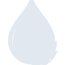

# apachenifi

[← Back to main README](../../README.md)

<table><tr>
  <td></td>
  <td></td>
  <td></td>
</tr></table>

## 16 px

### black
```
https://georgegach.github.io/compatible-icons/simple-icons/compat/apachenifi/16/black.png
```

### slate
```
https://georgegach.github.io/compatible-icons/simple-icons/compat/apachenifi/16/slate.png
```

### white
```
https://georgegach.github.io/compatible-icons/simple-icons/compat/apachenifi/16/white.png
```

## 64 px

### black
```
https://georgegach.github.io/compatible-icons/simple-icons/compat/apachenifi/64/black.png
```

### slate
```
https://georgegach.github.io/compatible-icons/simple-icons/compat/apachenifi/64/slate.png
```

### white
```
https://georgegach.github.io/compatible-icons/simple-icons/compat/apachenifi/64/white.png
```

## 128 px

### black
```
https://georgegach.github.io/compatible-icons/simple-icons/compat/apachenifi/128/black.png
```

### slate
```
https://georgegach.github.io/compatible-icons/simple-icons/compat/apachenifi/128/slate.png
```

### white
```
https://georgegach.github.io/compatible-icons/simple-icons/compat/apachenifi/128/white.png
```

## 512 px

### black
```
https://georgegach.github.io/compatible-icons/simple-icons/compat/apachenifi/512/black.png
```

### slate
```
https://georgegach.github.io/compatible-icons/simple-icons/compat/apachenifi/512/slate.png
```

### white
```
https://georgegach.github.io/compatible-icons/simple-icons/compat/apachenifi/512/white.png
```

## 1024 px

### black
```
https://georgegach.github.io/compatible-icons/simple-icons/compat/apachenifi/1024/black.png
```

### slate
```
https://georgegach.github.io/compatible-icons/simple-icons/compat/apachenifi/1024/slate.png
```

### white
```
https://georgegach.github.io/compatible-icons/simple-icons/compat/apachenifi/1024/white.png
```

## 16 px in base64

### black
```
data:image/png;base64,iVBORw0KGgoAAAANSUhEUgAAABAAAAAQCAYAAAAf8/9hAAAABmJLR0QA/wD/AP+gvaeTAAABC0lEQVQ4jZXTS0pDQRQE0JNEEY2o4Gci2YroMtxC9uASxA04dQuOMlLQgUtQEX8YIWI0GBU/7aD7SRLsJBY0D5pbdatv3VeRxyyusITGkLosdvGBa9T+S17HO0I6JyiPS17EAx57BF6wPa7AsWg9DJx7bIwi11Px0x8CAaeYyZGr6OA5Qw7J2U5OYAufaA8RCLjIubhEawQ54A2bBamIpoRVcfKjMIW1wcsyvnCW6XqXntZGNzktwUQS+EYTy5muk+lbEQddpNS3XXuYEzewQDMVVzAv/h8r4rCnB7tUcaM/xtsk0EnPCMntfsapmhhTt0egEHsVt/EACzkB4lzqOMJ5ctQSl+hQTOsXP7S+as+uVg6sAAAAAElFTkSuQmCC
```

### slate
```
data:image/png;base64,iVBORw0KGgoAAAANSUhEUgAAABAAAAAQCAYAAAAf8/9hAAAABmJLR0QA/wD/AP+gvaeTAAABlElEQVQ4jZWQP24TcRCFv/fbheDYsiPlD0awEjUngAbBCaBBQhA6REHJDSiQQDTU9JRQcQQKbkESx/ZiFGwnInaCdx9FiBM7uxFM+ebNN28GSqrX69W2uoN08/vgdZkHIJQ1xlx6J7Ec4HG7vZP8F+Dbj/4dsvyJIba5NgnRJ9uF3jPi9vbucpSFj4j9Y034RivdfftPgDz2Z+Q6sDQVpUUFr290+3fPBWx1h8/BN23vzxtt1oL0vtPpLBYC0jStEvxGeE+oXhRXcH0Sqq8KAWNVXshUcpQXDQMYYvD90ymmgCj3U1sDQaMMcATRlQNX780AbAtx1XL/vOGjM7wQQnZ7PoFyW9gqiZ4aDy0PMaOg8MB/vQFAUq5AKrFauNVckIRMJGnP8FOSZ35g9AFUBx2c2RyIMA1QzXgNM2m1WpUZwILHL4G25MOTe5UDUu4YSKfcwEaSJKMZQLPZ/BVl2S3n7CBGpyB1pJrNkqEn6Ut20Y9O+vMPs+PNTv9ZFEfrti9LrGIdIjeMvir6/TBZWWkf+/8Az460o5YRUbAAAAAASUVORK5CYII=
```

### white
```
data:image/png;base64,iVBORw0KGgoAAAANSUhEUgAAABAAAAAQCAYAAAAf8/9hAAAABmJLR0QA/wD/AP+gvaeTAAABI0lEQVQ4jZWSQS5DYRSFv7+KlAaJ1KTpyD6EHZjagqEdmJmIDZjaCAkDSxBBRFJJaarRqko/AxdP9VWdycv7c8+5554cyIFaVuvqXt7MWKiHal+9VWv/Ja+rPb9xrhYmJS+rD2ozI/Cs7k8qcBbWh3GvbvxF3o7h1ggB1Qt1Lo88r7bVpxyy4ewgy8sGswOUgMEYk0Vgc6QL9UZtjNn+iRd164cDNQFVoDk2pA/MAmufPykECkAfuAJWR5DqcR7ADNABKimlj3KklAYxVMnZOh3fKaANPKaU/DohcAQsAL2hza0gLgJlYAV4U0vDArvAHfCaeRvEmcUQAxC4Til1f/lUa+qV2onE7zLpd6ONx+pSzqmgFqORp+plFKsRJTpRq9n5d2q2VpHxOtKBAAAAAElFTkSuQmCC
```

