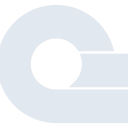

# appwrite

[← Back to main README](../../README.md)

<table><tr>
  <td></td>
  <td></td>
  <td></td>
</tr></table>

## 16 px

### black
```
https://georgegach.github.io/compatible-icons/simple-icons/compat/appwrite/16/black.png
```

### slate
```
https://georgegach.github.io/compatible-icons/simple-icons/compat/appwrite/16/slate.png
```

### white
```
https://georgegach.github.io/compatible-icons/simple-icons/compat/appwrite/16/white.png
```

## 64 px

### black
```
https://georgegach.github.io/compatible-icons/simple-icons/compat/appwrite/64/black.png
```

### slate
```
https://georgegach.github.io/compatible-icons/simple-icons/compat/appwrite/64/slate.png
```

### white
```
https://georgegach.github.io/compatible-icons/simple-icons/compat/appwrite/64/white.png
```

## 128 px

### black
```
https://georgegach.github.io/compatible-icons/simple-icons/compat/appwrite/128/black.png
```

### slate
```
https://georgegach.github.io/compatible-icons/simple-icons/compat/appwrite/128/slate.png
```

### white
```
https://georgegach.github.io/compatible-icons/simple-icons/compat/appwrite/128/white.png
```

## 512 px

### black
```
https://georgegach.github.io/compatible-icons/simple-icons/compat/appwrite/512/black.png
```

### slate
```
https://georgegach.github.io/compatible-icons/simple-icons/compat/appwrite/512/slate.png
```

### white
```
https://georgegach.github.io/compatible-icons/simple-icons/compat/appwrite/512/white.png
```

## 1024 px

### black
```
https://georgegach.github.io/compatible-icons/simple-icons/compat/appwrite/1024/black.png
```

### slate
```
https://georgegach.github.io/compatible-icons/simple-icons/compat/appwrite/1024/slate.png
```

### white
```
https://georgegach.github.io/compatible-icons/simple-icons/compat/appwrite/1024/white.png
```

## 16 px in base64

### black
```
data:image/png;base64,iVBORw0KGgoAAAANSUhEUgAAABAAAAAQCAYAAAAf8/9hAAAABmJLR0QA/wD/AP+gvaeTAAABG0lEQVQ4jY3Tu0qDQRAF4O+PUYhpBC8IYiXBWrC2sbb3CXwFS8HOXmytfQPBwgcQxcYLxCtWAaOVJCRgLP4VNusaHTjF7p5zZnZ2tvAzqljBMgrc4wz9DHcoxrGHB7QxCHjHI/ZR+008i0t0I2GKHq6wkIongvhzhDjGNeqxwW4m8ytucYNWctbHQWzQTAjPWIvOV0NfYk4rVK4Ii7lAfsMmTpJrNpQNroT1AEehUv3IuZk2KIonfCToVhNSJVQ1yBh0MJluVpTv/B1T2MiI1zGdK6vAHZaivRds4TisZ3AakvUSfb3ADrYNT1k7VNbJZY1ignL2L/x/kFIQ7ndu9ChnMRYMOjhUfqjFUE0t9Ghk5AgV5XduYP4vgy/spXGWK5Nb0wAAAABJRU5ErkJggg==
```

### slate
```
data:image/png;base64,iVBORw0KGgoAAAANSUhEUgAAABAAAAAQCAYAAAAf8/9hAAAABmJLR0QA/wD/AP+gvaeTAAABvklEQVQ4jZWTzWpTURSFv3USW3+oDW3aBOEiIsE6EQv6BKITcaIIinPfQJyITpyIT+IDCEIHzlvBUVCxok1qc1NTc9Mq1eZnObApuWkkuEZn77PPt9c57COGZDtbjbcXFTgnUAd9asxPrVyS2sO1AOov3thH5uLWU4nbmGnEzH5FgkmwX6rz40EURbuHALXazlxHnaUeYUF4clQni7bQR2Xa16J8/usBoFz2xNRssgy6MOjoXzK8m+TX5WKx+BMgTOeTRxAWUoftLYkPgveWNgcBAUp7Ovr8IDbhLinbrpDJ3owKuYWomDuvrq8DnwccZG1ulcueANBanNQF8/v73y3unC7klga7VjdbJfd6z/4a6HPCC8sNVetJ2yYLILEaFXKlUXevxs0vhrl0NmSyqQcywbYk+TAi7IKPp3Mm2DT7oSC30di5MXx0PU6ugGdHOVMlbq6Czg5Aq13r/plT068ANja28+3QfY0JIWgv7VgntFZvPpH1EDg2wN0CN8GpqRtWz56Q7ex63Fq2dBE8dpCGFSR11A1XEW9Bv/8XkPpMxW/J416PexBO2p6Rxo/2oQLboVJrLSqoZCiOA/wBN824TmV/E4UAAAAASUVORK5CYII=
```

### white
```
data:image/png;base64,iVBORw0KGgoAAAANSUhEUgAAABAAAAAQCAYAAAAf8/9hAAAABmJLR0QA/wD/AP+gvaeTAAABNklEQVQ4jZWTvUpcURSFv30dB3SagI4IljLYKqROIyntfQJfwVLQyl58B99AsLA3RWw0gRijWA3MaKnOiF+Ke9XD8Y4/qztr77XXPod1ggxqA1gCFoAA/gI/ImKY9+bCcXVbPVf7vuBG/afuqBOjxG31WL1zNAbqiTqXi5uV+PENcYpTtZUO2Kxx7qm/1V9qN6sN1d10wJ+s4VL9ltS/Wr5Liq7aBAi1C8xU/dfAakQcZNfsANtA8UQBe0Av1CHQqApnEdEZ8dAXQDujxxoZUagREdbMuAUmc7IAbpLzF2Clxn0ZmKrbLNQzYD7hroC1iNivxNPAYWU2yPStUDeAdSBNWb/a7LbONUEzLLN/BCxSZv9TKCLiAfgO/ATuPzvgGZafaasKTe+j0X61slpQfucOMPue8X+K12YlvqBtwQAAAABJRU5ErkJggg==
```

