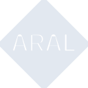
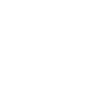

# aral

[← Back to main README](../../README.md)

<table><tr>
  <td></td>
  <td></td>
  <td></td>
</tr></table>

## 16 px

### black
```
https://georgegach.github.io/compatible-icons/simple-icons/compat/aral/16/black.png
```

### slate
```
https://georgegach.github.io/compatible-icons/simple-icons/compat/aral/16/slate.png
```

### white
```
https://georgegach.github.io/compatible-icons/simple-icons/compat/aral/16/white.png
```

## 64 px

### black
```
https://georgegach.github.io/compatible-icons/simple-icons/compat/aral/64/black.png
```

### slate
```
https://georgegach.github.io/compatible-icons/simple-icons/compat/aral/64/slate.png
```

### white
```
https://georgegach.github.io/compatible-icons/simple-icons/compat/aral/64/white.png
```

## 128 px

### black
```
https://georgegach.github.io/compatible-icons/simple-icons/compat/aral/128/black.png
```

### slate
```
https://georgegach.github.io/compatible-icons/simple-icons/compat/aral/128/slate.png
```

### white
```
https://georgegach.github.io/compatible-icons/simple-icons/compat/aral/128/white.png
```

## 512 px

### black
```
https://georgegach.github.io/compatible-icons/simple-icons/compat/aral/512/black.png
```

### slate
```
https://georgegach.github.io/compatible-icons/simple-icons/compat/aral/512/slate.png
```

### white
```
https://georgegach.github.io/compatible-icons/simple-icons/compat/aral/512/white.png
```

## 1024 px

### black
```
https://georgegach.github.io/compatible-icons/simple-icons/compat/aral/1024/black.png
```

### slate
```
https://georgegach.github.io/compatible-icons/simple-icons/compat/aral/1024/slate.png
```

### white
```
https://georgegach.github.io/compatible-icons/simple-icons/compat/aral/1024/white.png
```

## 16 px in base64

### black
```
data:image/png;base64,iVBORw0KGgoAAAANSUhEUgAAABAAAAAQCAYAAAAf8/9hAAAABmJLR0QA/wD/AP+gvaeTAAAA0klEQVQ4jZ3TsUoDQRCA4S8xQlKoAU2I5goFHyKlb+4DWIqFmEQbCxUbxQTUqM2sHJK9u7gwLCzz/zuzw5JfBW4ixhV5lfB3xAzH/4U3kuTgRpI6uFJSYI5VBlr92X8fthXwOYa4LNl38YQjXGGEN2zjBFOctcJ2GqWN8YBP7GGJQzzjCx94j3yYtkttvKIbydDHAtdxfoc2enhMUGrhIkrbxz22sBOyDgYBdfCCg5BPkmgUN9VNIMWtNZNoKlkLN5VUwnWSRnBOshGcVvk7F7mkH+L5bsX1M2AVAAAAAElFTkSuQmCC
```

### slate
```
data:image/png;base64,iVBORw0KGgoAAAANSUhEUgAAABAAAAAQCAYAAAAf8/9hAAAABmJLR0QA/wD/AP+gvaeTAAABNElEQVQ4jZWT3UoCURRG13ccwQoiSUrLIkN6gV4g6bG76OcVoosgSsgg1K4qSTgzXzc6ZM1k7ZsDm73W+WCfI0pqMHhpZ0nlHEBJPNlrNJ6K5rQE7s5a96l92mnV+0sFBfC8CiULgl/gUkku+ANcKAlf4CvEYQmU5ac5rEhnj+PxLoDym8WW7WuhA2OAdaERaAdnN4gmDu/IVaAD3CmJJ2EeWzCSdWwTJX0ITbGrEomlNhBEVkOkszRdx+Qi5CGtV0QN/DLrbDhoYnMrUbNC3yhgVoyGcyyEmPZAz+A9AAVtY60hpspYkbI6ZjXY+0hVYBLkKvJTiGlPAA/Dt2YlxksCR0s2MK9+avc6rXo/X+M/JDkM3x7SHyQL8A/BEskPuFBQIimESwWw+J1DTHvt9uagaO4Tt9m+zjc0Ln0AAAAASUVORK5CYII=
```

### white
```
data:image/png;base64,iVBORw0KGgoAAAANSUhEUgAAABAAAAAQCAYAAAAf8/9hAAAABmJLR0QA/wD/AP+gvaeTAAAA3ElEQVQ4jZ3TvUqDMRSH8V9rBR38AD+o9h0UvAhH79wLcBSH0lZdHFRcFBXUelwSeVHTxh4IgfB/HnJOCIWKiCYiRmkNSrl5cK5JRBwsCtdLZsDzJRVwWZLgy4iYFqDpj/17sJ2IaHCKXZwj29dxj31coI9nLOMQY5x0ImKEI0wwwC0+sIFX7OEBn3jHW8rDuNvq5AkrKQybeMEwnV+ji1XcZSi3cJautoUbLGEtyXrYSVAPj9hO8uM8xH5EDCteINfVXy9RK/kN/0NShisk8+EZknq4JWl/56aU+wLiF7qH6GYs2gAAAABJRU5ErkJggg==
```

