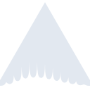
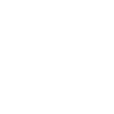

# ardour

[← Back to main README](../../README.md)

<table><tr>
  <td></td>
  <td></td>
  <td></td>
</tr></table>

## 16 px

### black
```
https://georgegach.github.io/compatible-icons/simple-icons/compat/ardour/16/black.png
```

### slate
```
https://georgegach.github.io/compatible-icons/simple-icons/compat/ardour/16/slate.png
```

### white
```
https://georgegach.github.io/compatible-icons/simple-icons/compat/ardour/16/white.png
```

## 64 px

### black
```
https://georgegach.github.io/compatible-icons/simple-icons/compat/ardour/64/black.png
```

### slate
```
https://georgegach.github.io/compatible-icons/simple-icons/compat/ardour/64/slate.png
```

### white
```
https://georgegach.github.io/compatible-icons/simple-icons/compat/ardour/64/white.png
```

## 128 px

### black
```
https://georgegach.github.io/compatible-icons/simple-icons/compat/ardour/128/black.png
```

### slate
```
https://georgegach.github.io/compatible-icons/simple-icons/compat/ardour/128/slate.png
```

### white
```
https://georgegach.github.io/compatible-icons/simple-icons/compat/ardour/128/white.png
```

## 512 px

### black
```
https://georgegach.github.io/compatible-icons/simple-icons/compat/ardour/512/black.png
```

### slate
```
https://georgegach.github.io/compatible-icons/simple-icons/compat/ardour/512/slate.png
```

### white
```
https://georgegach.github.io/compatible-icons/simple-icons/compat/ardour/512/white.png
```

## 1024 px

### black
```
https://georgegach.github.io/compatible-icons/simple-icons/compat/ardour/1024/black.png
```

### slate
```
https://georgegach.github.io/compatible-icons/simple-icons/compat/ardour/1024/slate.png
```

### white
```
https://georgegach.github.io/compatible-icons/simple-icons/compat/ardour/1024/white.png
```

## 16 px in base64

### black
```
data:image/png;base64,iVBORw0KGgoAAAANSUhEUgAAABAAAAAQCAYAAAAf8/9hAAAABmJLR0QA/wD/AP+gvaeTAAAA/0lEQVQ4jZ3SPUpDURQE4O8ZFcUgaQQRRJSsQgsrOwuXYe8+tFXchYWlNuIKQgSrEAn+RRBRVJTE4p7AE57PJANzLxxm5lzOuZRjKTg2ToNjYR0P6GJzVHOGBvrBBiZGCdjFSy7gNWpDoYpWzjxgC/PDBBziqyDgG0f/mVfRKTAPeIt6WcB5iXnAs7/MW9LK+njEE3rBfEA3tL9QQVOa9nuIetImOgUhzfCkA3vYCcMcJqWhTYcmy2mF5gOXUEM7urejww2u8IbPuJ/DlF9rrYJjbETHO1xgP+pdTEk/cREzMZuq9CeWRYdrbGOtYLgZZrGCA5yE/j5enVLGwALqP/9xYJCT+CW7AAAAAElFTkSuQmCC
```

### slate
```
data:image/png;base64,iVBORw0KGgoAAAANSUhEUgAAABAAAAAQCAYAAAAf8/9hAAAABmJLR0QA/wD/AP+gvaeTAAABn0lEQVQ4jZWRT2sTURTFf2dmTIJWrIZaaU2jWMGNxYWIuBGEbgT7MXSrfg3dlOKmiHs/izspbgR1moSYieZfAyYmmeMmBBuTAQ88eO/c88679x3IwHGzuXHcbG5kaaKsIuMzb6e7x8skwbJCrdF7ALqLdK/SbD/8LwPbGntyiLwGLnrCG9sLtQvJStJ+hrQ1I6RrlaT/dJFW80SSJCvDNHdkKM91Ff/OpTs3i8VeZgeDNPca2PznJXE1N9KrzBG+fe9cN37ihekoFMFeJeluLzUI7HdCWblfIfXhQoO40dlFuj09/gBagKdrBsNO3OjsnjKwHcrsCwqYgbGAixJ9UB30t0lRZt92ODOoJCcvgLJxDxEE6CwwsFUQ6XlgNDdKeXoHfW23V6OBPlq+hGkhlSSqWH2TbmFFEuNUjGQVwHkAQTzO+04UDTlA2sT+BXSxP6TW+yhMP6dmz+aRoSVzHztv0RCsG0rRkAPF9c5QIg4IXk6Ufiqvr3459Wm2qtVqYRSuXA4DnsvcQLplc0HiHLXaz1JGbEtRr5+sVZLu9h8hirw7zfJyqwAAAABJRU5ErkJggg==
```

### white
```
data:image/png;base64,iVBORw0KGgoAAAANSUhEUgAAABAAAAAQCAYAAAAf8/9hAAAABmJLR0QA/wD/AP+gvaeTAAABH0lEQVQ4jZ2RzUqCQRhGz5dC0j9BBYZJ5KJly2gTBG67DpfVrbipS+gGXNYFtAtxE4RBEpUFiWCheFo4kph9ag/MZnjPmeF9ICZqWk3HzcRGLaml/8IH6otaVw+nhSO17E/K6sw0goLaGBA01cKk8IJa9Xeq6tIkgnO1PULQUS/GwdtqbQTcz5OaixNcx8D9XP0F5+1VpvqqvqndcAZTV/PDcEKt2Nt2Kwx17TVRGyGpqAmAfrenQBZohLs54BNIAYtAe+jD2cAQqSvALbAKvAMZ4BFoAltAEugESQqYDZIHYC8JFIFNoAV8ADfAJXAHHANHQbwf4GdgIzxUjNSvYDsDKlEU3Q/tJwovrwMnwA6wCywD86iZkbWMibqm5r4Bqn5gNmpDZ5gAAAAASUVORK5CYII=
```

