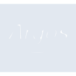
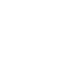

# argos

[← Back to main README](../../README.md)

<table><tr>
  <td></td>
  <td></td>
  <td></td>
</tr></table>

## 16 px

### black
```
https://georgegach.github.io/compatible-icons/simple-icons/compat/argos/16/black.png
```

### slate
```
https://georgegach.github.io/compatible-icons/simple-icons/compat/argos/16/slate.png
```

### white
```
https://georgegach.github.io/compatible-icons/simple-icons/compat/argos/16/white.png
```

## 64 px

### black
```
https://georgegach.github.io/compatible-icons/simple-icons/compat/argos/64/black.png
```

### slate
```
https://georgegach.github.io/compatible-icons/simple-icons/compat/argos/64/slate.png
```

### white
```
https://georgegach.github.io/compatible-icons/simple-icons/compat/argos/64/white.png
```

## 128 px

### black
```
https://georgegach.github.io/compatible-icons/simple-icons/compat/argos/128/black.png
```

### slate
```
https://georgegach.github.io/compatible-icons/simple-icons/compat/argos/128/slate.png
```

### white
```
https://georgegach.github.io/compatible-icons/simple-icons/compat/argos/128/white.png
```

## 512 px

### black
```
https://georgegach.github.io/compatible-icons/simple-icons/compat/argos/512/black.png
```

### slate
```
https://georgegach.github.io/compatible-icons/simple-icons/compat/argos/512/slate.png
```

### white
```
https://georgegach.github.io/compatible-icons/simple-icons/compat/argos/512/white.png
```

## 1024 px

### black
```
https://georgegach.github.io/compatible-icons/simple-icons/compat/argos/1024/black.png
```

### slate
```
https://georgegach.github.io/compatible-icons/simple-icons/compat/argos/1024/slate.png
```

### white
```
https://georgegach.github.io/compatible-icons/simple-icons/compat/argos/1024/white.png
```

## 16 px in base64

### black
```
data:image/png;base64,iVBORw0KGgoAAAANSUhEUgAAABAAAAAQCAYAAAAf8/9hAAAABmJLR0QA/wD/AP+gvaeTAAAA0ElEQVQ4jcXT20oDQRAE0LNxE03iJQhe/sP//x4VMbIxsrgbNQ+phUF80X1wYJimp6u6qpmpcGfEqvCK7o/4WYWvMQomY8A/EXR4+w1BXcSf6B1mUmFa5AerH1igwRJ1qeA5yQXuQz7FNsBdznXuNqWFBqeFjasA13iKsj73l3gcrA4W3rOP06nHKoo6HKFNwy1muC4J5mFscZvcA84SL7PhJfPofXsHTeLzFLXFfKoQrCL/AielAkkOaxLQLmdd1N4Udf7/JdYOUx31mUZ95z3lUTQa+gPACAAAAABJRU5ErkJggg==
```

### slate
```
data:image/png;base64,iVBORw0KGgoAAAANSUhEUgAAABAAAAAQCAYAAAAf8/9hAAAABmJLR0QA/wD/AP+gvaeTAAABHklEQVQ4jaWTyU4rURBDz7k0QaRBDBLDf/ADfDq/8hZMQsyJEN2daxbJCyDEgsRrl+2Sq/x39XTGGmgsuSB2K02bUQPu4Kr+UlYd/Y9vAoEOnP5FoFmGkWroK3k1keLmXNUKCITUGToOPBdoA80yQcJ9oIWMLV4TGsImYSKZkTpYnAEPhibh5esKz8AOgNjV5EiYAA+au0r6aL/gHqK3wHS5gvheyTuwJQ6SPmQfbKt2wgaVt4RCcULNKOZYnAtUsi1MIW+BU5HATZFdAkCLtADUPAIx9MiozBOwC2yjvVAJ98UMIY9YB8hl5GnRWxcco+23FoC9hRuBQlAcAEMas+CGE83PGr9COQAPPmm/n+ral9hAJms9U6rnK9tHPgBD24av2wzrLwAAAABJRU5ErkJggg==
```

### white
```
data:image/png;base64,iVBORw0KGgoAAAANSUhEUgAAABAAAAAQCAYAAAAf8/9hAAAABmJLR0QA/wD/AP+gvaeTAAAA1UlEQVQ4jcXT3UoDQQwF4G/rtmrrTxH8eQ/f/3lUxMraymK3Ol54CoN4o3vhQJiQ5JychJmmlHJrxGlKKWts/4ifNaWUMkbBZAz4J4ItXn9D0Fb+Bwas0WBaxRsUvGOODgu0tYKnBOe4C/kUmwB3uVfJvdQjdDipxrgMcIXHKBuSv8DDftT9CG+xw3QasIyiLQ7Qp+EGM1zVBMdh7HGT2D1O4y9i8Jx9DL69gy6JsxT11X6aECwj/xxHtQIJ7s8koF3utqq9rur8/0tsfW111Gca9Z0/AUFSRgg6Hf1sAAAAAElFTkSuQmCC
```

