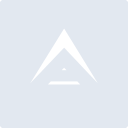
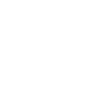

# arkecosystem

[← Back to main README](../../README.md)

<table><tr>
  <td></td>
  <td></td>
  <td></td>
</tr></table>

## 16 px

### black
```
https://georgegach.github.io/compatible-icons/simple-icons/compat/arkecosystem/16/black.png
```

### slate
```
https://georgegach.github.io/compatible-icons/simple-icons/compat/arkecosystem/16/slate.png
```

### white
```
https://georgegach.github.io/compatible-icons/simple-icons/compat/arkecosystem/16/white.png
```

## 64 px

### black
```
https://georgegach.github.io/compatible-icons/simple-icons/compat/arkecosystem/64/black.png
```

### slate
```
https://georgegach.github.io/compatible-icons/simple-icons/compat/arkecosystem/64/slate.png
```

### white
```
https://georgegach.github.io/compatible-icons/simple-icons/compat/arkecosystem/64/white.png
```

## 128 px

### black
```
https://georgegach.github.io/compatible-icons/simple-icons/compat/arkecosystem/128/black.png
```

### slate
```
https://georgegach.github.io/compatible-icons/simple-icons/compat/arkecosystem/128/slate.png
```

### white
```
https://georgegach.github.io/compatible-icons/simple-icons/compat/arkecosystem/128/white.png
```

## 512 px

### black
```
https://georgegach.github.io/compatible-icons/simple-icons/compat/arkecosystem/512/black.png
```

### slate
```
https://georgegach.github.io/compatible-icons/simple-icons/compat/arkecosystem/512/slate.png
```

### white
```
https://georgegach.github.io/compatible-icons/simple-icons/compat/arkecosystem/512/white.png
```

## 1024 px

### black
```
https://georgegach.github.io/compatible-icons/simple-icons/compat/arkecosystem/1024/black.png
```

### slate
```
https://georgegach.github.io/compatible-icons/simple-icons/compat/arkecosystem/1024/slate.png
```

### white
```
https://georgegach.github.io/compatible-icons/simple-icons/compat/arkecosystem/1024/white.png
```

## 16 px in base64

### black
```
data:image/png;base64,iVBORw0KGgoAAAANSUhEUgAAABAAAAAQCAYAAAAf8/9hAAAABmJLR0QA/wD/AP+gvaeTAAAA2klEQVQ4jaXTQUoDUQwG4G/GgiAupecouPAQnsCdSzcexq4KvUmpnkHElUupVqGg0mpLoR03UUZ5fZYxEAJ5+f/8CXnwiKqhPxRYo9DMqiKYskW5BuUf4FH4RssRzNFHF9McyaYF3WInmtxk6pLJZxzhAj0c4ilV20ooWuMKxzgNBW8Y4AQ/MKkd3OMO53iP+c9kFlqX9IohXrDAMnwRb5cRvzG/7+Ajilu4xizy++hghV3sfQHqBJOYv52SWbNJxIP6CKuYdds/MAvMVqectfKfBFWJcUOSCuNPzRtuCv+259UAAAAASUVORK5CYII=
```

### slate
```
data:image/png;base64,iVBORw0KGgoAAAANSUhEUgAAABAAAAAQCAYAAAAf8/9hAAAABmJLR0QA/wD/AP+gvaeTAAABHElEQVQ4jZ2SPU5CQRSFvzOQ4A+JFkSkcAlGE5ZhYq+VpY2bsWUdNhauQBMaGzvJCxBCoi+I0jDHQkhAeO8RbjXJnPPde8+M3vsfXaEGW5W6Qeh4OzOAGwFQQRfnXYb8BiTCSZ4kEyD4UXDLCveCUaau0//MGNGvJ/XDM8DJIG3bnG4MMAwCugSujSsu0dKUB6D+X1teA41yfFLQRUQ3mEAklfWIuDJe8qxkYOiI0ltEd6AxeIS5jXJirwa6vIJIZZ4NTcOuNHslOxpPgvQScVPWQVYG38DEUJZoy/oCiI5VSeeIKaYC7K0AhIbgaDhak8tiDTEgaoshRvCOoVpgBqgB4z8PYQ4IG5pnc7M/PwYg768XlQOotyXEoN4vLQd7IFCiUOsAAAAASUVORK5CYII=
```

### white
```
data:image/png;base64,iVBORw0KGgoAAAANSUhEUgAAABAAAAAQCAYAAAAf8/9hAAAABmJLR0QA/wD/AP+gvaeTAAAA5klEQVQ4jZ3SsUoDQRQF0LNrQJSAjSj+heBnBOy1srTxZ2z9DhsLv0BBxMoySAKSJmjUxn0WTmBZdnbDXhgG5t1739w3U0TEDEeGYVZERIVioEGUG4ijo1aUPeK3tLLoMvjGDa7xkWVFHi8RsRURZUQ850hFRLRlfMcpzrGdbnKLwyZx1CKucI8JLlLMJe5w1tS0zWCKV1xhlfJfygy0GWGJB5xgp9agwg8eU20vZ/CViCM84TOdj3GMX/8z2W0zWKROBy2x6likfb9uUKXu4x7xGqt1xNwzboxS91/vQ5SYDzQJzP8A85WIqQ4FeRYAAAAASUVORK5CYII=
```

