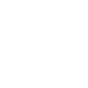

# arstechnica

[← Back to main README](../../README.md)

<table><tr>
  <td></td>
  <td></td>
  <td></td>
</tr></table>

## 16 px

### black
```
https://georgegach.github.io/compatible-icons/simple-icons/compat/arstechnica/16/black.png
```

### slate
```
https://georgegach.github.io/compatible-icons/simple-icons/compat/arstechnica/16/slate.png
```

### white
```
https://georgegach.github.io/compatible-icons/simple-icons/compat/arstechnica/16/white.png
```

## 64 px

### black
```
https://georgegach.github.io/compatible-icons/simple-icons/compat/arstechnica/64/black.png
```

### slate
```
https://georgegach.github.io/compatible-icons/simple-icons/compat/arstechnica/64/slate.png
```

### white
```
https://georgegach.github.io/compatible-icons/simple-icons/compat/arstechnica/64/white.png
```

## 128 px

### black
```
https://georgegach.github.io/compatible-icons/simple-icons/compat/arstechnica/128/black.png
```

### slate
```
https://georgegach.github.io/compatible-icons/simple-icons/compat/arstechnica/128/slate.png
```

### white
```
https://georgegach.github.io/compatible-icons/simple-icons/compat/arstechnica/128/white.png
```

## 512 px

### black
```
https://georgegach.github.io/compatible-icons/simple-icons/compat/arstechnica/512/black.png
```

### slate
```
https://georgegach.github.io/compatible-icons/simple-icons/compat/arstechnica/512/slate.png
```

### white
```
https://georgegach.github.io/compatible-icons/simple-icons/compat/arstechnica/512/white.png
```

## 1024 px

### black
```
https://georgegach.github.io/compatible-icons/simple-icons/compat/arstechnica/1024/black.png
```

### slate
```
https://georgegach.github.io/compatible-icons/simple-icons/compat/arstechnica/1024/slate.png
```

### white
```
https://georgegach.github.io/compatible-icons/simple-icons/compat/arstechnica/1024/white.png
```

## 16 px in base64

### black
```
data:image/png;base64,iVBORw0KGgoAAAANSUhEUgAAABAAAAAQCAYAAAAf8/9hAAAABmJLR0QA/wD/AP+gvaeTAAABFUlEQVQ4jZ3T20oCYRQF4M+RyhJDs26MCLruqgcolF6xi46P1ZWCQoVJ0EE6UJpduAcmS8kWbOZnmLX2XnvWz3es4QIt9PAW1Yt3Z6iYgkN0MMRoSg3RRuM3cncGcbK6qGfH7sxBTquNch5H2EdumrcpWMVGzng5O7hFP3xWsY47FPAahKvovoIaWglKoViMj4shCtfI4wP38VwOMShlBT7DRjXO8Bjda0G+Mf6to9RGkiF3QiCf2cdiptsW9uJ8iQEk4fs91BO8hMdJPOApbC7FFP1UoIBdPMcSa0HaDlFBGESDTSyEoHOz0zcrlSeMs93+h0Ab5dRfw/xRPphcUt3fL9MPcooKTtE0Tmb2OjdxnB0bvgC2JI+GvXPDSgAAAABJRU5ErkJggg==
```

### slate
```
data:image/png;base64,iVBORw0KGgoAAAANSUhEUgAAABAAAAAQCAYAAAAf8/9hAAAABmJLR0QA/wD/AP+gvaeTAAAByklEQVQ4jZWTQW5SYRSFv/MD8mwD8qzGlFIfnTto3EDTpHswHZl0D8Y9aLfgzG1IdQWdOXPwRJqQmPAKsbUC/3HwgDRaEzmjf3DP/c+5515xC/3+5UPX4inoANMAmgCIMWgC8cw3epVlrdGSo+VjMCyO5vY7ETrGgbsRjfue6aTbafVWDQbD4mhm3gue/IP4J4bRPu5up2dayD4HPf1PMgDGeayzH1yLpyJ01iGX0rVbvdHbKujAOCCGwEQwt9kCHgHfgQS4BjWBb2CDNsBto8MANABkNhVJHNnEfAGQGAAVy1PESPYUuC+5WaqgERZxYYjIQmxZRABHXwLXstqKnkZxIfgZbQPYboZFpwjOTRCoomW8CvekchcsdgXPXfr/HNAMICAmln5hXVDO4kpi46+hiQIzRiSGepQNTAIwwU4IPDP+gZnbtEtlMXMkLCwaMcO+EuxgapLGVfBHUBezI1SWrrLW9mpXTQqkS3eGKNxTnhcpCecy2Tp7YDuPCfshy1ojTzkxDNfgD2O1+nIvTYsA0O20eraPsb9CGeGdv5bHlM8rlRd7jxuf4NY1AuR5kYY6b0CHQCPaDxZFY6Sx8IdZ3a/30rRYcn4DUnbUGkhbTZgAAAAASUVORK5CYII=
```

### white
```
data:image/png;base64,iVBORw0KGgoAAAANSUhEUgAAABAAAAAQCAYAAAAf8/9hAAAABmJLR0QA/wD/AP+gvaeTAAABLUlEQVQ4jZ2T3UqCURBFl5/9WGJkdZMRRddd9QKh9JJh9CjRU3SloFChElRKJaWuLhrjU1SyDYc5DGfv2TPMgRTUHfVarasdtR+nE7krtcgsqBdqUx06H0O1oVZmkVsLiNNoqeW07eYS5DEa6jb+9LzI9jwM1WpGrQMnQBvoAUNgF9gDnoAc8AFsAfeAwCZQAuoJUIhR5ONxHqhH7gHIAl/Ac8SNEAMopAVGQCaqjyL3GtVLQX4E+uECYCtJkZshkI0IsJaqdgicxf0OGAAk0fdnqCfAe/Q4jRegG22uh4veWCAHnAJvMcRSkI5ClCAMosABsAp0V4Bb4DiS09hP3YtxxhgBN6jFWIr/LRKAWnH5VT6f8KqW/ftnmiSnRIpqVa2pbSe/c029/LUd+AYaAvsoVm6mYAAAAABJRU5ErkJggg==
```

