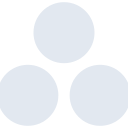

# asana

[← Back to main README](../../README.md)





## 16 px

### black
```
https://georgegach.github.io/compatible-icons/simple-icons/asana/16/black.png
```

### slate
```
https://georgegach.github.io/compatible-icons/simple-icons/asana/16/slate.png
```

### white
```
https://georgegach.github.io/compatible-icons/simple-icons/asana/16/white.png
```

## 64 px

### black
```
https://georgegach.github.io/compatible-icons/simple-icons/asana/64/black.png
```

### slate
```
https://georgegach.github.io/compatible-icons/simple-icons/asana/64/slate.png
```

### white
```
https://georgegach.github.io/compatible-icons/simple-icons/asana/64/white.png
```

## 128 px

### black
```
https://georgegach.github.io/compatible-icons/simple-icons/asana/128/black.png
```

### slate
```
https://georgegach.github.io/compatible-icons/simple-icons/asana/128/slate.png
```

### white
```
https://georgegach.github.io/compatible-icons/simple-icons/asana/128/white.png
```

## 512 px

### black
```
https://georgegach.github.io/compatible-icons/simple-icons/asana/512/black.png
```

### slate
```
https://georgegach.github.io/compatible-icons/simple-icons/asana/512/slate.png
```

### white
```
https://georgegach.github.io/compatible-icons/simple-icons/asana/512/white.png
```

## 1024 px

### black
```
https://georgegach.github.io/compatible-icons/simple-icons/asana/1024/black.png
```

### slate
```
https://georgegach.github.io/compatible-icons/simple-icons/asana/1024/slate.png
```

### white
```
https://georgegach.github.io/compatible-icons/simple-icons/asana/1024/white.png
```

## 16 px in base64

### black
```
data:image/png;base64,iVBORw0KGgoAAAANSUhEUgAAABAAAAAQCAYAAAAf8/9hAAAABmJLR0QA/wD/AP+gvaeTAAABBklEQVQ4jY3SS0oDQRDG8Z8a8RmI4FpB9x5C4sbHNcQsRVx4FR8nEQRREreiglujWRkIgcTViC6mRyahJ05BQVP1r6+rq5q4TaGB6+CNECtl07jFAD/BB7gJuX/tDMNcceZDnJYReIgUZ96MtTtuMxPEZ8sI3COJxBPcTRD/s0U8h4Ks9QRPWCgjAMu4xGPwCyxNKjiQDu9FOqh6hNlBKzAt7GaJE3SNTvsTh7nioxDLM10cQ1t8ZW+Yw3w4x5h2BSsFz6piS/qFqwVMrSK+MiH+JV31dxFTQQ+1SLKP19BBH6sRpgf76Bh92zu2c2AdH2NMB3sZsIkr6QrPsRa5bT3kmoHdgF+y6VpG7CspyAAAAABJRU5ErkJggg==
```

### slate
```
data:image/png;base64,iVBORw0KGgoAAAANSUhEUgAAABAAAAAQCAYAAAAf8/9hAAAABmJLR0QA/wD/AP+gvaeTAAABtklEQVQ4jY2SP2tTURiHn9+9N4ptY9NaaIzaFARBEBcVv4COIvolzFSEDqIBB2t3R/FDODoJDjp1FmyXQm/TtAlq/tRIxZvzcxENuZF6xt/7vM9538MRE45t7bZ7NZv7AMHh9XJ57qUkj7Oa0BylB913EtdA07/TgdDG+cXZW5LCKB+NC9L93iNJ1/82A2ja9s1G+3B1nM8JFHEXmMrtJU3hcO9YARBPyAAwFP5DoA+CLJfiDPT+WEESBnWjLWA4Eg+RNvWzX8+LJ5x2uz3zI5x4gbhhG6GNAkcPy+XyYKJg5+DrHRHVQUWJXsj8tHqu9HYU3Nnr3lbMM9BpcD9Ya8tnZ9+o0eqvBsJjzJkR/rMD9Wql9Aqg0Tqs2WHNeOEPYb4gryvd76aIC7nR7PToW+lSkqD4VG8LWMrtanYTYG7SOxgVT870rwpkUST3iUGilBCR/aOYBWffJUU4GuYJsMkS7A6oNF4MuLdUnt8ElLa6PaGFnEF0oiiOV8DNsfkbMXogaSgpS6SaYW/s/mYUa0UAaat7EfuJ0OVA+FgIPK9U5tNRfLvZqRYi1YErxp8srVcXS9u/AJzLsf6mumdzAAAAAElFTkSuQmCC
```

### white
```
data:image/png;base64,iVBORw0KGgoAAAANSUhEUgAAABAAAAAQCAYAAAAf8/9hAAAABmJLR0QA/wD/AP+gvaeTAAABGElEQVQ4jY3RQUuUURTG8WdswsoChdYJue9DxLQp/RqSSwkXfhW1TyIIUsy0jQraNjkrBRG01Rs/F96Xhtc70zxw4HLO/zz33HuSitDDDo5L7KBXY2vNSzjFtX+6xgmWFjHYx437usHeIgZfKs2thl2+NtKDOf4PFzH4nKSp5Jskn+aY3wlP8B3N1OgNvuHxfw2KyVMc4WuJQ6zMa9gqn/cDQwwqzBuMCjPC27bwARed3z7H9lTz+5Kb1gV2g/GMlf3CMh6Vc03jfpK1GS97luRVkl4517TaT31lKfk/uVv131lMP8llktVK8SrJzzLBVZLnFeYy2MSk87bfeN1SGOCsw0zwrgU28LGs8AAvuldhvdSGhX2ZJLetTZ0RFFeaCQAAAABJRU5ErkJggg==
```

