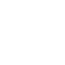

# asciinema

[← Back to main README](../../README.md)




## 16 px

### black
```
https://georgegach.github.io/compatible-icons/simple-icons/asciinema/16/black.png
```

### slate
```
https://georgegach.github.io/compatible-icons/simple-icons/asciinema/16/slate.png
```

### white
```
https://georgegach.github.io/compatible-icons/simple-icons/asciinema/16/white.png
```

## 64 px

### black
```
https://georgegach.github.io/compatible-icons/simple-icons/asciinema/64/black.png
```

### slate
```
https://georgegach.github.io/compatible-icons/simple-icons/asciinema/64/slate.png
```

### white
```
https://georgegach.github.io/compatible-icons/simple-icons/asciinema/64/white.png
```

## 128 px

### black
```
https://georgegach.github.io/compatible-icons/simple-icons/asciinema/128/black.png
```

### slate
```
https://georgegach.github.io/compatible-icons/simple-icons/asciinema/128/slate.png
```

### white
```
https://georgegach.github.io/compatible-icons/simple-icons/asciinema/128/white.png
```

## 512 px

### black
```
https://georgegach.github.io/compatible-icons/simple-icons/asciinema/512/black.png
```

### slate
```
https://georgegach.github.io/compatible-icons/simple-icons/asciinema/512/slate.png
```

### white
```
https://georgegach.github.io/compatible-icons/simple-icons/asciinema/512/white.png
```

## 1024 px

### black
```
https://georgegach.github.io/compatible-icons/simple-icons/asciinema/1024/black.png
```

### slate
```
https://georgegach.github.io/compatible-icons/simple-icons/asciinema/1024/slate.png
```

### white
```
https://georgegach.github.io/compatible-icons/simple-icons/asciinema/1024/white.png
```

## 16 px in base64

### black
```
data:image/png;base64,iVBORw0KGgoAAAANSUhEUgAAABAAAAAQCAYAAAAf8/9hAAAABmJLR0QA/wD/AP+gvaeTAAAA3klEQVQ4jZ3TMUtCYRTG8Z/U2BLU4ujcF4g25/oMjmGfwQ/i7uTu2iq0BEEEkUQUJSgq4pUiCRvuFS5vt3v1vnCGMzz/8z7P4UAdc3RwqMSrI8IP3tDCfhnAOqlPDHBRFrCpCfqo7QL4FltJg97RxsE2gBGu8RFAVnjFFSpFgBM0scywtcAdTvMAtxgn/Uy8ma8ANEIP1XBdRzhOBE/iEM/+8571gzWG6OIG02ByhPsiC/0EEob4gksFIa7suMYwg3Q/xQMaeM6J4E8GER5xnifKAqSPaW9b8QZQ+px/AXTPa5XqHrrGAAAAAElFTkSuQmCC
```

### slate
```
data:image/png;base64,iVBORw0KGgoAAAANSUhEUgAAABAAAAAQCAYAAAAf8/9hAAAABmJLR0QA/wD/AP+gvaeTAAABkUlEQVQ4jZWQPWuTYRiFr/MkfhJKI40p0qZFd1cpgoO7/gAXB9HBQQfddHMo/gN1EgV30R8gFSo4iUMRBM1HP95EsO9bWimteY5D0xCJMclZnhvu51yc+1BN0sv1JM0aSfayVkuLjKlw8DhnfE1H+VxNNh/azo8J6MxiRg4P6kn6pZZsXRkXAIDk45LO4fbzRjNbrjXTsyMDDPtC8QCkU7YXsN/Xk/RJq9UqDAUEKY32O6SNbiJ0RnBjNx5ZqW5kt21ryAnxbhs/wv7VkywPmg2Kj1db2afV5tbC4a6vbTm8yItZSycNqcQ2pgQcAxVsztvxdSPJPjq3d+svQLSnJEpYu+CvspbBFwf0159AICAxXgpo3vgqUOz5sINdDSF3c6Y88aEfIP2I9nfQJeNp1AX/jniNkF+sTBWeSfKADlwM6IJxt1zjddCbE2H//ulScfu/J9jkwZ3ZPxXCCnC9Up78NlIHHe1g1lDuXqU88XaQ8V+AiFmP8tO56clFSe1h5h6A2kKv4p7vzM8VN0cxHuoPx92yHZ34dE8AAAAASUVORK5CYII=
```

### white
```
data:image/png;base64,iVBORw0KGgoAAAANSUhEUgAAABAAAAAQCAYAAAAf8/9hAAAABmJLR0QA/wD/AP+gvaeTAAAA/klEQVQ4jZ2TvUoDURBGz1VLG0UbK7H2BYKdtfEVrET0GXwQe1/B1kZh7YQ0AYlIUPwhoiImGFj0WLiByzW7iftVM8UcZr6ZQd1U39VjdYH/qgD01S/1Tj1U5+oARvpUr9VmXcBIL2qmrlXVzyR5DnwX8SLQAM7VI3V+mg566qn6kHSTq7fqgRomAdbVfXUwZqwPtaU2qgCX6nORvxWbGSagnnqirqTrWgKWgSHQATJgo8rEFBCAJ+AMWAW2gfi4BkAX2A0hXJSNkKmPY0zsqnuTTMz9vchY91asMR0hzl+BNrATQrgpNcG/l9hXr9St0qISQPxMs1MVR4Da7/wDa5evC7CVOfMAAAAASUVORK5CYII=
```

