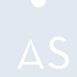
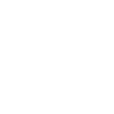

# assemblyscript

[← Back to main README](../../README.md)





## 16 px

### black
```
https://georgegach.github.io/compatible-icons/simple-icons/assemblyscript/16/black.png
```

### slate
```
https://georgegach.github.io/compatible-icons/simple-icons/assemblyscript/16/slate.png
```

### white
```
https://georgegach.github.io/compatible-icons/simple-icons/assemblyscript/16/white.png
```

## 64 px

### black
```
https://georgegach.github.io/compatible-icons/simple-icons/assemblyscript/64/black.png
```

### slate
```
https://georgegach.github.io/compatible-icons/simple-icons/assemblyscript/64/slate.png
```

### white
```
https://georgegach.github.io/compatible-icons/simple-icons/assemblyscript/64/white.png
```

## 128 px

### black
```
https://georgegach.github.io/compatible-icons/simple-icons/assemblyscript/128/black.png
```

### slate
```
https://georgegach.github.io/compatible-icons/simple-icons/assemblyscript/128/slate.png
```

### white
```
https://georgegach.github.io/compatible-icons/simple-icons/assemblyscript/128/white.png
```

## 512 px

### black
```
https://georgegach.github.io/compatible-icons/simple-icons/assemblyscript/512/black.png
```

### slate
```
https://georgegach.github.io/compatible-icons/simple-icons/assemblyscript/512/slate.png
```

### white
```
https://georgegach.github.io/compatible-icons/simple-icons/assemblyscript/512/white.png
```

## 1024 px

### black
```
https://georgegach.github.io/compatible-icons/simple-icons/assemblyscript/1024/black.png
```

### slate
```
https://georgegach.github.io/compatible-icons/simple-icons/assemblyscript/1024/slate.png
```

### white
```
https://georgegach.github.io/compatible-icons/simple-icons/assemblyscript/1024/white.png
```

## 16 px in base64

### black
```
data:image/png;base64,iVBORw0KGgoAAAANSUhEUgAAABAAAAAQCAYAAAAf8/9hAAAABmJLR0QA/wD/AP+gvaeTAAAA90lEQVQ4jd3TvS5EURAH8N+iUEi2ER8hNlFSEYVOr/EKHkAjXmOfQKFQ0iAhdFRqiaiWwueKzVaK62sp7mxsuPdGsp1JTjIz5z//M3NmBj5zzpFvOczDlULJkiechj6PoSxQEcGfpKeb4H9C0Fdw94yBDruJGyQYx1hRBg/YxluHbw9bQXQSRLkZXKKGe1SkrT7GCmbxiv42+Od0NbEW6a6jFf5zTGMTt218Vgl1zKGMfdyFfwoHUdYSrrP+IIlXZ9DAAs7wIR3tUSxjEY9ZBPWou4YLTKKKXqxiA7vYwSC/d6GBd4yE3cIVhvEi7U4iXawJlLpepi8pkkxe8qOyUwAAAABJRU5ErkJggg==
```

### slate
```
data:image/png;base64,iVBORw0KGgoAAAANSUhEUgAAABAAAAAQCAYAAAAf8/9hAAAABmJLR0QA/wD/AP+gvaeTAAABLElEQVQ4jd2TMS+DYRSFn/OWxCBhkKqQSow2YrAZm1j8BavEYvAv/AKDzcJSEiKdmMwWUxkqqKgiMXzU9x5LhaRfhXRzt3vuuU/OclSrP5nsqRQLwyWA2t3zEXYpy6SuAHMfpNNIxGhekP8b4JcTenn+J4C+7ie/gAa/CU0iVwokhglg/IcEugXtWmp9SdonsGOpCTqRlXRPIC4wVewbYBJwkI6jvYo9a/OGGMhOID1CLCOvBKgABhRjum6ny5K2JT982jsBdh2HOaEh4wOZ67Z1Oih3aLnlqCVBLQOgJMWblmdsGhEWIj4DpYJ7wxhRy8pp0XCXAXC9P+gmWFWh80CYCrABzqWRNWALeU9OyzYj0NmFBvAOFNp7BC4Fo4ZX4FaQRDsvqQio5zJ9ACoAjm+b78faAAAAAElFTkSuQmCC
```

### white
```
data:image/png;base64,iVBORw0KGgoAAAANSUhEUgAAABAAAAAQCAYAAAAf8/9hAAAABmJLR0QA/wD/AP+gvaeTAAABA0lEQVQ4jd3TvUrcURAF8N9GCwvBRjQSUUipVSSFXXobX8EHsBFfwyfYwsJSmygosTNVakGsNilcPzYoW6VYv/ZY7BUE/7sIdjnVnXPnHubMnZH+OFSQ5Ee/pFqSqMY1fpXzIiaqkgYJvAkf3vP4PxEYHnD3D6Mv4jaa6GAanwZVcIUd3L/g9rBdhH4Wob4V/EYDl5hFcIRVLOAOI6BiuNpJ1pM0k9STdAt/kmQ+yVaS8+fkKgstfMUY9nFR+DkcFFvLOKvqQQd1fMENvuEYj3qjPYUVLOFvlUCr+G7gFJ+xgSGsYRO7+I5xXu/CDR7wscRd/MEkbvV+p6O3WDOovXuZngD/u7H45+MlCAAAAABJRU5ErkJggg==
```

