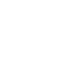

# autocad

[← Back to main README](../../README.md)

<table><tr>
  <td></td>
  <td></td>
  <td></td>
</tr></table>

## 16 px

### black
```
https://georgegach.github.io/compatible-icons/simple-icons/compat/autocad/16/black.png
```

### slate
```
https://georgegach.github.io/compatible-icons/simple-icons/compat/autocad/16/slate.png
```

### white
```
https://georgegach.github.io/compatible-icons/simple-icons/compat/autocad/16/white.png
```

## 64 px

### black
```
https://georgegach.github.io/compatible-icons/simple-icons/compat/autocad/64/black.png
```

### slate
```
https://georgegach.github.io/compatible-icons/simple-icons/compat/autocad/64/slate.png
```

### white
```
https://georgegach.github.io/compatible-icons/simple-icons/compat/autocad/64/white.png
```

## 128 px

### black
```
https://georgegach.github.io/compatible-icons/simple-icons/compat/autocad/128/black.png
```

### slate
```
https://georgegach.github.io/compatible-icons/simple-icons/compat/autocad/128/slate.png
```

### white
```
https://georgegach.github.io/compatible-icons/simple-icons/compat/autocad/128/white.png
```

## 512 px

### black
```
https://georgegach.github.io/compatible-icons/simple-icons/compat/autocad/512/black.png
```

### slate
```
https://georgegach.github.io/compatible-icons/simple-icons/compat/autocad/512/slate.png
```

### white
```
https://georgegach.github.io/compatible-icons/simple-icons/compat/autocad/512/white.png
```

## 1024 px

### black
```
https://georgegach.github.io/compatible-icons/simple-icons/compat/autocad/1024/black.png
```

### slate
```
https://georgegach.github.io/compatible-icons/simple-icons/compat/autocad/1024/slate.png
```

### white
```
https://georgegach.github.io/compatible-icons/simple-icons/compat/autocad/1024/white.png
```

## 16 px in base64

### black
```
data:image/png;base64,iVBORw0KGgoAAAANSUhEUgAAABAAAAAQCAYAAAAf8/9hAAAABmJLR0QA/wD/AP+gvaeTAAAA3UlEQVQ4jZ3SMU4CURQF0DNECwmVhcTCyoZlQEWltnbEwootsAMbd+AaqGhgB3S0BBONEcXChIShULGYT6I4jDPc5BU/77/77r3/RxJUcYND+dHHLXTwgC+sCtQzjmFZcHBdL6hF4bANUzzhCCcbvVdUSv/4HKKLK7yn9MsyJMa4xAINTFIsrLIUzPCIT5xhnHYpi+At9EdBxZ0k8NwEPbRQwTkGQdUv7G0ZnoWtdZxijmuJnT/Y5Q/kCjEXflqY4qPA7MGaIJaEuV+QIA7lAvd2zCIKbE20ZT9rKr4B4RJp7coGNCoAAAAASUVORK5CYII=
```

### slate
```
data:image/png;base64,iVBORw0KGgoAAAANSUhEUgAAABAAAAAQCAYAAAAf8/9hAAAABmJLR0QA/wD/AP+gvaeTAAABLUlEQVQ4jY2TvS5EURSFv3XuHRMikShQKCTewBPoVPQqUdB4Asm8gcYbqDyASsMbUGlFMZPIZYhJRgzhnKUYf+HOdXe79/r2XvvsI4Crm8fZLL3uBYVpaobgZH5ual/tot/CcVti3qC6AEyR8sZSDqmFaLq28lNP8GucCuDm6DlVIM5td8rSmeJ5qOoicwY+Qto09EqmmKgA6NlwiNnN7CR4KKuqALhrqQPEFMIqcFm2p5EAmzvFtyB0gf0Uow4kPdcGZOJYIWwYTwJrMQunJHd/1+Uj9N0ET6BlYNFSf8xxi0Dklw+1i96/J2D+XpjNLXim8hm/ulTkvi2YguC3OsAhVOM2BOyBrRegUVc8JHgADHJStq4s7QMLuP5fApA+7LWv71dQ2JFCrZ38jHcd8HPCSCTuDgAAAABJRU5ErkJggg==
```

### white
```
data:image/png;base64,iVBORw0KGgoAAAANSUhEUgAAABAAAAAQCAYAAAAf8/9hAAAABmJLR0QA/wD/AP+gvaeTAAAA5UlEQVQ4jZXTMS5EcRDH8c8TImQrxYpC5SB0KhxBFConkLiBxg1UDqDScAOdViIhYrMrIZHYLdifYt+KTZ63+77tzHxn5j/5F5BkFadYMTvXRVGcSXKS5DHJMM14SbJWJBlgsUHnMV1sFklSk9TBM9pYrxC05qZ0ucUlDvBeEV+uEwxwgWMM8VaVVCfo4Qnf2MF9U8FrGb/DJ87LqWYWXGEfLezippxqgvl/intl1y1s4AOHRutMMO2MdXTRnnbGqfxdoYOvBrVLY0Hf6DEXGgr66Euyl+Sh4Uf6pYAk2zhSf9ZKfgCN2rOWBIz6/QAAAABJRU5ErkJggg==
```

