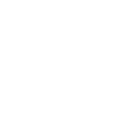

# autodeskmaya

[← Back to main README](../../README.md)




## 16 px

### black
```
https://georgegach.github.io/compatible-icons/simple-icons/autodeskmaya/16/black.png
```

### slate
```
https://georgegach.github.io/compatible-icons/simple-icons/autodeskmaya/16/slate.png
```

### white
```
https://georgegach.github.io/compatible-icons/simple-icons/autodeskmaya/16/white.png
```

## 64 px

### black
```
https://georgegach.github.io/compatible-icons/simple-icons/autodeskmaya/64/black.png
```

### slate
```
https://georgegach.github.io/compatible-icons/simple-icons/autodeskmaya/64/slate.png
```

### white
```
https://georgegach.github.io/compatible-icons/simple-icons/autodeskmaya/64/white.png
```

## 128 px

### black
```
https://georgegach.github.io/compatible-icons/simple-icons/autodeskmaya/128/black.png
```

### slate
```
https://georgegach.github.io/compatible-icons/simple-icons/autodeskmaya/128/slate.png
```

### white
```
https://georgegach.github.io/compatible-icons/simple-icons/autodeskmaya/128/white.png
```

## 512 px

### black
```
https://georgegach.github.io/compatible-icons/simple-icons/autodeskmaya/512/black.png
```

### slate
```
https://georgegach.github.io/compatible-icons/simple-icons/autodeskmaya/512/slate.png
```

### white
```
https://georgegach.github.io/compatible-icons/simple-icons/autodeskmaya/512/white.png
```

## 1024 px

### black
```
https://georgegach.github.io/compatible-icons/simple-icons/autodeskmaya/1024/black.png
```

### slate
```
https://georgegach.github.io/compatible-icons/simple-icons/autodeskmaya/1024/slate.png
```

### white
```
https://georgegach.github.io/compatible-icons/simple-icons/autodeskmaya/1024/white.png
```

## 16 px in base64

### black
```
data:image/png;base64,iVBORw0KGgoAAAANSUhEUgAAABAAAAAQCAYAAAAf8/9hAAAABmJLR0QA/wD/AP+gvaeTAAABA0lEQVQ4jZXSvUoDQRTF8V/WlcSPCIFAQNHOQqxtrKx8BCufx9Y3sPER8gZiq0UaSwtB8SNiRIXExFjMLMZlE90DA3Ph3P/MnTmwjBPcYfzPNUBbVAfDEs3ZuoQU85jzW4/oooEW+rhBFevRs4azRLFusYXrWD9hF6cTniq2pwFgHxdx38NmkWkW4FAY7RUPOC4LSIQxUryjXhYgAo7QxGeRIZ3SuBqbatjDhvBbB0XmK+UzMMYLun+NMEsVft5ggOeSgHoGqAnBKXwkfE3sh7kb9BLs4FyIbKYMNorGUazvc/B+KsQ0rzchRCuxToQsNPPG7Bs7+MBirBs5XwVLBQctfAN+2U7Upq4wfAAAAABJRU5ErkJggg==
```

### slate
```
data:image/png;base64,iVBORw0KGgoAAAANSUhEUgAAABAAAAAQCAYAAAAf8/9hAAAABmJLR0QA/wD/AP+gvaeTAAABWUlEQVQ4jZWTz26SURDFf2f4KPinJSQYCAR3XaBrN125MCYu3Lryebo16Sv0Kdwa486NL9CEJjRFNNJIA+J3jwsIpe2HgdnNvXN+M2durobD4eNp2jsxvBG02CIs5mF97LZqb7Np2vsCfiZU2kYMIFNG7gBkQmXDbbH5LumHoQ5ugmaCc+yKRRcgmU7/YvwpNrQYdFu1nvDZMh9ljiOL01UJqoCfFwOA/uWv15a/Lk2PU/iwqG4jwLnfg0qIK6Fh7vRhJwARgelhsuR8gtnfDQAIepCOQ9FAzItqsmKh2siNZFeFXlrpKY4y+N1WAMMTDEIAr/DyFBo7Wfh/WCuArT/Azx0J+wCR7KqUBlC8JERaS/6u3xiPo+x4YfgMNFfD3cByjCTlC0m6XGeHYhbt9sHoXlPpt+GKxR+R7QBPcNxbYrYglb7Z6Rp4uBjBdd01gh4tX2IVyenBP8PGhcPVcfpaAAAAAElFTkSuQmCC
```

### white
```
data:image/png;base64,iVBORw0KGgoAAAANSUhEUgAAABAAAAAQCAYAAAAf8/9hAAAABmJLR0QA/wD/AP+gvaeTAAABD0lEQVQ4jZXSOUoEURDG8d9rR9wDQRAUzQSX2MTIyCMYeR5Tb2DiEbyBiJmJiaGBMOIKIyq4jGXQr1GabnW+6BV89a/llYiYjIj9iLiK/+stIg6hgxOsYsj/NYz5CjDckHyLe0xjFq+4xAgWsmc+Io6KlgrdlNIKLnJ8hw0c/PCMYK0NICK2cJrDHpaafK0A7ChHe8QN9gYFFFhR7ukZU4MCZMAuZvDeZOi0JM7lpFFsYlH5W9t1Y4qIcyz/0UmTeuj/NcJvSnzv4A0PAwKmKsAoulqWhM8f749aB70C6zhWnmylCtbPxn6Or2vw1yKldNdQ9Ul5QEMZUChvYaZurL7xDC8Yz/F0zZcw0VBo7AszfGtVbvolwgAAAABJRU5ErkJggg==
```

