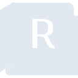

# autodeskrevit

[← Back to main README](../../README.md)





## 16 px

### black
```
https://georgegach.github.io/compatible-icons/simple-icons/autodeskrevit/16/black.png
```

### slate
```
https://georgegach.github.io/compatible-icons/simple-icons/autodeskrevit/16/slate.png
```

### white
```
https://georgegach.github.io/compatible-icons/simple-icons/autodeskrevit/16/white.png
```

## 64 px

### black
```
https://georgegach.github.io/compatible-icons/simple-icons/autodeskrevit/64/black.png
```

### slate
```
https://georgegach.github.io/compatible-icons/simple-icons/autodeskrevit/64/slate.png
```

### white
```
https://georgegach.github.io/compatible-icons/simple-icons/autodeskrevit/64/white.png
```

## 128 px

### black
```
https://georgegach.github.io/compatible-icons/simple-icons/autodeskrevit/128/black.png
```

### slate
```
https://georgegach.github.io/compatible-icons/simple-icons/autodeskrevit/128/slate.png
```

### white
```
https://georgegach.github.io/compatible-icons/simple-icons/autodeskrevit/128/white.png
```

## 512 px

### black
```
https://georgegach.github.io/compatible-icons/simple-icons/autodeskrevit/512/black.png
```

### slate
```
https://georgegach.github.io/compatible-icons/simple-icons/autodeskrevit/512/slate.png
```

### white
```
https://georgegach.github.io/compatible-icons/simple-icons/autodeskrevit/512/white.png
```

## 1024 px

### black
```
https://georgegach.github.io/compatible-icons/simple-icons/autodeskrevit/1024/black.png
```

### slate
```
https://georgegach.github.io/compatible-icons/simple-icons/autodeskrevit/1024/slate.png
```

### white
```
https://georgegach.github.io/compatible-icons/simple-icons/autodeskrevit/1024/white.png
```

## 16 px in base64

### black
```
data:image/png;base64,iVBORw0KGgoAAAANSUhEUgAAABAAAAAQCAYAAAAf8/9hAAAABmJLR0QA/wD/AP+gvaeTAAAA7klEQVQ4jZ3TrU4DQRQF4G+aTaijCQWPAZ6gDofkAQjB1/MSKARPgOQFcEUDClsUjgQChQQcDSxiZpN22d12Ocn83Mydc8+cyQ0iMhxjzfIY4Qr2MMY38hbjEX2YtLxYjCdshxRU4RUfM0/cQHfm/BmfGipcY4BLHOEc05KCH2mqIzhM+zG2UtU5gk6N/AI53nCPTayUE7IFBA+4wClusVpOWKRgB0Mc4E6F4U0EXawnlUOciX//B3UmvotGFfGL+LVzJjZ50CvF/YqckCW2gC/R8WWRIe+IPTBJaxtMU1EnuPG/fshDYtvFfksF4Bcw0nIUVD6vNQAAAABJRU5ErkJggg==
```

### slate
```
data:image/png;base64,iVBORw0KGgoAAAANSUhEUgAAABAAAAAQCAYAAAAf8/9hAAAABmJLR0QA/wD/AP+gvaeTAAABSElEQVQ4jZWRMUubYRSFn/N+LxinSqPJ4CQW6dbVpdDBSQVX+wvcXf0NGUp/RNvdzf6ATl0rFAqVVkzQEHQyTe7pkKSEr37x8/DCu5x77sO5ArCdf/XujoNoUlMZztbbK5/1szvYwbwXbAGpboCky2KsV1nmE/C87uBMNoVNM1cNC64Nt1N7htQCN+Y94+zTamTpu6y3Qt8knyTxETwqYWxmwJOFD2K8MN5zFJtF1oFH2pVozVsWlmYwpi/FeYQ3JJbKnrwoQPDD+EOgTmF/MTwrexYShPVSKR1l0qGlrxOoGZ0fCYhoKMWa7Wx8JPFO4vd/lBdXg+ChEsUA6x7cNpCka4eFaE4I6Apa1R2YlRmxANur5TW29e+MNkMl9SsDy4AR2eBkGAM3mvy1ZfEHNMwEHRJvENvYy7UJENMHF73b13bsP4Vgpr+a3oSeWSJMswAAAABJRU5ErkJggg==
```

### white
```
data:image/png;base64,iVBORw0KGgoAAAANSUhEUgAAABAAAAAQCAYAAAAf8/9hAAAABmJLR0QA/wD/AP+gvaeTAAAA+UlEQVQ4jZXTvS5EURTF8d+Rm9ARn7WMwkuIRoVEyxPotR5ApfAUvAM9lZZEolNIEKHyuRTuTORmzMz9N+fsZGXtlb3PKZCkwh5mjM5pKeVMkrUkV0m+0o67JLMlySOmW3Tuco/VkiT/CB7wUt8rzGOiYfA6NqDDDXZwhX2c4LOh6VQIyj8mS9hAB1tYr5P0GJRAbf6EayxivCmohhjc4hiHuMBkUzAswTJ2sY3LOtHIBhOYq1Pu4gh3TVFJ8q3/EJ/xhoW6fqh13dd6j/lBM5hq1LN9NOXvGt/9TnxUKmQMX3iszzZ84F2SgyTnLT9SjwJJVrDZMgH4AR2ztIWS/nRXAAAAAElFTkSuQmCC
```

