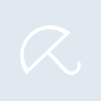
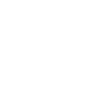

# avira

[← Back to main README](../../README.md)

<table><tr>
  <td></td>
  <td></td>
  <td></td>
</tr></table>

## 16 px

### black
```
https://georgegach.github.io/compatible-icons/simple-icons/compat/avira/16/black.png
```

### slate
```
https://georgegach.github.io/compatible-icons/simple-icons/compat/avira/16/slate.png
```

### white
```
https://georgegach.github.io/compatible-icons/simple-icons/compat/avira/16/white.png
```

## 64 px

### black
```
https://georgegach.github.io/compatible-icons/simple-icons/compat/avira/64/black.png
```

### slate
```
https://georgegach.github.io/compatible-icons/simple-icons/compat/avira/64/slate.png
```

### white
```
https://georgegach.github.io/compatible-icons/simple-icons/compat/avira/64/white.png
```

## 128 px

### black
```
https://georgegach.github.io/compatible-icons/simple-icons/compat/avira/128/black.png
```

### slate
```
https://georgegach.github.io/compatible-icons/simple-icons/compat/avira/128/slate.png
```

### white
```
https://georgegach.github.io/compatible-icons/simple-icons/compat/avira/128/white.png
```

## 512 px

### black
```
https://georgegach.github.io/compatible-icons/simple-icons/compat/avira/512/black.png
```

### slate
```
https://georgegach.github.io/compatible-icons/simple-icons/compat/avira/512/slate.png
```

### white
```
https://georgegach.github.io/compatible-icons/simple-icons/compat/avira/512/white.png
```

## 1024 px

### black
```
https://georgegach.github.io/compatible-icons/simple-icons/compat/avira/1024/black.png
```

### slate
```
https://georgegach.github.io/compatible-icons/simple-icons/compat/avira/1024/slate.png
```

### white
```
https://georgegach.github.io/compatible-icons/simple-icons/compat/avira/1024/white.png
```

## 16 px in base64

### black
```
data:image/png;base64,iVBORw0KGgoAAAANSUhEUgAAABAAAAAQCAYAAAAf8/9hAAAABmJLR0QA/wD/AP+gvaeTAAAA70lEQVQ4jcXTMUpDQRQF0JOPVipWLsKVuANXoIWlYDoF3YDYCGJpZ6GF67BSIYFA0EJRoxY/aCAf/RaZyOQzEUkKBwYed96973IfU0MfsyY7RQ3lhGSQTUOGmV/eushDvYj5vwq8o4lDA4c5etjBMhaqhDK6HzjFCe7xGbAGVvBc6S+rAk0ch4lDrI1NPCTIIwJf2MNdhLVQx+MYchlvIQ+Nc5GbNaxiKRUgo2vM8BrI1zjDOS5wFRz20Ql1MsQDbGMfLwHrYAs3YcCGwYqTId7iCG8V/Am7WMfluBCHQXalA+tF9n/w//8LGYop+MU335dxBc1TT3wAAAAASUVORK5CYII=
```

### slate
```
data:image/png;base64,iVBORw0KGgoAAAANSUhEUgAAABAAAAAQCAYAAAAf8/9hAAAABmJLR0QA/wD/AP+gvaeTAAABRklEQVQ4jaWTMWoUYBBG35sYCGgQFUGPYG3nBbxBOjtBK7GzEhsvYCEBGwuxsNBCEGy8hBamsMmCsCiCWRNjsmQ+C11Zs7sg65QzvDfD/PM7GO4cQlZZKhzX8jBAVmt5+FecWFQQvjUZiRBOI6f+SSDsRbfS/bC0OoxWrP0md0NfEtcXCkL2wVfCQaruJ7lQxcFRelu9bfsEWSwgDpSdbq5p1gAShnYeseJj5PzxiaeXGPBZyNUJDHzQ2kx5h+TivB3UFD2yMkw8CSZhy+R6ujdktvOMoKDSfFEi/U59Hn1B+VJ5C3TgUPwM6XkTrJdegTw4at5AbgJnSW6leQq+L9iNuUf8PuEcDL/mjyRsW7wGNghnpuSfKtlEPybcQC7PFYDB7JHZo0n8odkFz0Gc5I8dUpwHA/x+mTXIX/n//gsFjpfHHf8EkiaYfSUMlI0AAAAASUVORK5CYII=
```

### white
```
data:image/png;base64,iVBORw0KGgoAAAANSUhEUgAAABAAAAAQCAYAAAAf8/9hAAAABmJLR0QA/wD/AP+gvaeTAAABA0lEQVQ4jcWTMUoDURRFzwxaabAQF+FK3IEr0CKlEDsF3YDYCJLSziIWrsNKhQQE0UKJxlhMNJEM5lj4hclnIpIUvupy37uXx/3vJ+oQmGe6yhPVKcUApLOIAeZ+6fWALOAlYPGvBu9ACzjie8MMGAC7wCpQGZt2vPrqqXqiPqifgWuqa+pzNG9s0FLr6qDA3apb6mMsjg1G6r56X+Bu1G21XSZWLb5CBrSBBcCQwwawDqxMSjqNcDeIr4AGcAacA5fACBgCnYBLQzxUd9QD9SVwHbWmXqtdtar2JoV4px6rrxH/pO6pm+pFsRGfsuEOyo7mA3gDloHkh/z/v5AC+Qz6/As1dWFSQBhzwwAAAABJRU5ErkJggg==
```

