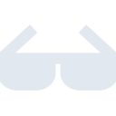

# awesomelists

[← Back to main README](../../README.md)

<table><tr>
  <td></td>
  <td></td>
  <td></td>
</tr></table>

## 16 px

### black
```
https://georgegach.github.io/compatible-icons/simple-icons/compat/awesomelists/16/black.png
```

### slate
```
https://georgegach.github.io/compatible-icons/simple-icons/compat/awesomelists/16/slate.png
```

### white
```
https://georgegach.github.io/compatible-icons/simple-icons/compat/awesomelists/16/white.png
```

## 64 px

### black
```
https://georgegach.github.io/compatible-icons/simple-icons/compat/awesomelists/64/black.png
```

### slate
```
https://georgegach.github.io/compatible-icons/simple-icons/compat/awesomelists/64/slate.png
```

### white
```
https://georgegach.github.io/compatible-icons/simple-icons/compat/awesomelists/64/white.png
```

## 128 px

### black
```
https://georgegach.github.io/compatible-icons/simple-icons/compat/awesomelists/128/black.png
```

### slate
```
https://georgegach.github.io/compatible-icons/simple-icons/compat/awesomelists/128/slate.png
```

### white
```
https://georgegach.github.io/compatible-icons/simple-icons/compat/awesomelists/128/white.png
```

## 512 px

### black
```
https://georgegach.github.io/compatible-icons/simple-icons/compat/awesomelists/512/black.png
```

### slate
```
https://georgegach.github.io/compatible-icons/simple-icons/compat/awesomelists/512/slate.png
```

### white
```
https://georgegach.github.io/compatible-icons/simple-icons/compat/awesomelists/512/white.png
```

## 1024 px

### black
```
https://georgegach.github.io/compatible-icons/simple-icons/compat/awesomelists/1024/black.png
```

### slate
```
https://georgegach.github.io/compatible-icons/simple-icons/compat/awesomelists/1024/slate.png
```

### white
```
https://georgegach.github.io/compatible-icons/simple-icons/compat/awesomelists/1024/white.png
```

## 16 px in base64

### black
```
data:image/png;base64,iVBORw0KGgoAAAANSUhEUgAAABAAAAAQCAYAAAAf8/9hAAAABmJLR0QA/wD/AP+gvaeTAAAAwUlEQVQ4jd3SPU9CQRCF4ecioTIU2htjjBZUdBY2akkrHb/Q3t7Y8CMMhIDxkhAiXyVfhUu8Eu5CK28y2Z09Z2d2kuXouMJjRH8Inp1UkaKP0g69FLQ0eP9wj0GemKGCTwzxtDl8xgg9XEcub7hEC2M0Ekxxgi5mBxSAU1xgkWAVMQ7Dep5nKO7p9HFIgQnKOfoXkkiDCbz7mX2ViSU6uMFt2C+3PDO8JSighrvMSG284DvkZ6j7/URzNPEaed1/YQ3HDSsZHCMngwAAAABJRU5ErkJggg==
```

### slate
```
data:image/png;base64,iVBORw0KGgoAAAANSUhEUgAAABAAAAAQCAYAAAAf8/9hAAAABmJLR0QA/wD/AP+gvaeTAAABNUlEQVQ4jd2Qvy9DcRTFP+f7mi7qRxAG0UoXQ6d2MlgwiZW/wl/gfzGT2C3C2BjF0InQ19IfEnlPy1J971paqtGaOdPJPffck3Phf8FvhtlyI9wcpZfrwYbfDLODM9cnj09BXkbRiaNSyZLD5lLJks7pWEbx8SnIfzvg11rrcawzAzzZdi6nzvCBXE4di70tQdSNdO4/hFsA8uvhLrJDmdrytLG8MH07ruZ9PVjxnLvAbF6K91VpBG2QZ6IieB1n7sMgJSMNFiVAKQAZq8OLgueeYW5o/skSvyTd9OjcqJ0EshamqR9VUQOEjQxoJSzmWqIATHwJZkDFc96BQN0oLoClhTTgfxNcycxcrdneiYjXrF8piu94dyeZzEwAUK2+zCppexFkAWR0He5yaXHydNwL/gg+AIvtepyEjAgmAAAAAElFTkSuQmCC
```

### white
```
data:image/png;base64,iVBORw0KGgoAAAANSUhEUgAAABAAAAAQCAYAAAAf8/9hAAAABmJLR0QA/wD/AP+gvaeTAAAAzklEQVQ4jd2SvU4CYRBFzyeEilhoTwwxWFjRWdiIpa12PqE9vaHhIQzECGFNzEZct9Q9NrsJEPanxdvMZM7NTGYy8L+k9tVRBb9R+2VwqEbqu9rZwzs5i9ThLrxWP/bCbd+lulRj9bYo3qtrdaGeN1jzTJ2pX+pjUL+BFvAGpHUNcnWBHvAbVCuMcR5PywztmkkvTRokwHEJXwGhYkCCOlFTt5Wpr+pAvcjzbMeTqs9BPQLugKuNlebAUwjhE0A9AR6A4ol+gCkwrjnBIegPVtW6jLC62UMAAAAASUVORK5CYII=
```

