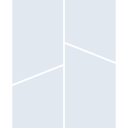
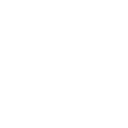

# bambulab

[← Back to main README](../../README.md)





## 16 px

### black
```
https://georgegach.github.io/compatible-icons/simple-icons/bambulab/16/black.png
```

### slate
```
https://georgegach.github.io/compatible-icons/simple-icons/bambulab/16/slate.png
```

### white
```
https://georgegach.github.io/compatible-icons/simple-icons/bambulab/16/white.png
```

## 64 px

### black
```
https://georgegach.github.io/compatible-icons/simple-icons/bambulab/64/black.png
```

### slate
```
https://georgegach.github.io/compatible-icons/simple-icons/bambulab/64/slate.png
```

### white
```
https://georgegach.github.io/compatible-icons/simple-icons/bambulab/64/white.png
```

## 128 px

### black
```
https://georgegach.github.io/compatible-icons/simple-icons/bambulab/128/black.png
```

### slate
```
https://georgegach.github.io/compatible-icons/simple-icons/bambulab/128/slate.png
```

### white
```
https://georgegach.github.io/compatible-icons/simple-icons/bambulab/128/white.png
```

## 512 px

### black
```
https://georgegach.github.io/compatible-icons/simple-icons/bambulab/512/black.png
```

### slate
```
https://georgegach.github.io/compatible-icons/simple-icons/bambulab/512/slate.png
```

### white
```
https://georgegach.github.io/compatible-icons/simple-icons/bambulab/512/white.png
```

## 1024 px

### black
```
https://georgegach.github.io/compatible-icons/simple-icons/bambulab/1024/black.png
```

### slate
```
https://georgegach.github.io/compatible-icons/simple-icons/bambulab/1024/slate.png
```

### white
```
https://georgegach.github.io/compatible-icons/simple-icons/bambulab/1024/white.png
```

## 16 px in base64

### black
```
data:image/png;base64,iVBORw0KGgoAAAANSUhEUgAAABAAAAAQCAYAAAAf8/9hAAAABmJLR0QA/wD/AP+gvaeTAAAApElEQVQ4jdXSQauBQRSA4SehbHS5ycLCzlLkV/p3usmeIhIWN33JgoWZkj7fyIq3TlNz5rydMx1ujHHJiUWIvNwYyorJEnml1IOPEBSOmfoDmOKEJtrvCEbh3GCJBjqvCqo4oheKtthhgtkzQYY1DliF4kgrxDne3wv2oc1//KCLX7f5H6nE2ij4wxx1DELrQruFREEfw9TjPL5jEwtJ7UEtJbgCzYYjVNHxzVcAAAAASUVORK5CYII=
```

### slate
```
data:image/png;base64,iVBORw0KGgoAAAANSUhEUgAAABAAAAAQCAYAAAAf8/9hAAAABmJLR0QA/wD/AP+gvaeTAAAA3ElEQVQ4jdWSsUpDURBEz7nEgI1EJaQIki6lKP6bfoN+nYjYB1EMEhVEQhDuWKTRh3lJCgunWpjds+ywAkymb5eGcxoy3ANEjppe5Go06F10msaPpsJ8WazuKW2ATfT3AEPrma0mQMVbkoV6ABlsDZB6hgKZJjwo+wlD3AhgF/kgjIGh8izOMNfFcrcCkDmUJ+Q14VEZfzP7IX3ws9Y6bgB8IZmi7ya9JKOCh5HFL0t24nK2A1DwppqJsJdwgnRBIrN1GXUAKjk2nALLvLbQP/jEdWr9Ayu7AGnJ5QsS5kuLJSEoOAAAAABJRU5ErkJggg==
```

### white
```
data:image/png;base64,iVBORw0KGgoAAAANSUhEUgAAABAAAAAQCAYAAAAf8/9hAAAABmJLR0QA/wD/AP+gvaeTAAAApUlEQVQ4jdXST6uBQRSA8V9C2dz8SRZ3YWcp8il9O0n2FF0JC0myeC3MlPR6R1bXU6epmXOezpkOyLJsnOWzDJHHGMqKOSfelVIJ/0JQOGbqD2CGC5rofCIYhXODFRr4fVdQxQm9ULTFDhPMXwnO+MMB61AcaYe4xvtHwT60eUQdXbTc53+mEmujYIoFfjAIrQvtFhIFfQxTyXl8xyYWktqDWkpwA5HRTSr+0Qk4AAAAAElFTkSuQmCC
```

