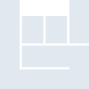
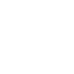

# bandsintown

[← Back to main README](../../README.md)





## 16 px

### black
```
https://georgegach.github.io/compatible-icons/simple-icons/bandsintown/16/black.png
```

### slate
```
https://georgegach.github.io/compatible-icons/simple-icons/bandsintown/16/slate.png
```

### white
```
https://georgegach.github.io/compatible-icons/simple-icons/bandsintown/16/white.png
```

## 64 px

### black
```
https://georgegach.github.io/compatible-icons/simple-icons/bandsintown/64/black.png
```

### slate
```
https://georgegach.github.io/compatible-icons/simple-icons/bandsintown/64/slate.png
```

### white
```
https://georgegach.github.io/compatible-icons/simple-icons/bandsintown/64/white.png
```

## 128 px

### black
```
https://georgegach.github.io/compatible-icons/simple-icons/bandsintown/128/black.png
```

### slate
```
https://georgegach.github.io/compatible-icons/simple-icons/bandsintown/128/slate.png
```

### white
```
https://georgegach.github.io/compatible-icons/simple-icons/bandsintown/128/white.png
```

## 512 px

### black
```
https://georgegach.github.io/compatible-icons/simple-icons/bandsintown/512/black.png
```

### slate
```
https://georgegach.github.io/compatible-icons/simple-icons/bandsintown/512/slate.png
```

### white
```
https://georgegach.github.io/compatible-icons/simple-icons/bandsintown/512/white.png
```

## 1024 px

### black
```
https://georgegach.github.io/compatible-icons/simple-icons/bandsintown/1024/black.png
```

### slate
```
https://georgegach.github.io/compatible-icons/simple-icons/bandsintown/1024/slate.png
```

### white
```
https://georgegach.github.io/compatible-icons/simple-icons/bandsintown/1024/white.png
```

## 16 px in base64

### black
```
data:image/png;base64,iVBORw0KGgoAAAANSUhEUgAAABAAAAAQCAYAAAAf8/9hAAAABmJLR0QA/wD/AP+gvaeTAAAAqElEQVQ4jcXTPQpCMRAE4M9/CwtB0MJC8AIWnsM7ehXtPIBga2EjKLYW/hSuGB5Pn6jgQJgM7M6GSQKXZE0VY5r2lN9oeIlqRpcwTPQxuJGpeWrQwgKn0LvgTnAF81cG96n92G+De8GbbPHXGfw8xBMO2Ide5wxcYYkz6nkZpBhk9BmT4NwTVND2CLEQP88AmnKuK0EN3WcGI8wKho5TUXL7FB/j/w/pCkxMG0zP3DcdAAAAAElFTkSuQmCC
```

### slate
```
data:image/png;base64,iVBORw0KGgoAAAANSUhEUgAAABAAAAAQCAYAAAAf8/9hAAAABmJLR0QA/wD/AP+gvaeTAAAA5klEQVQ4jcWTTUoDQRSEv+qJPwsXiqBIQMELuMg5cgY9mh5Fdx5AcJuAaALqbAOZVy7ScTKODkEDfptHdRevH9XdGr+UZol9c3pycEUH4+f3a6TLpU5d5nXoNVRKGk3K809ZzGcAUfV2apOE66EbDRTeQ7oHVwCeF68AgsPsKGTfWT9NAAjPDP0sp7ke572nr/4/Z7DpEKlslRBvACKNAEywqCkhPdp+kCLC3m5lsIqJs+ZKBDCUcsfWBEEhed+ozxokadMZLNgVtK6rRlvGR982CHGRzG3XiSEPVt4RanymX/D/D+kDBq1NOkGYRQEAAAAASUVORK5CYII=
```

### white
```
data:image/png;base64,iVBORw0KGgoAAAANSUhEUgAAABAAAAAQCAYAAAAf8/9hAAAABmJLR0QA/wD/AP+gvaeTAAAAqUlEQVQ4jcWSOwoCMRRFzzj+CgtB0MJCcAMWrsM9zla0cwGCrYWNoNhazFybJz5DTAoHPM3NhfcJN0GfVGSQVPmGTq4hRzfwhaSl8w/Tga9JDRgBe6A2fzWdmJbALjXgtXVu54vpzPQcFv+cQesh1sAduJk/RRYegQPQAP1YBp5F4BtgYxq9QQmMeYeYpfUMAIZEnsvRA6bfBqyAbWbp2ptCkjINSf7/kZ4eWjkulhmjvwAAAABJRU5ErkJggg==
```

