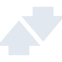

# betfair

[← Back to main README](../../README.md)

<table><tr>
  <td></td>
  <td></td>
  <td></td>
</tr></table>

## 16 px

### black
```
https://georgegach.github.io/compatible-icons/simple-icons/compat/betfair/16/black.png
```

### slate
```
https://georgegach.github.io/compatible-icons/simple-icons/compat/betfair/16/slate.png
```

### white
```
https://georgegach.github.io/compatible-icons/simple-icons/compat/betfair/16/white.png
```

## 64 px

### black
```
https://georgegach.github.io/compatible-icons/simple-icons/compat/betfair/64/black.png
```

### slate
```
https://georgegach.github.io/compatible-icons/simple-icons/compat/betfair/64/slate.png
```

### white
```
https://georgegach.github.io/compatible-icons/simple-icons/compat/betfair/64/white.png
```

## 128 px

### black
```
https://georgegach.github.io/compatible-icons/simple-icons/compat/betfair/128/black.png
```

### slate
```
https://georgegach.github.io/compatible-icons/simple-icons/compat/betfair/128/slate.png
```

### white
```
https://georgegach.github.io/compatible-icons/simple-icons/compat/betfair/128/white.png
```

## 512 px

### black
```
https://georgegach.github.io/compatible-icons/simple-icons/compat/betfair/512/black.png
```

### slate
```
https://georgegach.github.io/compatible-icons/simple-icons/compat/betfair/512/slate.png
```

### white
```
https://georgegach.github.io/compatible-icons/simple-icons/compat/betfair/512/white.png
```

## 1024 px

### black
```
https://georgegach.github.io/compatible-icons/simple-icons/compat/betfair/1024/black.png
```

### slate
```
https://georgegach.github.io/compatible-icons/simple-icons/compat/betfair/1024/slate.png
```

### white
```
https://georgegach.github.io/compatible-icons/simple-icons/compat/betfair/1024/white.png
```

## 16 px in base64

### black
```
data:image/png;base64,iVBORw0KGgoAAAANSUhEUgAAABAAAAAQCAYAAAAf8/9hAAAABmJLR0QA/wD/AP+gvaeTAAAA/UlEQVQ4jaXSzSpFURjG8d92dCKcGEgpJgZcgJKrkJkLcDlG7sGIAVMzZgYmkq8oH5HPpBMJB4O9dq1Wu3N2nafeyfu8/2fttfZLl8oqzExjIuk1sVf1kHV84D2qk8LsrRCQoT/pfcVmmWawHU4exljiP+EFjVoJvIhXXGABoyUzA6G2UmMWdzgP4Are8JdUCzvoieFxXIaBX+yjD5v4TAKO0IjhQRwmQ9/hHeryX9YK/StMxnANu/gp+dQmVjGCMzxgPr33mvy1U7ioZyxjCkspDLc4xmMJfC9fmmv5RrbVQUnARico3sR6uEqhLIS0VbyJcxhK/BucdgrpSv+r3FEdTomKiwAAAABJRU5ErkJggg==
```

### slate
```
data:image/png;base64,iVBORw0KGgoAAAANSUhEUgAAABAAAAAQCAYAAAAf8/9hAAAABmJLR0QA/wD/AP+gvaeTAAABm0lEQVQ4jaWRz2pTURDGf3POxZq2JoHQxhpDN4p1oSC0C3EtVERELC7cuKlv4iv4Aq51oSupD1CkqxZcdCFCYopJKE1vMWC893yubsxNghE6q8PM92fmO3DOslmAViu+kUShPtpzsrP65dJngGiWQBKFVyY9BJT1gmgCa/8l4MCEFXI9x+CfJ3w7ite8pTvC9THKhqpjkK5hxzKKfpzcbMdPwE6ct6+gxwZLUzwWkBYCep87oXHUW5f0GtJ+lEZ3fztuIl4CxRxdBJztrS6XtocCjW73iiW8FVoxMw2Ufgz90j1fiK8JbRrMDQXMDn9FySMzCw6g0+ksKol2ZKxmEGfc9oXeh7Pj4jMT+2aEzCsK6eb1SiUG8JL8yc/0E3AHcKNhA9WL84NlDdjG81Qi9c5t1VbKXzJQ9L1z+kbSOthEoGCLQs/dHAcyHhhh42q1vJtDNH6ctgxioQpjiQtrI3pGmPfB36/ViocTFtmj2e4dSNzKDY139Wp5a3KzvzX8hRC4YKb+KD9gmsKZLuDMXgTjUm6YuOYsgXPXHyESmk0qxBPJAAAAAElFTkSuQmCC
```

### white
```
data:image/png;base64,iVBORw0KGgoAAAANSUhEUgAAABAAAAAQCAYAAAAf8/9hAAAABmJLR0QA/wD/AP+gvaeTAAABFUlEQVQ4jaWSu0qDQRCFvzUSvAZFgiBoY6EPYOMDWIudnY2PY+U7WGmhbTrtUtiIiIqCIgpBxUswiLfPwt/ws25IJAem2Zkz5+zMQJcI7QrUGWAyeq6HEKodKaibakN9ycXxb763Q5f90dtbPplSnQUqQAMYAcajklvgHigVEuQl4AE4BxaBckJjMIudmDyn3qhnalldU5/8i091V+3JkyfUi6zgS91X+9Rt9TVqcKSW8uQh9TAqelcralGtZqqql+pUnlxQ99SPhNW6uq6OqqdqTZ2P/72R7bkV7tRVdVpdjqcZ1GvgGRhLTLwGPAIDwEII4SSxkaaTg4T6VktChvwlFvk5nKY7wP80WAGGo/xVuwZd4xu35DsqUPet1AAAAABJRU5ErkJggg==
```

