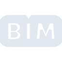
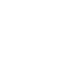

# bim

[← Back to main README](../../README.md)





## 16 px

### black
```
https://georgegach.github.io/compatible-icons/simple-icons/bim/16/black.png
```

### slate
```
https://georgegach.github.io/compatible-icons/simple-icons/bim/16/slate.png
```

### white
```
https://georgegach.github.io/compatible-icons/simple-icons/bim/16/white.png
```

## 64 px

### black
```
https://georgegach.github.io/compatible-icons/simple-icons/bim/64/black.png
```

### slate
```
https://georgegach.github.io/compatible-icons/simple-icons/bim/64/slate.png
```

### white
```
https://georgegach.github.io/compatible-icons/simple-icons/bim/64/white.png
```

## 128 px

### black
```
https://georgegach.github.io/compatible-icons/simple-icons/bim/128/black.png
```

### slate
```
https://georgegach.github.io/compatible-icons/simple-icons/bim/128/slate.png
```

### white
```
https://georgegach.github.io/compatible-icons/simple-icons/bim/128/white.png
```

## 512 px

### black
```
https://georgegach.github.io/compatible-icons/simple-icons/bim/512/black.png
```

### slate
```
https://georgegach.github.io/compatible-icons/simple-icons/bim/512/slate.png
```

### white
```
https://georgegach.github.io/compatible-icons/simple-icons/bim/512/white.png
```

## 1024 px

### black
```
https://georgegach.github.io/compatible-icons/simple-icons/bim/1024/black.png
```

### slate
```
https://georgegach.github.io/compatible-icons/simple-icons/bim/1024/slate.png
```

### white
```
https://georgegach.github.io/compatible-icons/simple-icons/bim/1024/white.png
```

## 16 px in base64

### black
```
data:image/png;base64,iVBORw0KGgoAAAANSUhEUgAAABAAAAAQCAYAAAAf8/9hAAAABmJLR0QA/wD/AP+gvaeTAAAA/0lEQVQ4jdXSvS4DYBTG8V9bDWmEgUh8LGaDSxCxuwAWN2B0GyLuwmp0A3YmmyY+E4S0tOkHhj6VpmkaI2d5P877nvM8/xz+fRSylrEycIYG7rE6dA9fuEG7gAPsp8jwoxPsojuieRvHBdxhFi9JTGEedVRyV8t5CW94xyIeoZMiWzjFXuRdYyedrrCWD+fYTtFOEaV0qWAzLD5joZ7cBxbwgDO00ERpYsDTB6qYG+G3hkNcRtVLiigOAGrhGRf95EBU9SBvRGEr/7p9iNN4iuzJwHoNrOV4L2Mm620sN/r+1/Xol6PqPR36e+HSDJei3pwcjRukcfEzSL98/5fjGy3VR45aFMq7AAAAAElFTkSuQmCC
```

### slate
```
data:image/png;base64,iVBORw0KGgoAAAANSUhEUgAAABAAAAAQCAYAAAAf8/9hAAAABmJLR0QA/wD/AP+gvaeTAAABYElEQVQ4jdWSzW7McRSGn+dMJxiiCzWiuuAe7MXKPZAm1hLLXoYu3IVbcA0SCRtLRWv+0a9Jpy0zmd9rMUG7IJa8u3Py5uS8H/DfQ4BXSX+lG6/pYgZI9U9vX7/8+f3o8M7ZPUBCdm8sf7qrMz92hxtpPE3RP8cLAV6QPKKcnztAsDGjeO6HbrxDa8uBfQGrLiZZIZkgAy1aclQwCayCY2jHUDehdWUYRsboY6zX0Q1kW92TWidphq5l/iDwRXkHPMGciMMK6S0eawPIfcgaoQUS2gTA4iTUUBkBL62aEr4Geku/lNUJuEXjGvlh70JvGkfKZpK3wsMW9yVTkJKFQbY21eyR9gad/ozJAmtLql96L7hm5lNwLszdGh3sgFeEXSCQC+AqegjtmHgL6IA+cBXoK9vBAXBayjPDQeQSOsDqoR3wDWoJ7VDQWWAfHTXomRxB2/xtkf6Es0X6G/4/ju+NlrD1MJ6ZlgAAAABJRU5ErkJggg==
```

### white
```
data:image/png;base64,iVBORw0KGgoAAAANSUhEUgAAABAAAAAQCAYAAAAf8/9hAAAABmJLR0QA/wD/AP+gvaeTAAABEklEQVQ4jdWSvy6DYRTGf2+rSCMMROLPYnYRInYXUIsbYBG3YehdWI1uwM5k06RKE4S0Wvna+hmcT5rmS2PkWd6cP+85z/PkwL9HAlArwGYeB/oppQd1ayIPINBMKQ2SegocAZWCpnPgABgVLB8A9aS2gCXgJQrzwArQBaqR60S8DrwB78Aa0EYdqi11T71QD9WmeqfW1IF6q26rbfVK3Vc76rAElGNLFdgNLz5DQjdqPWAVeAQugQz4AMozY5p6QANYLtDbAc6AG6AWcjOA0phBGfAMXOfFMTT4NnknGGbxb5SbuAA8Be25MOs1zNoA2jFgMd77kNxP6glwDMwWUJ9EiiU54/q0Q5qGn0P6Zf9fxhcHQ4gpv5z9FQAAAABJRU5ErkJggg==
```

