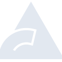

# biome

[← Back to main README](../../README.md)





## 16 px

### black
```
https://georgegach.github.io/compatible-icons/simple-icons/biome/16/black.png
```

### slate
```
https://georgegach.github.io/compatible-icons/simple-icons/biome/16/slate.png
```

### white
```
https://georgegach.github.io/compatible-icons/simple-icons/biome/16/white.png
```

## 64 px

### black
```
https://georgegach.github.io/compatible-icons/simple-icons/biome/64/black.png
```

### slate
```
https://georgegach.github.io/compatible-icons/simple-icons/biome/64/slate.png
```

### white
```
https://georgegach.github.io/compatible-icons/simple-icons/biome/64/white.png
```

## 128 px

### black
```
https://georgegach.github.io/compatible-icons/simple-icons/biome/128/black.png
```

### slate
```
https://georgegach.github.io/compatible-icons/simple-icons/biome/128/slate.png
```

### white
```
https://georgegach.github.io/compatible-icons/simple-icons/biome/128/white.png
```

## 512 px

### black
```
https://georgegach.github.io/compatible-icons/simple-icons/biome/512/black.png
```

### slate
```
https://georgegach.github.io/compatible-icons/simple-icons/biome/512/slate.png
```

### white
```
https://georgegach.github.io/compatible-icons/simple-icons/biome/512/white.png
```

## 1024 px

### black
```
https://georgegach.github.io/compatible-icons/simple-icons/biome/1024/black.png
```

### slate
```
https://georgegach.github.io/compatible-icons/simple-icons/biome/1024/slate.png
```

### white
```
https://georgegach.github.io/compatible-icons/simple-icons/biome/1024/white.png
```

## 16 px in base64

### black
```
data:image/png;base64,iVBORw0KGgoAAAANSUhEUgAAABAAAAAQCAYAAAAf8/9hAAAABmJLR0QA/wD/AP+gvaeTAAAA/klEQVQ4jaXRO0pDURAG4O/GwkIx1uIO3ICIYKNLcAsqrsDOJVhqKbiGCBZaiQgBCwkWNsYHoiQovkBIYixyLpwbr5JcB+YczuN/zAx/x1TIwlHBflHwHB7QxMKw4AQ1dEPWUBqGYBUvEcE71gYFj6MegdOsY2IQgm10gmorImiFt0wkfecydnCD+wAsYwXT4W4eV3nKiV6d57hDA484wFnk5CgPPIZjvMrW/YVN2Z40sRSDSzhFO/rUwHXY1/HUR3yBEWHZwDJG8YYqtgJBFTOYzXH8iRO4jOweYjfYTNU+/BxpOtZJoVFdvdHd4vkXQH92sJcEhaLRTrD4DwLfTzRj2n0no58AAAAASUVORK5CYII=
```

### slate
```
data:image/png;base64,iVBORw0KGgoAAAANSUhEUgAAABAAAAAQCAYAAAAf8/9hAAAABmJLR0QA/wD/AP+gvaeTAAABoUlEQVQ4jZ2SS2tTURSFv3WSJqLVVuOLtLWddCQtgqAiiiA4EcGxfyBzR/4GHxMHgiiOCv4LcSA4VnAkiOReDPehTexDNOTe5aAaNKZBXcO1195n7bUPTECU580oz5uTNNVJRRdTj2UEXN1NE3YrfEg3zgudRjoT591L/zTAtgYuHoGPgRsueGB7rHYsGWXdlqSFISEtxdlWa5xWo0SWZdPfytobw+KIq3a/Vq4uNxobEx18LWp3bS+AtyUGQ6E0V+9Xbk908G59fWaqX3loFxFSB4IlZlS6ZTFv3DG6sHR89v3PnuEZbSvOtm5AcVIKF4G6cGl4VUIumBdqBngCXP5thSRJ9sVp74Up7gArwBxw2HDE6GUQh4YPwWo77V0ZDrAd+t7zDHROZv8P/iN2BHxSSW5z4JdNGzL3bVcAqlH6+VYQK4aKYVP2awetVYJOlIVL47OSDo5ktxhnmzeBe4qS7lvQ8k4Mfq4QYtnXDI0dy/4itHdM+u1B3afUTnqp4ChQSnRA07ZnRxvGoBR+qnbS3f7jN/0tFAZVpOv+3wGY7wgIvUBbMrhuAAAAAElFTkSuQmCC
```

### white
```
data:image/png;base64,iVBORw0KGgoAAAANSUhEUgAAABAAAAAQCAYAAAAf8/9hAAAABmJLR0QA/wD/AP+gvaeTAAABF0lEQVQ4jaWRPUpDQRhFzyR2BhMbiyC6AmtBBBvdigY7K0s3YB9LQXAHChZaWVgJSrCwMYoEQ4LgT6rEHJsRH8/4eNHTDAz33u9+M5CBWlWrWZpM1CP1+K/mJfVJ7aor45qD2vCbhloYJ2BDfUkEvKu1vOaS2vQnTXUqT0Bd/YhT+4mAvlpP60PKXAb2gAegBQiUgXVgNt4thxDuRk0Oak29Vh/VjtpWT9TLRJOzUeZJ9Vx9Te09VHdSb9JV15LmgnqhDhKijnofz031ORV8oxYBJoBtYAEoAm/AFXAAzAFDYBGYTpWeB7aAXdTbRN1TdT/W/KI34kuNa1WC2gZm4rQWUAIqWV8dGQKHQe3lEP/GIKir/wjgE84mc7sbaxrIAAAAAElFTkSuQmCC
```

