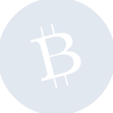
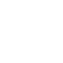

# bitcoincash

[← Back to main README](../../README.md)





## 16 px

### black
```
https://georgegach.github.io/compatible-icons/simple-icons/bitcoincash/16/black.png
```

### slate
```
https://georgegach.github.io/compatible-icons/simple-icons/bitcoincash/16/slate.png
```

### white
```
https://georgegach.github.io/compatible-icons/simple-icons/bitcoincash/16/white.png
```

## 64 px

### black
```
https://georgegach.github.io/compatible-icons/simple-icons/bitcoincash/64/black.png
```

### slate
```
https://georgegach.github.io/compatible-icons/simple-icons/bitcoincash/64/slate.png
```

### white
```
https://georgegach.github.io/compatible-icons/simple-icons/bitcoincash/64/white.png
```

## 128 px

### black
```
https://georgegach.github.io/compatible-icons/simple-icons/bitcoincash/128/black.png
```

### slate
```
https://georgegach.github.io/compatible-icons/simple-icons/bitcoincash/128/slate.png
```

### white
```
https://georgegach.github.io/compatible-icons/simple-icons/bitcoincash/128/white.png
```

## 512 px

### black
```
https://georgegach.github.io/compatible-icons/simple-icons/bitcoincash/512/black.png
```

### slate
```
https://georgegach.github.io/compatible-icons/simple-icons/bitcoincash/512/slate.png
```

### white
```
https://georgegach.github.io/compatible-icons/simple-icons/bitcoincash/512/white.png
```

## 1024 px

### black
```
https://georgegach.github.io/compatible-icons/simple-icons/bitcoincash/1024/black.png
```

### slate
```
https://georgegach.github.io/compatible-icons/simple-icons/bitcoincash/1024/slate.png
```

### white
```
https://georgegach.github.io/compatible-icons/simple-icons/bitcoincash/1024/white.png
```

## 16 px in base64

### black
```
data:image/png;base64,iVBORw0KGgoAAAANSUhEUgAAABAAAAAQCAYAAAAf8/9hAAAABmJLR0QA/wD/AP+gvaeTAAABNUlEQVQ4jZXTTytEURgG8J+ZsZAw/u0sKEtF2Uk0slJ2dj6EfBE7G0X5AFYWrK0sbJWpkRkLjRFTFJIxFvdMrmNGPPXW7Zznec573z98xxB2cYkaXkPUwtkuBnXAMipooNkhGihjqZ24+oswjioK6bQrEaGGd9z8YlLGYBbbWEBXKqM7dOMUT3hEbzhroR8jQnFaru84xyY2cIYTDOOiTRalDPpSrln0YAVvmMEs1sOLMfpiA5jAJI5RxCHq2A/FS6MfXtqkVsccrvAQYg1HEe8lE4oUIx8ExfD9LOnIWMR7ygWD0eiiLinclqQjFexhPOI9ZjEdIt3Ge0lH5rGKAUwhl+J84IBktstt6tDEta9diEe8HIyRzPZ/R3kx+h2F4PqXZfohbiGPHZRw6/s6l8JdPi34BP/ajJ5jd77ZAAAAAElFTkSuQmCC
```

### slate
```
data:image/png;base64,iVBORw0KGgoAAAANSUhEUgAAABAAAAAQCAYAAAAf8/9hAAAABmJLR0QA/wD/AP+gvaeTAAAB7klEQVQ4jXWTz2pTURjEf3Nya6ySepNSbSE1KQouVdwKVSkuXAtSXAh9BhE3voCKoHsFwTdw48ZaH0ArLoSu5Boqxi6SJrTQmnvGTVNuY5zV4ZyZ+f4MRxTQam3XmPATwzVMBZgCQPRAfYhr3tP9RiPtDDUaHjbb3aU8+qUU6saB8YgWLf9hpVlPVw8NNtvdpYF5IzjzH+Eo2tFebs5VP6jV2q55Iq6DzhYIW0I1w2/w3DgHQ8YelxNPxKci1I2LjzsiHrf5rBBmHX1SogFMFmafV5nHAbRYmDnH+qaSXsQQHilo1jHulvJwVdKPkSaC0fUAVAqXJeRJom/FPN/HviTpihPf9TCRAgSVcBBXEQvAeSm8g7BheBtFR/ZrzK8je7CnxsdlUhTmApyQuano59F8IujLKDUg+mMs0oBv5/YGIlVgNwnhpxzrI7x+AvSBmSMNSB3FOC3rmaUt7Gzg+EoKTQppIfUS8BqoCRyOoxh3JOYjPBRx0fBV0gWORh0Dfq8s61Ype12oMWYZLaPTMj3EdLGIcTY45ouh0Ug7HmjF0P7XQPOCMmKmKAbasZTcO1erbQeAZj1dtb1syIA4ZqmHbdvO8lLpzsJM5SMUfiPA904nTfb1GOsGUIn2qQNSD6knvDoo+8FCtdodav4CYgvYBABnqcUAAAAASUVORK5CYII=
```

### white
```
data:image/png;base64,iVBORw0KGgoAAAANSUhEUgAAABAAAAAQCAYAAAAf8/9hAAAABmJLR0QA/wD/AP+gvaeTAAABT0lEQVQ4jZ3Tu2qUURQF4M9xCi8kzhgEBYMXBFvBBxgSJIWdYBfyHj6DiJA2GMFnsLERbCwVsRMyMGMRxrEIGCIimSyLHPDPyZ8gLjjN3muvfTl700CSy0k2kwyTTJP8Km9abJtJ+tqQ5EGScZJZTsYsySjJclvw5JTAGpMkS82yxxVhmmQ/yfYpIqMk/S6e4XrV0R7O4SOu4iJu4HyDs4inZ5IMcbsYZ/iCFzjAGn7iEd7jbpVo2MFcw3C2ZHmI37iH+1jFfMvs52oBuIU7eFOqeY0dvMKk4s53WlShh2u4gBWs4wM+1cQOdk8QeFwq6Dmcw7bjw97tFoErlWMHC3iO7xjjJW5WvB9dvCuOZjt7Dr/pCQb47PgPHOCtJP2yFG34mr+3UK/4KMklkGT5P1Z5cKSeJEtF9V+OaaANSXpJNpJsJfmWo+e8VXy9Zswf9Bm1rfZ50JcAAAAASUVORK5CYII=
```

