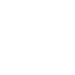

# bitwig

[← Back to main README](../../README.md)




## 16 px

### black
```
https://georgegach.github.io/compatible-icons/simple-icons/bitwig/16/black.png
```

### slate
```
https://georgegach.github.io/compatible-icons/simple-icons/bitwig/16/slate.png
```

### white
```
https://georgegach.github.io/compatible-icons/simple-icons/bitwig/16/white.png
```

## 64 px

### black
```
https://georgegach.github.io/compatible-icons/simple-icons/bitwig/64/black.png
```

### slate
```
https://georgegach.github.io/compatible-icons/simple-icons/bitwig/64/slate.png
```

### white
```
https://georgegach.github.io/compatible-icons/simple-icons/bitwig/64/white.png
```

## 128 px

### black
```
https://georgegach.github.io/compatible-icons/simple-icons/bitwig/128/black.png
```

### slate
```
https://georgegach.github.io/compatible-icons/simple-icons/bitwig/128/slate.png
```

### white
```
https://georgegach.github.io/compatible-icons/simple-icons/bitwig/128/white.png
```

## 512 px

### black
```
https://georgegach.github.io/compatible-icons/simple-icons/bitwig/512/black.png
```

### slate
```
https://georgegach.github.io/compatible-icons/simple-icons/bitwig/512/slate.png
```

### white
```
https://georgegach.github.io/compatible-icons/simple-icons/bitwig/512/white.png
```

## 1024 px

### black
```
https://georgegach.github.io/compatible-icons/simple-icons/bitwig/1024/black.png
```

### slate
```
https://georgegach.github.io/compatible-icons/simple-icons/bitwig/1024/slate.png
```

### white
```
https://georgegach.github.io/compatible-icons/simple-icons/bitwig/1024/white.png
```

## 16 px in base64

### black
```
data:image/png;base64,iVBORw0KGgoAAAANSUhEUgAAABAAAAAQCAYAAAAf8/9hAAAABmJLR0QA/wD/AP+gvaeTAAAA8ElEQVQ4jd3Qvy4DYBQF8B+DBZWgohbC0oGBTTwAL8CgHqnxHISJJ2iEwerPJrZqU4aKSJpoGBzSlD4AJ7n5znfP+b7cc/l3WEABQyhjJFVObyKeX7GHBu5wjCbOcRF+FK2Bytej4Z4PVlHEWPgMSpgNX4tWjP6NDWxhHDeoYgUP2MZO+DL2cR3vJtbhEW3U8Io6LtHFbeotvXo8tbxp9UaA957zfYDWzx3iDFMZr5qsleyghF2MJsIVJn0u+ACe0cF9xm5i0U8sRevG20F7OFmecJp9vOTej6doLZzk3obpjAnzPjc8CIV4YC6x/zo+AJWDQMK4XWaMAAAAAElFTkSuQmCC
```

### slate
```
data:image/png;base64,iVBORw0KGgoAAAANSUhEUgAAABAAAAAQCAYAAAAf8/9hAAAABmJLR0QA/wD/AP+gvaeTAAABs0lEQVQ4jdWSzWqTYRSEn3lj06pNaWp/TBETrejWVFxUcWPRC+haFLwAN96GGy/BheJaF4LQjaAIgoq4KWoaY00tX9KvSVtbQ/OOi1AtSi+gs5vDYTgzZ+DAQ3vJ4nJa2snG1TMjI+vV5fVzP9NcBeBIfv10qZBbqKTpUPil/KlCvvqfwLeV1Rsmcw970+Yd0hWIn0ECpoL9wtI00tFI925pYuQhQNgVMJkyjmOGQYmy8DhQAI4Lxi1NGw1ijwVC+c8F31fal6OcG1Dn5Vb30GusZ1J8YMLzELgDKEbuQ7wGmduI64dDZ2YrZi8F1FbtR6sB9CG/x74IYY3gJSIXgIWeT501fgs6AXEY6Q3mvFAnYAOGCCC758eSDBH/Tcre5RH3hiaQ0Tz2h9ANc+BF2Y8G1JkFbsVM/6wzfbOYm1m2rwoeC75oR3MifnTQvL4up20U+iXXMScNDcRMcWK4svfFtZW1KZtXwqNINVuTkreDAi1B09ZTm4ZgY6cvNv8tTDfrpmADQmLriaCJaVGvt0eryWYBoFJPi0mS5PZr3admc6hST4sAtSSZXFpqH9tv9wDhNydlyJa78vL9AAAAAElFTkSuQmCC
```

### white
```
data:image/png;base64,iVBORw0KGgoAAAANSUhEUgAAABAAAAAQCAYAAAAf8/9hAAAABmJLR0QA/wD/AP+gvaeTAAABGElEQVQ4jd2RzSrEYRTGfzPFxsyQMfKXmonSLCgfWcgFcAMsjEuaXAex4hLERklhYSEbZWSm/GUzavrZnNHQzAVw6vQ+532e856PF/6XqRW1oGbUqjocXo27UbUyKHlPbagP6rH6op6rF4GPgmuotW5etueNZaAE5AJPAgkwFXgluFLw35U31C01r96pdXVRfVa31Z3AC+q+ehvaTXU9ozaBIeAaWAPegCdgFbiPOvPAFTADjAGXwBLw2TsCgD2nA7ifWD1Uz9RitFdXc2pNTcJ31ZEY4UYdjwUfoL6rbfVR7cTGZ/v80lxwndC21TQLpEALOAWawEfEv60V3CtwEnGKOqEmUaWs5vskd7soqOXA02pxkPYP2Reg7RqwXovzrwAAAABJRU5ErkJggg==
```

