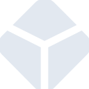

# blockchaindotcom

[← Back to main README](../../README.md)

<table><tr>
  <td></td>
  <td></td>
  <td></td>
</tr></table>

## 16 px

### black
```
https://georgegach.github.io/compatible-icons/simple-icons/compat/blockchaindotcom/16/black.png
```

### slate
```
https://georgegach.github.io/compatible-icons/simple-icons/compat/blockchaindotcom/16/slate.png
```

### white
```
https://georgegach.github.io/compatible-icons/simple-icons/compat/blockchaindotcom/16/white.png
```

## 64 px

### black
```
https://georgegach.github.io/compatible-icons/simple-icons/compat/blockchaindotcom/64/black.png
```

### slate
```
https://georgegach.github.io/compatible-icons/simple-icons/compat/blockchaindotcom/64/slate.png
```

### white
```
https://georgegach.github.io/compatible-icons/simple-icons/compat/blockchaindotcom/64/white.png
```

## 128 px

### black
```
https://georgegach.github.io/compatible-icons/simple-icons/compat/blockchaindotcom/128/black.png
```

### slate
```
https://georgegach.github.io/compatible-icons/simple-icons/compat/blockchaindotcom/128/slate.png
```

### white
```
https://georgegach.github.io/compatible-icons/simple-icons/compat/blockchaindotcom/128/white.png
```

## 512 px

### black
```
https://georgegach.github.io/compatible-icons/simple-icons/compat/blockchaindotcom/512/black.png
```

### slate
```
https://georgegach.github.io/compatible-icons/simple-icons/compat/blockchaindotcom/512/slate.png
```

### white
```
https://georgegach.github.io/compatible-icons/simple-icons/compat/blockchaindotcom/512/white.png
```

## 1024 px

### black
```
https://georgegach.github.io/compatible-icons/simple-icons/compat/blockchaindotcom/1024/black.png
```

### slate
```
https://georgegach.github.io/compatible-icons/simple-icons/compat/blockchaindotcom/1024/slate.png
```

### white
```
https://georgegach.github.io/compatible-icons/simple-icons/compat/blockchaindotcom/1024/white.png
```

## 16 px in base64

### black
```
data:image/png;base64,iVBORw0KGgoAAAANSUhEUgAAABAAAAAQCAYAAAAf8/9hAAAABmJLR0QA/wD/AP+gvaeTAAAA/ElEQVQ4jY3SS0rDUBSH8R9Bi4h7EOpj4sQdiIgguIMO3IKDdl1OfAx1A7oD+/JRFNpRC9GB6MATiOlt7IEDSc7/+zj3EtLVwCXe8I47rC/IztUqbvGB7+gvPGDjP7iRgJeWFPBnAi5L7hdJzjCugYue4Lx65lZssIkLvCbAEW6wG9lWsK4xwyM6CdEIV9iOWSeys2D/rJ3HsF0SbcVzO2Z5KT+GaWLdHF3sR3crYNHTFQyxV7nQNTSxE+/N1K1jmOEEvQWBuurhNMMLDmLNZauPo2IDITlcUlLAA8hKg+eQ1B1nEHC/+JBVAnWSOTglgCcc+/1li5oEPCf+AVg+Z8VirJBbAAAAAElFTkSuQmCC
```

### slate
```
data:image/png;base64,iVBORw0KGgoAAAANSUhEUgAAABAAAAAQCAYAAAAf8/9hAAAABmJLR0QA/wD/AP+gvaeTAAAB1klEQVQ4jY2SP2tTYRSHn/PmJm0gTRpvjc1NQFtwEkQQEXUIIQhCRxfp6qKD4jcRdKgfwaV0EuumexCXuNk0ubWNMYGbpJSoue9xsCn5K/2Nh/M8nPfHK8xIpaKxpNvdtugtA6Lw1bEnG57nnUzuyuSgrBq9+CP4IJi7oAsAqljgSzzyu5DJZI7nCioVjSXcYHcUHmaexIyf3dkFuTcJA4hggBv9MPax2WwmpgSple4jRa4LxGb1MiJZ+2UXHp8JyqpRv9HZ7LSSbwfW3gR2QA5n4Eco741j7nTbyS2/0dksq0bFb3TeKVpAaABveq3Uq3g6yDpGXoLcVqyA+WwML7o/k/Wllc5z4AnKqiCfpH4UtBDcf0VJX4x+B93qtZZfx9NB1omI02ul/KWV4BnIU7WSE9HF07Pa4jeCnkJi4tw+6KEx+hDAWtkG8eAMHObYAa2BXBuf6yKwHoZy9bS8ddDpVtCakYF9IMjevOb/k70/lg2Tz7sHMhgUgG/nJVW1GqqW1r10zQDk8+5BJAyL55EoVFWktJZN78PIR8rlXD8ShkWUuc9R1X2F0pXV5epwZkYXcjnXd9QWYVqiyj5GxuApAYDnXaircB+0PYK3MZQuX1qeEv8F0I7Hkf+bpH4AAAAASUVORK5CYII=
```

### white
```
data:image/png;base64,iVBORw0KGgoAAAANSUhEUgAAABAAAAAQCAYAAAAf8/9hAAAABmJLR0QA/wD/AP+gvaeTAAABGElEQVQ4jZWSSUpDQRBAX39MEPEOYhw2gngDEREELyDZeoTkXG40LvUCegMzOQSFZJVAdCHPTQebpDNY8OF3V73X1UVDJtSyeqN+qJ/qg7qRq83BJfVe/fIvftQndXMZXM7Aq0kS+DsDp5LHVFIkjkvgECgvaLIAtoGr6TtXYwdb6rX6njm9p96p+7G2qpZQG+pIfVbrGVFPvVV3Y64ea0dqA7WfnDKOyVoi2on/tZgbJ/V91GGm3bHaVI/i15wCJzFcA7rAwdSw1oEKsBfXlTlD7RbAOdBaMPl50QIuihDCG3AMNP8Bt4HTEEK3AIiSkxUlE7gDyUMKIbxGyaLrdCLcnmykL3GZZAaeEUTJC3AGDJLtQYRnxL8/j4k8XsL52wAAAABJRU5ErkJggg==
```

