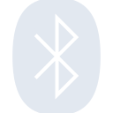
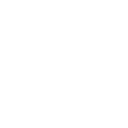

# bluetooth

[← Back to main README](../../README.md)





## 16 px

### black
```
https://georgegach.github.io/compatible-icons/simple-icons/bluetooth/16/black.png
```

### slate
```
https://georgegach.github.io/compatible-icons/simple-icons/bluetooth/16/slate.png
```

### white
```
https://georgegach.github.io/compatible-icons/simple-icons/bluetooth/16/white.png
```

## 64 px

### black
```
https://georgegach.github.io/compatible-icons/simple-icons/bluetooth/64/black.png
```

### slate
```
https://georgegach.github.io/compatible-icons/simple-icons/bluetooth/64/slate.png
```

### white
```
https://georgegach.github.io/compatible-icons/simple-icons/bluetooth/64/white.png
```

## 128 px

### black
```
https://georgegach.github.io/compatible-icons/simple-icons/bluetooth/128/black.png
```

### slate
```
https://georgegach.github.io/compatible-icons/simple-icons/bluetooth/128/slate.png
```

### white
```
https://georgegach.github.io/compatible-icons/simple-icons/bluetooth/128/white.png
```

## 512 px

### black
```
https://georgegach.github.io/compatible-icons/simple-icons/bluetooth/512/black.png
```

### slate
```
https://georgegach.github.io/compatible-icons/simple-icons/bluetooth/512/slate.png
```

### white
```
https://georgegach.github.io/compatible-icons/simple-icons/bluetooth/512/white.png
```

## 1024 px

### black
```
https://georgegach.github.io/compatible-icons/simple-icons/bluetooth/1024/black.png
```

### slate
```
https://georgegach.github.io/compatible-icons/simple-icons/bluetooth/1024/slate.png
```

### white
```
https://georgegach.github.io/compatible-icons/simple-icons/bluetooth/1024/white.png
```

## 16 px in base64

### black
```
data:image/png;base64,iVBORw0KGgoAAAANSUhEUgAAABAAAAAQCAYAAAAf8/9hAAAABmJLR0QA/wD/AP+gvaeTAAABLUlEQVQ4jaXTvS6EQRQG4IdCgsZqXIH4qRSs6DRuQeEaBK1EROcGVOIOFBKJSqtQo0DhLxssspvdEPGTrGJmk9mxQuJNvsx8c97zzjlzzuE71nCJJ3ziPe4vsdqG34It1NGIXw3PyX89ctpiCg8JuYETbGciDyi2E9jLnBs4whx2MpHdplNnIjAY1yrKyfk8urGPl3g2lAv0oyfuP7COG3RFzlhM5TVyelFIwx+NtzZDvMUCDmK4S7hO7GUMpwJFVLL87zCLaVxltgom8jf4CY0/cIz8N4V+lBLjYnQ4xSHuhXI+Rk4JfdCRiJwLpawK7TuAY6H+daECM0IFzsVSpm9wFtdCdG5iI3NOuS2Y9LdWLmO8nQC/D1MNmz85N7EijO6j0JVvwjhfYDknfwFFcnsJnR0rSAAAAABJRU5ErkJggg==
```

### slate
```
data:image/png;base64,iVBORw0KGgoAAAANSUhEUgAAABAAAAAQCAYAAAAf8/9hAAAABmJLR0QA/wD/AP+gvaeTAAAB6UlEQVQ4jX2Sv2uTURSGn/emEWob2kh/pEJaHMTVSfAPcHApOOjqoKPo0EELHaQI0UFwcFPQWQfRxcG/QHBw7dhGbBOLbRNqwfid1yHJ134t9EyXc8773HPee8WxaLZ2Htu6DaqAJy1CpmPcxenNwtzE6tF+FcRbu6+BW4bKoNqRKRnGAIy7gnfzterdoSYNDz9anaugxVwMYDcxnwX7fZ4qWIvNzb0rJwD/IlaMpwvjSYH0IcNfhhDEtMXKCUASF/sidgytYT7wvWSNFiDmUgHQbO6dA84CRNAj1ABvAGcSJKTLJdJ7wwGAFWPr67vVHBAjqWYoDyaYUSkemvQ87O2w2wmeghvA1GC5cpTTLMBInxLjFmU8NE9zwssp6YEzt028NZo/9MblklwpeHBK+LRiAsicuja9PCtvGjWy8P2AJZFeCDZyotXLrG4OKGXREn2ATdtZeiZiKUlTSZoJeARaBrYBBD1Gs60cUK9P/HbwByAlyiQv09/5b0Bgf8+Im4LRgUf7F6rV3YIHKWltMEFVMHu4o16GfFBC14ZfGmKt4MEgngj9KrhnJ+wbR8VCbazVE4B6beIr+JOhe2im6ojr+c2iA/44f37yW95y/Fk2fu6skLgj0jgwGRCyu0p0wrxaqE02jvb/Bx741n+edewdAAAAAElFTkSuQmCC
```

### white
```
data:image/png;base64,iVBORw0KGgoAAAANSUhEUgAAABAAAAAQCAYAAAAf8/9hAAAABmJLR0QA/wD/AP+gvaeTAAABT0lEQVQ4jY2TvS5EURSFv1FImIZpPIEQlYIRncYrKDyDIFFJRHRahUq8wRSSSVRahRoFCn8RzIwQgwgj+RRzLscxflZz7tl7rZWz974bEqhL6ol6o76pr+H7RF1M+al4Xa37iXv1MbrX1fWfxKNq1a/YV0uJSVUttjLY9Dt21Ul1IzEpZ7q2yKM3nHdAJYpPAR3AFvAUYn1fDNQC0BliDWAZOAfaA2cQKAHPgZNXu+PnD6iV6ImX6rS6rZbVWfUsylfU/tigqN4m9V+pE+qYeprkbtXhtAc/wd+SmcFDqD3DVejDNDAHrISeZGgEzUcJBfUiqm8m1Hyg7qjXYZy1wLlQuwBykckRzVHeAa9AD7AHPAJ1mhMYB/LAUS6X60t7cBjO7iDOsJqIY+4n1BH/9ytX1KGWHfXvZbpX11qKI5MFm6tbUxvqi811PlbnU/47FzvWIe4wYCYAAAAASUVORK5CYII=
```

