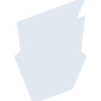

# boardgamegeek

[← Back to main README](../../README.md)





## 16 px

### black
```
https://georgegach.github.io/compatible-icons/simple-icons/boardgamegeek/16/black.png
```

### slate
```
https://georgegach.github.io/compatible-icons/simple-icons/boardgamegeek/16/slate.png
```

### white
```
https://georgegach.github.io/compatible-icons/simple-icons/boardgamegeek/16/white.png
```

## 64 px

### black
```
https://georgegach.github.io/compatible-icons/simple-icons/boardgamegeek/64/black.png
```

### slate
```
https://georgegach.github.io/compatible-icons/simple-icons/boardgamegeek/64/slate.png
```

### white
```
https://georgegach.github.io/compatible-icons/simple-icons/boardgamegeek/64/white.png
```

## 128 px

### black
```
https://georgegach.github.io/compatible-icons/simple-icons/boardgamegeek/128/black.png
```

### slate
```
https://georgegach.github.io/compatible-icons/simple-icons/boardgamegeek/128/slate.png
```

### white
```
https://georgegach.github.io/compatible-icons/simple-icons/boardgamegeek/128/white.png
```

## 512 px

### black
```
https://georgegach.github.io/compatible-icons/simple-icons/boardgamegeek/512/black.png
```

### slate
```
https://georgegach.github.io/compatible-icons/simple-icons/boardgamegeek/512/slate.png
```

### white
```
https://georgegach.github.io/compatible-icons/simple-icons/boardgamegeek/512/white.png
```

## 1024 px

### black
```
https://georgegach.github.io/compatible-icons/simple-icons/boardgamegeek/1024/black.png
```

### slate
```
https://georgegach.github.io/compatible-icons/simple-icons/boardgamegeek/1024/slate.png
```

### white
```
https://georgegach.github.io/compatible-icons/simple-icons/boardgamegeek/1024/white.png
```

## 16 px in base64

### black
```
data:image/png;base64,iVBORw0KGgoAAAANSUhEUgAAABAAAAAQCAYAAAAf8/9hAAAABmJLR0QA/wD/AP+gvaeTAAAA6UlEQVQ4jY3SvUoDQRSG4QcFC0VQEElhJ1iKhU0asRK8AMt4C+JtWHgLVilt7bwDrSRJ4x8iiCgoRsUfcC12F5ZkdnY+ONXwvnPOmSEtc9jDGYbYTIEmsYUT3OALGS6awDV0cVXcllVqiAOsh8BVDPA0AlXrvaj9EpqoCKbRwkKku5mC6YcEt/hsGA/e5DsZEzziN0Hwg7uQIEvs4Fv+ImOCHcwnCGbRCQm25UtsyiLaoYNlPKh/wrLusVRnP08QnMba28VHBH7BRkwwhesa+A+9GFzmaAR8xSUORWavZgXP8t92rGbjZf4B7oFTSJ0GiSYAAAAASUVORK5CYII=
```

### slate
```
data:image/png;base64,iVBORw0KGgoAAAANSUhEUgAAABAAAAAQCAYAAAAf8/9hAAAABmJLR0QA/wD/AP+gvaeTAAABc0lEQVQ4jY3RMWuTURTG8f9zXkGwrSQYk1ZisIsiRXHU2UE6dOxY3J1c/AAOOjno5FdQP4U66FKcRHAoFfsSTYSmrUFs09zHQVLbvry+veO55/zuc7jiBGd9MKjFLnelWAFfUfLSxbn6awCVDdnONvrbt0ncR1wFzYFPI3/stOrXJn0FIO8PbqQUD8A3BU3D9D+VoYLnHvOqc6G2CnBqcrfR27yeHC/T2A3kxt/+Y6lkYe4R8Q1YBYiDKM7OIGaRGmVrCU2BAvFpUjsARpF9Af8qGz50diK0XgAunZ/qhTU6AbA3Gs58LQCSnExlApvd+Xn9LgB5f2tZoXoVoGAm7w1WCkBKXsSerVzANBO6VQCQHhm+VwKiG6Px4wLQadXWZLqV8yk+t9vn8mICwPgZ/u9XbjkbPzxcOAIMN2svkHolb9u422nW35YCCwvaQ3pzJJXYFqwBT7P9dKfAHi/kP3Yup/30DvET+UOQPWm3zr4v2+kPgYqG2/Cyh/AAAAAASUVORK5CYII=
```

### white
```
data:image/png;base64,iVBORw0KGgoAAAANSUhEUgAAABAAAAAQCAYAAAAf8/9hAAAABmJLR0QA/wD/AP+gvaeTAAABAklEQVQ4jY2TTStFURSGn0UZkKIkAzNlKAMTExmRH2DIX5C/YeRPGJqam5sJGRxXupEocdF1lcfgnFunez7f2pO99/usd63dhhZSZ9QD9ULtqZttTOPqlnqmdtS+qS6bjKvqiZpk1fLqqUfqWplxRb1RX6zWZ7YOh76xHGMSWADmagJOZZ7rMsA98F3bX6oPoFMGeAZ+WwAGwEMBEBG2TPATEf0CQN0FZlsAptW9AgDYIR1ik+aB9cKuuqQ+1TzhUF11sZAgIhLgsUWC24jolp6o++pXTfU3daMSrU6odxXmP/Vq1JMfIhExAM5H7rwDCXAMbDc2qC6rr6Y/8FQtTjynf+fXIt6R7f+OAAAAAElFTkSuQmCC
```

