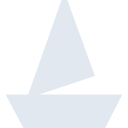

# boat

[← Back to main README](../../README.md)





## 16 px

### black
```
https://georgegach.github.io/compatible-icons/simple-icons/boat/16/black.png
```

### slate
```
https://georgegach.github.io/compatible-icons/simple-icons/boat/16/slate.png
```

### white
```
https://georgegach.github.io/compatible-icons/simple-icons/boat/16/white.png
```

## 64 px

### black
```
https://georgegach.github.io/compatible-icons/simple-icons/boat/64/black.png
```

### slate
```
https://georgegach.github.io/compatible-icons/simple-icons/boat/64/slate.png
```

### white
```
https://georgegach.github.io/compatible-icons/simple-icons/boat/64/white.png
```

## 128 px

### black
```
https://georgegach.github.io/compatible-icons/simple-icons/boat/128/black.png
```

### slate
```
https://georgegach.github.io/compatible-icons/simple-icons/boat/128/slate.png
```

### white
```
https://georgegach.github.io/compatible-icons/simple-icons/boat/128/white.png
```

## 512 px

### black
```
https://georgegach.github.io/compatible-icons/simple-icons/boat/512/black.png
```

### slate
```
https://georgegach.github.io/compatible-icons/simple-icons/boat/512/slate.png
```

### white
```
https://georgegach.github.io/compatible-icons/simple-icons/boat/512/white.png
```

## 1024 px

### black
```
https://georgegach.github.io/compatible-icons/simple-icons/boat/1024/black.png
```

### slate
```
https://georgegach.github.io/compatible-icons/simple-icons/boat/1024/slate.png
```

### white
```
https://georgegach.github.io/compatible-icons/simple-icons/boat/1024/white.png
```

## 16 px in base64

### black
```
data:image/png;base64,iVBORw0KGgoAAAANSUhEUgAAABAAAAAQCAYAAAAf8/9hAAAABmJLR0QA/wD/AP+gvaeTAAAA40lEQVQ4jZ3TPU5CQRSG4QcFTSRUJJaWdsYlWNlLZeUSKIg2LMGaBZi4AWOtlSuwNBjxpyEh0QZiJJJcCu4NIxnhXk7yFfPzvWdmzhmWxyVuVuxZGk94xfY65kMM8I3TdQBXSFI9FDWX0A0AH6gXARzhKwD84qII4DYwZ3rMa66gFwH0sZ8H0MAoAkjQWdxcjgCaqC7MDfGZJ3sVb2m2IV5whxNsxQxl1MzvdoxdsxJe4x6TdO0g4u+WsIN3bOQ5YhAJ9rLBuVnLxh4uph+0Q9qmv523Ss8iH+zM/+ULNUYrM00B4n5Ul4ehZd0AAAAASUVORK5CYII=
```

### slate
```
data:image/png;base64,iVBORw0KGgoAAAANSUhEUgAAABAAAAAQCAYAAAAf8/9hAAAABmJLR0QA/wD/AP+gvaeTAAABWUlEQVQ4jZWPvUpjURSFv31MEBPE8Td6CxHh2jiD9oKdnaAPYGMtgvgANjZaWOoD+AJ2U/kI0w/oMKC5hGuCGqMGNd6zLET8i+Zmwyn22ut8a2/4pk7OqtuncfXgO49rMVwAmz4+VmfbgOjsckqiD3yhs/tisW1AAmvAIFgXlllpCyDJDDfzRhiLolp/akAUV2fxGnjpDRvxWb+cfgNYx+h97ZVBLKUC/JGywn59chqFqFKbaAkolKvzmIaarDXsH5PVj3Lmo+C9rZqRfx/OtRfn1uSEd4A4jvMNGBeA6QZvZRz/hXZvzn/8npy0h0+XVSqV7nojOwHgHHNe2nDOihL7hh16r8cmwQDkso0jK5VKucTlTgQOfWVtUoYyvj7qgiCoy7QFdGH0pXmCvMPtBEFQNwBJHcXy1V9EmCrc+HdX6/kZhnbvngVLlGjT4Lblb/Fg0l4Y2j3AE/D+iH4ED5y/AAAAAElFTkSuQmCC
```

### white
```
data:image/png;base64,iVBORw0KGgoAAAANSUhEUgAAABAAAAAQCAYAAAAf8/9hAAAABmJLR0QA/wD/AP+gvaeTAAAA90lEQVQ4jZ2TvUoDQRSFv4lJBINNIgYbS7vgG9jZx0fwAaysrFNZC7aCLyDWWvkElrIi/vRWiaKifGk2uKyz4yanm7nn3HPucAcSUI/VixQnCfVOfVSXqziNhHgb6AJ9YLiI+5m/uJlXHNSs0OBF7cW4VSPsAGuF8wawP0+CS//itlYCtQUMIty+ulXHfU+dRBKonpT5zUiPA6BTuhsDr3XcO+pT7jZWH9Qrdai2Y5qmugrMZtsF1oEMOAeuge+8NlDL+iyoK8Azia2sCgxszqIfqu8VDxfDh3pUnH2ptHn/4d78gzUAQgg/wAh4qxH9CzgNIXwCTAHejBghLHif3gAAAABJRU5ErkJggg==
```

