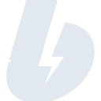

# boosty

[← Back to main README](../../README.md)

<table><tr>
  <td></td>
  <td></td>
  <td></td>
</tr></table>

## 16 px

### black
```
https://georgegach.github.io/compatible-icons/simple-icons/compat/boosty/16/black.png
```

### slate
```
https://georgegach.github.io/compatible-icons/simple-icons/compat/boosty/16/slate.png
```

### white
```
https://georgegach.github.io/compatible-icons/simple-icons/compat/boosty/16/white.png
```

## 64 px

### black
```
https://georgegach.github.io/compatible-icons/simple-icons/compat/boosty/64/black.png
```

### slate
```
https://georgegach.github.io/compatible-icons/simple-icons/compat/boosty/64/slate.png
```

### white
```
https://georgegach.github.io/compatible-icons/simple-icons/compat/boosty/64/white.png
```

## 128 px

### black
```
https://georgegach.github.io/compatible-icons/simple-icons/compat/boosty/128/black.png
```

### slate
```
https://georgegach.github.io/compatible-icons/simple-icons/compat/boosty/128/slate.png
```

### white
```
https://georgegach.github.io/compatible-icons/simple-icons/compat/boosty/128/white.png
```

## 512 px

### black
```
https://georgegach.github.io/compatible-icons/simple-icons/compat/boosty/512/black.png
```

### slate
```
https://georgegach.github.io/compatible-icons/simple-icons/compat/boosty/512/slate.png
```

### white
```
https://georgegach.github.io/compatible-icons/simple-icons/compat/boosty/512/white.png
```

## 1024 px

### black
```
https://georgegach.github.io/compatible-icons/simple-icons/compat/boosty/1024/black.png
```

### slate
```
https://georgegach.github.io/compatible-icons/simple-icons/compat/boosty/1024/slate.png
```

### white
```
https://georgegach.github.io/compatible-icons/simple-icons/compat/boosty/1024/white.png
```

## 16 px in base64

### black
```
data:image/png;base64,iVBORw0KGgoAAAANSUhEUgAAABAAAAAQCAYAAAAf8/9hAAAABmJLR0QA/wD/AP+gvaeTAAABIElEQVQ4jY3Tuy4FURgF4M8lNISIgogX0FOIaLTiBYQHUPEKQqXVUYvGEyhUOp0Ql7jGLe4NCQ5HcbbY58+c8CeTmX+tvdasf+8ZqqsRFyhn1z2a1Kj60A+hJWB7eP+vwSTasv4Ta7XERbWrOv4VehI3in7U1RL3JkFusJO4TtzgUWWkwSKDaZSCwXLiZgN3ib5osBnEzxhOkQ8CV8Z6Lm7GaVhwonKsI3gqMDjk9xSG0RESnaXYM3jDQ+AbcoMBtGZkCavpeRRjCcvrNW+2Q7xbLGEO3dgP/BcWc4PjghnLaV9WVL7EHD9H118GH9jAXcAfMBXGsVVgcInrgN1hPop/Niq+6U3lXyin+ynGi8Q/NYGjZPSKl5TgEAtoLxJ9A/O6fGD6Lj4QAAAAAElFTkSuQmCC
```

### slate
```
data:image/png;base64,iVBORw0KGgoAAAANSUhEUgAAABAAAAAQCAYAAAAf8/9hAAAABmJLR0QA/wD/AP+gvaeTAAABy0lEQVQ4jXWSv2tTURTHP+cmVaG1aUpaTSWYuCh2FEVEHAS34iJCF52cRWeXDhVcXcTBSRdRBFc3J/0TFDqYSNImsWnyUhW0effrEJP3I+l3uu98z/nwvec+IyZJ2Xo7qEqcipU7+53cyuqq/WWKXPyj3uxdlZhLdJh9PWx4AmAZuwvkYpUQ8e6w4QmA93Y5afu2ZQ/eDNP1177vBBcl2VRAo9EpgV9I8bulQqGxvd0vePwL0Idas/ul0epfmQAMMtlb4JZTCT4PvfA+UMDIO3NnQ+ltbWf/fALg8LdBmej6BHheSjLJ1oHIQyvm/NMxYGtLR8HiT4c83VJx4VOjFVwHlkhLKo8BR+aDa8Bi3DdTzcwGofTQsD9AJ4XIjAEmLgmOR8MM8HoNcLqYXzNxUzBIztvvaAdiPZmOrjl3odrsbVZ//CoKvTI4EW9B/iNA9v/CZlPxlgT3TNRceHBGjgpK+PUwM7MZJZgiMxvI9E3YDcRMlE57XvaksjzXjADGXhrgvW8bdg5UiO1mV6bn5WLu2ajmhlS/AewmE7iCM0Y/lheqhfgH5ZOLjxJ9o0OtFdxBfsOweUOzEpJZ39BPZO/DY3pcyed76aT/ANLgxXF0GebBAAAAAElFTkSuQmCC
```

### white
```
data:image/png;base64,iVBORw0KGgoAAAANSUhEUgAAABAAAAAQCAYAAAAf8/9hAAAABmJLR0QA/wD/AP+gvaeTAAABNklEQVQ4jY2STSvFQRyFn/G6IRIhKWtbsZAslJ2slfgMfAVRylewU7LxCWxsWNmSyGsuyuuGont7LEyMuf9bzmp+58w5c2YaSKA2qDf+xaPaRA3UZfMY0JJxxyGEz/8GzANtyVwBtmuZq6AeZfVv1b6oTanDaqhl7o+GFIdR61Tv1Wf1WB0tClhQy1nAetSWMq2kDuYBe5n5VR1Xg3piNXZ+HlFtBvqyUi/APjABdBXceuAnABgHOrINVyGEMrAIfABPmV6fBowArYlYBrYAQghTwHTkUrynATMF9YfUZbUX2AC6E11g93fS84JHUr1UN9XPjL9We9IGRSgDF8Ak0Jjwz8BqCOE+bXBQcHpJvcu4B3Wl6ii/v+lDtvlDrcR1JV5ntmZfdU49i0Hv6ltscKquqe1Fvi/LWJO2Dln2JgAAAABJRU5ErkJggg==
```

