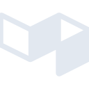

# buildkite

[← Back to main README](../../README.md)





## 16 px

### black
```
https://georgegach.github.io/compatible-icons/simple-icons/buildkite/16/black.png
```

### slate
```
https://georgegach.github.io/compatible-icons/simple-icons/buildkite/16/slate.png
```

### white
```
https://georgegach.github.io/compatible-icons/simple-icons/buildkite/16/white.png
```

## 64 px

### black
```
https://georgegach.github.io/compatible-icons/simple-icons/buildkite/64/black.png
```

### slate
```
https://georgegach.github.io/compatible-icons/simple-icons/buildkite/64/slate.png
```

### white
```
https://georgegach.github.io/compatible-icons/simple-icons/buildkite/64/white.png
```

## 128 px

### black
```
https://georgegach.github.io/compatible-icons/simple-icons/buildkite/128/black.png
```

### slate
```
https://georgegach.github.io/compatible-icons/simple-icons/buildkite/128/slate.png
```

### white
```
https://georgegach.github.io/compatible-icons/simple-icons/buildkite/128/white.png
```

## 512 px

### black
```
https://georgegach.github.io/compatible-icons/simple-icons/buildkite/512/black.png
```

### slate
```
https://georgegach.github.io/compatible-icons/simple-icons/buildkite/512/slate.png
```

### white
```
https://georgegach.github.io/compatible-icons/simple-icons/buildkite/512/white.png
```

## 1024 px

### black
```
https://georgegach.github.io/compatible-icons/simple-icons/buildkite/1024/black.png
```

### slate
```
https://georgegach.github.io/compatible-icons/simple-icons/buildkite/1024/slate.png
```

### white
```
https://georgegach.github.io/compatible-icons/simple-icons/buildkite/1024/white.png
```

## 16 px in base64

### black
```
data:image/png;base64,iVBORw0KGgoAAAANSUhEUgAAABAAAAAQCAYAAAAf8/9hAAAABmJLR0QA/wD/AP+gvaeTAAAA4klEQVQ4jc3SsUrCURTH8U9W0NQT+ARBQ9AQLdaitDZHLZFP0qP0AIGb1FYh6aBSUCAKRkPo0FBN8W+5f7hc/ppbfeFO5/y+nMM9/Aca2Pqlp4Im6lhOi88Y4hbbSW0fLUzwiiu84CwWXaKE4yC6wwnaIZiFNwz9m7jGGKe5IKeEI0yjYCqAJZzjOxXkPM0RHKCPd2QrWCsQFLGKB5SxHo9cRhfVOeFJCG3E4Zg9dPCIw2iFN9xjN6yQrpWlohp6+MINdqJakeBj1shFY8aCTwyEb1yUUZhsIDmkRbkw45T/lh8pPkcDu4iEeAAAAABJRU5ErkJggg==
```

### slate
```
data:image/png;base64,iVBORw0KGgoAAAANSUhEUgAAABAAAAAQCAYAAAAf8/9hAAAABmJLR0QA/wD/AP+gvaeTAAABm0lEQVQ4jcWSPWtTYRiGr/vNKThIUhtpoyY1IkFQHPwFIoLiJDqKu4sfg7+gIlRx6qagS+kfENy6CYJDEVRUUDDxpO05JzaekwwqwnkfB1OalqTgIF7jc7/3Bc/DC/+dL1H6bK2TntrtTTtKT4dxttxMsmtmVhjOFCbZR4wJg0iem7MHJ1c2w9UoPePRPcOOSvwS+oDsmFxw59D+vU8k5Qrj3tPaTPHSWqd/NTebE4qd00NvdgOzOlAe+Fqzlckj7fjbSW9uwTkaODcXAEjywKKZLa12+le89wvA1Kh1apWpt2Z2tp307pL7R27bPpKvzZSWMDbG3aMV9S60O9kbg+uAC4A9ux1wiIkwTt+BVTEVNRg6M18Nk+z15yQ7N64p2BAUQceB4nDmDh/YdyJ3diuA+TDK3rfW08vaWuyrGStO7qJBd4x8i2bSO18wewBqCP9KuNvVSuklQBhnTaC+o/19m2CTT91usVEu94dnwwLBD4NIBTcfjBLsLP8pSd7sp8S6CoX71cFHGikYwwvveF6fLj2WlP9F7x/zG/ABqXUykRyCAAAAAElFTkSuQmCC
```

### white
```
data:image/png;base64,iVBORw0KGgoAAAANSUhEUgAAABAAAAAQCAYAAAAf8/9hAAAABmJLR0QA/wD/AP+gvaeTAAAA60lEQVQ4jcXSsS5EQRjF8c8iUXmCfQKJQqIQDRqiVQvNhifxKB5gE53QIYICISHZXAlRyCoUqOSnmZVx77Wo9pTznfOfM18mYuDCDqZ+8cxhF5sYLg9vUeAQ06XZAo7RxSP28ICNLxDaaGAtgY6wjtMU7KlI/kns4x6tQDu7sYFVPKuqyHxD2MLHN0BmuPkJgGVc4gVGImLsj/sexVVENCNivHfYiIgmzrHYJ9xNoYk8nFeexxmusZI94QknmE0LrqgMWsIF3nGAmWxWB3it7YtKzRLgDR20+i2tDLhLzTryj/QPwLa6rzxwfQI5TnHmFLiFvQAAAABJRU5ErkJggg==
```

