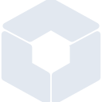

# builtbybit

[← Back to main README](../../README.md)

<table><tr>
  <td></td>
  <td></td>
  <td></td>
</tr></table>

## 16 px

### black
```
https://georgegach.github.io/compatible-icons/simple-icons/compat/builtbybit/16/black.png
```

### slate
```
https://georgegach.github.io/compatible-icons/simple-icons/compat/builtbybit/16/slate.png
```

### white
```
https://georgegach.github.io/compatible-icons/simple-icons/compat/builtbybit/16/white.png
```

## 64 px

### black
```
https://georgegach.github.io/compatible-icons/simple-icons/compat/builtbybit/64/black.png
```

### slate
```
https://georgegach.github.io/compatible-icons/simple-icons/compat/builtbybit/64/slate.png
```

### white
```
https://georgegach.github.io/compatible-icons/simple-icons/compat/builtbybit/64/white.png
```

## 128 px

### black
```
https://georgegach.github.io/compatible-icons/simple-icons/compat/builtbybit/128/black.png
```

### slate
```
https://georgegach.github.io/compatible-icons/simple-icons/compat/builtbybit/128/slate.png
```

### white
```
https://georgegach.github.io/compatible-icons/simple-icons/compat/builtbybit/128/white.png
```

## 512 px

### black
```
https://georgegach.github.io/compatible-icons/simple-icons/compat/builtbybit/512/black.png
```

### slate
```
https://georgegach.github.io/compatible-icons/simple-icons/compat/builtbybit/512/slate.png
```

### white
```
https://georgegach.github.io/compatible-icons/simple-icons/compat/builtbybit/512/white.png
```

## 1024 px

### black
```
https://georgegach.github.io/compatible-icons/simple-icons/compat/builtbybit/1024/black.png
```

### slate
```
https://georgegach.github.io/compatible-icons/simple-icons/compat/builtbybit/1024/slate.png
```

### white
```
https://georgegach.github.io/compatible-icons/simple-icons/compat/builtbybit/1024/white.png
```

## 16 px in base64

### black
```
data:image/png;base64,iVBORw0KGgoAAAANSUhEUgAAABAAAAAQCAYAAAAf8/9hAAAABmJLR0QA/wD/AP+gvaeTAAABJklEQVQ4jY3Tuy6EURQF4M8/4hYKyVCRoBBKhUulVYo3UAm1d/AMotEqNBKlSodCFC6NEddkQiioiEvx75F/xgl2spJz1tlr7X1upKMHG7hDFZvB/RntWEEF7/gMfOAKq+hMCTPM4xyvBWEj3nCJZZRq4nGc4OUXYSNecIqJDEPoQGuis2vcJPjW2O5gE/bQhXsMoB8P2MdCCNYwgXKYXqAXz3AYbT3gCFuYTFSdirWjyP0M7bdBDbdoSRi0yK+1mHuYJRI/0Jzgm+VXWxcpg1ryf7ikQRkHmC1ws8GV/+PahmGsYze4aXSnOihhBIN+PtF2NEXVvoS2iu3aZBQ7eFR/ymeBIvcU2xlLdTSDY/kDaTR4jvFcSliMDIvyH3kVqGBJ4tC/ADZhXxbzppA6AAAAAElFTkSuQmCC
```

### slate
```
data:image/png;base64,iVBORw0KGgoAAAANSUhEUgAAABAAAAAQCAYAAAAf8/9hAAAABmJLR0QA/wD/AP+gvaeTAAAB3ElEQVQ4jXWTv09TUQCFv/P6oKBAeGmtrYYfOqgkTiYYJ1YXE1Yn3UjcjQkDq4uJMTLpYvwL3JyJTkgirCYaTB+lRTBSCkvT1+MAYnmv3Onek+9+9+TeXNFn1OutS20ly+A5UA778yDhk0pldDfNqncRx/GwB0aXgIeIKUxwgll4y/BxKGg/LZVKh2cEtoO40XqEukuGCcFAv2ZAR3g7Ma+nyuOvJCX6sdecDTt+LzwJunjOxtTwkVGcWI+DoNO5Dr6AlO9DxthbmVTKg4elzjVVG81VYBR7FzFte0Joz/iLws4CgJLBt7bvGheFYsQmqAS0QtMdFJpBLgnVEBtCzyfL46s9Zz7YajTvdfGiYNr4NlAw3gh7ehUMBSkoHuyNradbN3+PfR0p7M8Cld7HCzLXg7tRVA/TeRTVQ0lJOs8IAI7y+YygX3aOQMV8O7dWrR3M/0uqtYP5fDu3Biqm6azVHkLcIPS7aqP56djpOUyEncFDCFbAFeByShRJunU8dZQtyg4OVgTwc7s1kwuSZcQdm1NY0rcTwc1TL+wLvucCL1wtRetnPtPmTvN+zt2XhkmhkZTg0KLmJFicvjL24X+RzBU4iH/9WXBXzwIIjbDckf1iohy9kdTt5f8Cwg3Js2qXAGAAAAAASUVORK5CYII=
```

### white
```
data:image/png;base64,iVBORw0KGgoAAAANSUhEUgAAABAAAAAQCAYAAAAf8/9hAAAABmJLR0QA/wD/AP+gvaeTAAABPUlEQVQ4jY2Tuy6EURSFP2MyjFBM4hKFBIVQKlwqrVK8gUqovYNnEI1WodErRMcUkylcGsQ1mZhQzFRkfIo5f/z5ncFKdrKz9l4re++TAxGoQ+q++qzW1AN1KNabFRbVbfVGbfmNT/Ve3VH7Y8KcuqZeq+92xod6p26p3Yl4Tr1Qm78Is2iql+p8DpgE+oCeyFYPwGOE7wGKwESXegoMAC/AODAG1IEzYD0IdoF5YDCY3gLDQAO1Esaqq1X1UF2I3Gkx1KqhV7WSNkjwpBYiBgXbz5pGJRfZ7xPIR/g80MqSMYOk+T9c1GAQKKsrCRHycqj96doLTAF76kngloBSp1GPgVFgJFMrAdOpPIta0II6ox6pr5krX4VI400tq7M/LNVl9VxtRAwaIV+NrZI2yakbtn/kfYgbdVP9cfQvY3ecn23rv3gAAAAASUVORK5CYII=
```

