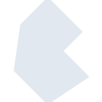
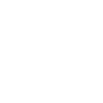

# bulma

[← Back to main README](../../README.md)





## 16 px

### black
```
https://georgegach.github.io/compatible-icons/simple-icons/bulma/16/black.png
```

### slate
```
https://georgegach.github.io/compatible-icons/simple-icons/bulma/16/slate.png
```

### white
```
https://georgegach.github.io/compatible-icons/simple-icons/bulma/16/white.png
```

## 64 px

### black
```
https://georgegach.github.io/compatible-icons/simple-icons/bulma/64/black.png
```

### slate
```
https://georgegach.github.io/compatible-icons/simple-icons/bulma/64/slate.png
```

### white
```
https://georgegach.github.io/compatible-icons/simple-icons/bulma/64/white.png
```

## 128 px

### black
```
https://georgegach.github.io/compatible-icons/simple-icons/bulma/128/black.png
```

### slate
```
https://georgegach.github.io/compatible-icons/simple-icons/bulma/128/slate.png
```

### white
```
https://georgegach.github.io/compatible-icons/simple-icons/bulma/128/white.png
```

## 512 px

### black
```
https://georgegach.github.io/compatible-icons/simple-icons/bulma/512/black.png
```

### slate
```
https://georgegach.github.io/compatible-icons/simple-icons/bulma/512/slate.png
```

### white
```
https://georgegach.github.io/compatible-icons/simple-icons/bulma/512/white.png
```

## 1024 px

### black
```
https://georgegach.github.io/compatible-icons/simple-icons/bulma/1024/black.png
```

### slate
```
https://georgegach.github.io/compatible-icons/simple-icons/bulma/1024/slate.png
```

### white
```
https://georgegach.github.io/compatible-icons/simple-icons/bulma/1024/white.png
```

## 16 px in base64

### black
```
data:image/png;base64,iVBORw0KGgoAAAANSUhEUgAAABAAAAAQCAYAAAAf8/9hAAAABmJLR0QA/wD/AP+gvaeTAAAAs0lEQVQ4jaXSMYoCQRQE0Kcms4GRuRcw2sC77D3MTFdBBU+wN9ELbLgHMDMxUBfEUNDAGWhluqfRgoYOqupXfT5xzHDAIsGJYlKKr/jH8lVx9bJNpjXi0KSxziYijpq0g38XRU7MGD6xb5ie3MMXLrnRK4QVhui80cAqET+rwl+DQW2VMHIfA3wkhhQlp4c1jzsY4wfHVEycsUsRvtVf4wm/ZdJGPJtsMUIrR1xh7n5Yyak3WJlUwf4ci/YAAAAASUVORK5CYII=
```

### slate
```
data:image/png;base64,iVBORw0KGgoAAAANSUhEUgAAABAAAAAQCAYAAAAf8/9hAAAABmJLR0QA/wD/AP+gvaeTAAABKklEQVQ4jZWSv0oDQRCHv1mD2IjHFZIESRrBytJX0V4IqK1gkVYFFRT7gzyGz+ATWJvjyIVE44paOmMhHiHunjjV7vD7fbvzByIxLP1FXvrnYemvYhoAF0oWE38mIj2EFGe9vHy9jgEkZFaVQ7D0J2diXtQNOq2141pAMfbnahwgpItCEzxK1m0lJ9ESPmEvZAYQI8HRW+xJBZhOp6uCrYTMdVEBPqyxCRIFmOBFZRAtwanbwkhiZpQs1MRGdRJ2gKX/FTDfRLPtmOi7geF9mJ/Cet1LYpKYs/3oFBzcYczqIb9HWQE2mknfIPsToryL2bi6LwqKycupqjuaX2UAE95MeVg23W230zwKCEKMQrHbbjO5ERGr+2EVw9Jf5mP/9Fj6+9Fo1onpvgDp1Yg1+fxK1AAAAABJRU5ErkJggg==
```

### white
```
data:image/png;base64,iVBORw0KGgoAAAANSUhEUgAAABAAAAAQCAYAAAAf8/9hAAAABmJLR0QA/wD/AP+gvaeTAAAAr0lEQVQ4jaWSuw0CMRAFn4+EhBbogYBe6IOMlI8AiQrohAoIKYCMhICPdCJEGgIQcuDdvQNHDvzmeVYrGQdYAldgbb0xDzD7hAHuwObXMK0gwLwQziG+DnA0wiakysI9Sd3GroX2AXAJ2u05ACPg2da/yu5DSZ1/FHYNBugqHAKAqyJggb0DJuQ7g5TSRNJW0i2wfUg6eypT4yc1sAf6QUERcgLGQArDGWTFe7Hc1hfFPZ4gMBTWWgAAAABJRU5ErkJggg==
```

