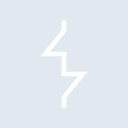
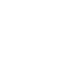

# burpsuite

[← Back to main README](../../README.md)

<table><tr>
  <td></td>
  <td></td>
  <td></td>
</tr></table>

## 16 px

### black
```
https://georgegach.github.io/compatible-icons/simple-icons/compat/burpsuite/16/black.png
```

### slate
```
https://georgegach.github.io/compatible-icons/simple-icons/compat/burpsuite/16/slate.png
```

### white
```
https://georgegach.github.io/compatible-icons/simple-icons/compat/burpsuite/16/white.png
```

## 64 px

### black
```
https://georgegach.github.io/compatible-icons/simple-icons/compat/burpsuite/64/black.png
```

### slate
```
https://georgegach.github.io/compatible-icons/simple-icons/compat/burpsuite/64/slate.png
```

### white
```
https://georgegach.github.io/compatible-icons/simple-icons/compat/burpsuite/64/white.png
```

## 128 px

### black
```
https://georgegach.github.io/compatible-icons/simple-icons/compat/burpsuite/128/black.png
```

### slate
```
https://georgegach.github.io/compatible-icons/simple-icons/compat/burpsuite/128/slate.png
```

### white
```
https://georgegach.github.io/compatible-icons/simple-icons/compat/burpsuite/128/white.png
```

## 512 px

### black
```
https://georgegach.github.io/compatible-icons/simple-icons/compat/burpsuite/512/black.png
```

### slate
```
https://georgegach.github.io/compatible-icons/simple-icons/compat/burpsuite/512/slate.png
```

### white
```
https://georgegach.github.io/compatible-icons/simple-icons/compat/burpsuite/512/white.png
```

## 1024 px

### black
```
https://georgegach.github.io/compatible-icons/simple-icons/compat/burpsuite/1024/black.png
```

### slate
```
https://georgegach.github.io/compatible-icons/simple-icons/compat/burpsuite/1024/slate.png
```

### white
```
https://georgegach.github.io/compatible-icons/simple-icons/compat/burpsuite/1024/white.png
```

## 16 px in base64

### black
```
data:image/png;base64,iVBORw0KGgoAAAANSUhEUgAAABAAAAAQCAYAAAAf8/9hAAAABmJLR0QA/wD/AP+gvaeTAAAAq0lEQVQ4jaXTPQ5BQRwE8B8RWgkaicYhFM5Cr3MhhTM4Bo1SoyLiM5EoFU/hFRJvd8mb5J/sZmcmm5ndCjIlUC0j/sXglk8QtYTBBnW0YqQsMHuMcIhwspDBGROcEuKsKIMHZthint8kiIrvGq+45Osdmhj8Y/CJJe7o5fsO2p+EVI1drDHFAo0iUjQkHMUDjYoPGHsHWchJZbDCE8MQIfUS+4nzZAtJlP6NLxlQUY/07+J9AAAAAElFTkSuQmCC
```

### slate
```
data:image/png;base64,iVBORw0KGgoAAAANSUhEUgAAABAAAAAQCAYAAAAf8/9hAAAABmJLR0QA/wD/AP+gvaeTAAAA20lEQVQ4jaWTvU5CURCEv1mJViQmgoVS+RC+jqGzs7KztLW3sPAZfBI7aIgJYjQBEhLqe8ZCMFFxr3Kn3TmTb3+Oxm8L00DR5HFtgGAumGeeVla0PMTaBQ62IXgRcWvc24ZgSinXKG4kHWYBPwiMlwF33olRCe4lJlmANqxxBpqu4p4F+4bT/7TQAXcABEvDAjRYBXY/6kkLX/k4sni0fFG5ejDe+wvBp2x6QmeU6qkV0Te0v3tSAuPXEJdEXBk2bqPmEjWxyzlw/JsnbUFwAsosNTNITnitxr/xHZykQ3dmBOE2AAAAAElFTkSuQmCC
```

### white
```
data:image/png;base64,iVBORw0KGgoAAAANSUhEUgAAABAAAAAQCAYAAAAf8/9hAAAABmJLR0QA/wD/AP+gvaeTAAAAtklEQVQ4jaXTsUpDQRQE0BMR0woxjZjGj7DwX9Kn83csLPwGP0MbSxsro2gSQbC0GJtHCPjeu+obWNjlzs4d5u6OksQA7A25/BuB92Z1Yr8QeMABJv9x8IxLnPS2SDtWSRZJ3jrqW7Q5+MQVHnGNZZ+BUcsYN1g3+ycc4uwvAru4xQdmzXmKo11CNcZj3OMCNxj/YFQhJXntC7QSeEkyT7LsIlQZ3OEL512E6iWeFvVyCiUG/8Zvfb7icl2abEgAAAAASUVORK5CYII=
```

