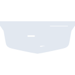
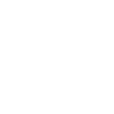

# cadillac

[← Back to main README](../../README.md)

<table><tr>
  <td></td>
  <td></td>
  <td></td>
</tr></table>

## 16 px

### black
```
https://georgegach.github.io/compatible-icons/simple-icons/compat/cadillac/16/black.png
```

### slate
```
https://georgegach.github.io/compatible-icons/simple-icons/compat/cadillac/16/slate.png
```

### white
```
https://georgegach.github.io/compatible-icons/simple-icons/compat/cadillac/16/white.png
```

## 64 px

### black
```
https://georgegach.github.io/compatible-icons/simple-icons/compat/cadillac/64/black.png
```

### slate
```
https://georgegach.github.io/compatible-icons/simple-icons/compat/cadillac/64/slate.png
```

### white
```
https://georgegach.github.io/compatible-icons/simple-icons/compat/cadillac/64/white.png
```

## 128 px

### black
```
https://georgegach.github.io/compatible-icons/simple-icons/compat/cadillac/128/black.png
```

### slate
```
https://georgegach.github.io/compatible-icons/simple-icons/compat/cadillac/128/slate.png
```

### white
```
https://georgegach.github.io/compatible-icons/simple-icons/compat/cadillac/128/white.png
```

## 512 px

### black
```
https://georgegach.github.io/compatible-icons/simple-icons/compat/cadillac/512/black.png
```

### slate
```
https://georgegach.github.io/compatible-icons/simple-icons/compat/cadillac/512/slate.png
```

### white
```
https://georgegach.github.io/compatible-icons/simple-icons/compat/cadillac/512/white.png
```

## 1024 px

### black
```
https://georgegach.github.io/compatible-icons/simple-icons/compat/cadillac/1024/black.png
```

### slate
```
https://georgegach.github.io/compatible-icons/simple-icons/compat/cadillac/1024/slate.png
```

### white
```
https://georgegach.github.io/compatible-icons/simple-icons/compat/cadillac/1024/white.png
```

## 16 px in base64

### black
```
data:image/png;base64,iVBORw0KGgoAAAANSUhEUgAAABAAAAAQCAYAAAAf8/9hAAAABmJLR0QA/wD/AP+gvaeTAAAAmUlEQVQ4je3Quw3CAAwE0JdQpEBU2YEhmCIDZCHmYABEwQoMQEmJaKkIESB+jSNFKAkFLSe5sM8+n80fCea/ClQYD/Tc8cAIl1Y9ww1KvAbiiEMPV0LeQdRYY9+qXcNtEy/kSdg5IQ27jb3sy/kVJk2y6rFY4xzbP7llWy1FgQW2MfiMJ7XFttFTxIxEN1JMMYt8g12I/vGBN61uPitpiz0eAAAAAElFTkSuQmCC
```

### slate
```
data:image/png;base64,iVBORw0KGgoAAAANSUhEUgAAABAAAAAQCAYAAAAf8/9hAAAABmJLR0QA/wD/AP+gvaeTAAAA9klEQVQ4je2QsUoDYRCEv/kvMWK8IChCioiF2Im9D2HjS+RVfJg01qKdva0ISgxEJGBIgifn5R+LMyIqJ9jqwDa7MzuzC//QzXB8HMLvxDGC+vePM1CzgleA5pIT28+LpqWG7Dw4uvuD0UTyyKYGWl2UTN3RXQ0Gk/VYi6NPokzoHLxn6JSW5Mgv5VgAzVCEDQH0h+Op5SCpAJDVMG5U5jKzrfZaWr5PPhNawbQwrQ/iDPwEyr8skE/fs9gOdw/TQ8/nRwraB3ZsLyMVgvobMTNcO/pSSdLrbKYnkqK+TWeH2+F0d6nGAUBecLHdTq8kxcqz/iheAeNWaSUV6liKAAAAAElFTkSuQmCC
```

### white
```
data:image/png;base64,iVBORw0KGgoAAAANSUhEUgAAABAAAAAQCAYAAAAf8/9hAAAABmJLR0QA/wD/AP+gvaeTAAAAt0lEQVQ4je3PsU1DQRCE4e8OkCUMJJCSOqMBV0EZboU63AaCjAIIqYEIrGf0MB6SMzwhxAsI4ZdWupudvZ3jn5Lk6rcPrDD9wbPBG/bwMtAn6CsWI0ue8Ih9HA3qAIuS5LQZhqxxiwucN63H68AzxVmBJM+oLe4u3mQk2aqUclzb5QaHOGm1G16ja9u/cv1xSlKTXCZZJrlP0iXZJunzSdd6y+atUL7L1pozzJt0h4dSynbkW3+Sd5rqWkA7Sj+4AAAAAElFTkSuQmCC
```

