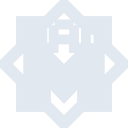

# cairometro

[← Back to main README](../../README.md)





## 16 px

### black
```
https://georgegach.github.io/compatible-icons/simple-icons/cairometro/16/black.png
```

### slate
```
https://georgegach.github.io/compatible-icons/simple-icons/cairometro/16/slate.png
```

### white
```
https://georgegach.github.io/compatible-icons/simple-icons/cairometro/16/white.png
```

## 64 px

### black
```
https://georgegach.github.io/compatible-icons/simple-icons/cairometro/64/black.png
```

### slate
```
https://georgegach.github.io/compatible-icons/simple-icons/cairometro/64/slate.png
```

### white
```
https://georgegach.github.io/compatible-icons/simple-icons/cairometro/64/white.png
```

## 128 px

### black
```
https://georgegach.github.io/compatible-icons/simple-icons/cairometro/128/black.png
```

### slate
```
https://georgegach.github.io/compatible-icons/simple-icons/cairometro/128/slate.png
```

### white
```
https://georgegach.github.io/compatible-icons/simple-icons/cairometro/128/white.png
```

## 512 px

### black
```
https://georgegach.github.io/compatible-icons/simple-icons/cairometro/512/black.png
```

### slate
```
https://georgegach.github.io/compatible-icons/simple-icons/cairometro/512/slate.png
```

### white
```
https://georgegach.github.io/compatible-icons/simple-icons/cairometro/512/white.png
```

## 1024 px

### black
```
https://georgegach.github.io/compatible-icons/simple-icons/cairometro/1024/black.png
```

### slate
```
https://georgegach.github.io/compatible-icons/simple-icons/cairometro/1024/slate.png
```

### white
```
https://georgegach.github.io/compatible-icons/simple-icons/cairometro/1024/white.png
```

## 16 px in base64

### black
```
data:image/png;base64,iVBORw0KGgoAAAANSUhEUgAAABAAAAAQCAYAAAAf8/9hAAAABmJLR0QA/wD/AP+gvaeTAAABEklEQVQ4jZXTPU4DQQwF4C/kDwkFLrBCNJRcAFoEZ+BgiJJrUFDDIUgB0ZICiQCBgt+EYj3SsLBReNLT2rv289jjpRkFRijD/hdS8n1w1CTSyuznzG/hE8Pwt9HGPPw5BrCSCcyxFmxjFs8+3iImfU9CPwRyfKGH1WAHH7isByaBoibWD97iLqu8leUVqdcCF1hHN2tnjr3o9Swr0MI7ptilmvAEh6orS8lTnOAYD9n7Egeq2yk7tYo5BjgKe6Pee2CW+r/GE8aZWBPHeFTbjQIvwRQ4abBTXJGmKfqa1Y43jMQJrv44ekl1vznaquF1cYpN1dRvsKPahV5ebNEqv2I//HPVQv1a5SYs/TMtI7Iw+Rsu8Vs1pW82EAAAAABJRU5ErkJggg==
```

### slate
```
data:image/png;base64,iVBORw0KGgoAAAANSUhEUgAAABAAAAAQCAYAAAAf8/9hAAAABmJLR0QA/wD/AP+gvaeTAAABlUlEQVQ4jX2TMW7UUBRFz312MmHMANE0IFkRDRINPQotawiCHbAP9sE2KChRYAlIpAEZgZBmgoJSQMbvUtgeZoKTX33b97737vn+4orVNIvaRRwjQqt8XNfzZkwX15mNKls3XMRx0yzqMa2GzZfvP3+Bu2cjpBXmBEDige0C4d7mg7t3ZlsTGBtUgSoUBZASBdLE6Dchhu+d9poIIlvhXcQeeM9kCVwI3o8yaJpFra1pYmJikslXix8iKkxlfL/PHQMTrYGJW6AdMBgjWconQTlryTcy4S6oJP7InKnNw+hp30TxDHEKmiJVAjvjZUu+wFoZpqCpQkukI6PKZXwo11NvgOlfzJCed9x9e4wVJrsIZbwz7APnoHuj4n+n9U0wHSJogJhlfESAVfVHcYrZ/3/vcwyxyod1PW8CoK7njSEvtToBLYWWoE+X4uXwa5fbpijAZ9g7oNeyD7JASj6DHyFd4NiFXDdbFxASZAsUXRNeRemnAbTobQ+6ALeddvCNrM3L1Il8rjYPx27kaIHNIgBXmQH+Apj6yqGA793fAAAAAElFTkSuQmCC
```

### white
```
data:image/png;base64,iVBORw0KGgoAAAANSUhEUgAAABAAAAAQCAYAAAAf8/9hAAAABmJLR0QA/wD/AP+gvaeTAAABJklEQVQ4jZXTz0pbQRQG8N8k0ZTUWFwKobhx6Qvots/Qom/Qp+prdNGlqO9gNoaIIJiCVrD1z7i4Z2CMubF+8HHPMN/5e8/QgpzzKOc8yTlPc86jNt1bzlfBSVuQVDndVOeEB4zjvI0ucpGnlIbQqRPjY7CLp/j28Tc05b4EehGgxiNW8SHYwz2O54Wd0vNcsH7wHJdV5q3iV2aSwjjCOlaqdjL2MMTPKkHCP1xjtxPOa/iG3xhUfX7HgWagg+AMX0Nz0pvLWGOI/bA/LR6Vp9LCITZwi80WccFFVHKN3SZ9szh/ggWzFrvoRspgUkpTzX+vMY5+Zzh9VXrjozd30Y3SVvADnzVTP8OOZhdW62TLVvkOX+L8S7NQr1Z5Id7zmP4nyFLnZ2zew2DuVMr4AAAAAElFTkSuQmCC
```

