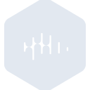
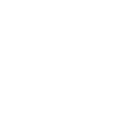

# castbox

[← Back to main README](../../README.md)





## 16 px

### black
```
https://georgegach.github.io/compatible-icons/simple-icons/castbox/16/black.png
```

### slate
```
https://georgegach.github.io/compatible-icons/simple-icons/castbox/16/slate.png
```

### white
```
https://georgegach.github.io/compatible-icons/simple-icons/castbox/16/white.png
```

## 64 px

### black
```
https://georgegach.github.io/compatible-icons/simple-icons/castbox/64/black.png
```

### slate
```
https://georgegach.github.io/compatible-icons/simple-icons/castbox/64/slate.png
```

### white
```
https://georgegach.github.io/compatible-icons/simple-icons/castbox/64/white.png
```

## 128 px

### black
```
https://georgegach.github.io/compatible-icons/simple-icons/castbox/128/black.png
```

### slate
```
https://georgegach.github.io/compatible-icons/simple-icons/castbox/128/slate.png
```

### white
```
https://georgegach.github.io/compatible-icons/simple-icons/castbox/128/white.png
```

## 512 px

### black
```
https://georgegach.github.io/compatible-icons/simple-icons/castbox/512/black.png
```

### slate
```
https://georgegach.github.io/compatible-icons/simple-icons/castbox/512/slate.png
```

### white
```
https://georgegach.github.io/compatible-icons/simple-icons/castbox/512/white.png
```

## 1024 px

### black
```
https://georgegach.github.io/compatible-icons/simple-icons/castbox/1024/black.png
```

### slate
```
https://georgegach.github.io/compatible-icons/simple-icons/castbox/1024/slate.png
```

### white
```
https://georgegach.github.io/compatible-icons/simple-icons/castbox/1024/white.png
```

## 16 px in base64

### black
```
data:image/png;base64,iVBORw0KGgoAAAANSUhEUgAAABAAAAAQCAYAAAAf8/9hAAAABmJLR0QA/wD/AP+gvaeTAAAA6ElEQVQ4jaXTv0rDUBiG8R+xHawKDk6C0MmxuOllODg7ejHegosXIhQcnNwcXAoK/kEoUgct2CJxyIkcPhpb7QPfcpLnTXLyHmbTRR/DNP20NpdVnOIJZZhHnGG9ST7CAJ8z5HqmuMdJLrZxgdEvYpxRclpw8Ec5D9kv0ElvESnxnAmRNtaKhv14wAS36Ul3DfeJARO84B3XuFLt/lZaXyjgHJfYwyZesYIbjFV/4YdWCOjgGG9JOlR1o0QPX0IPYkCB7fQJQ+xk12pxIwaMVQXJ2TWfKT7qkKWKVPPvKucsdZhyuhY8zt+5/HIQO7OedQAAAABJRU5ErkJggg==
```

### slate
```
data:image/png;base64,iVBORw0KGgoAAAANSUhEUgAAABAAAAAQCAYAAAAf8/9hAAAABmJLR0QA/wD/AP+gvaeTAAABeklEQVQ4ja2TvUpcURhF1z53JsFfZiCZ8WcGtEkVgmCTB7CwTGEnBFLkAVKltgk+Q5r4FtNbWM1UCqmCyvgzIYhXmFhc75ydQkLm6hUTyG4OB7612AfOJ0pyeH65lEhfBC8BDAcj+93yfP3o7qzGL/1+fyJWZrYkb4IWiqM+Feo8DdmHRqMxvCc4Pr/YgLAthTb4SVkzQR7t06SiT63ntc8A6trV5verjsUqplYGlphS2b1Ws7auk8HV64g78Jfwn6RC6yHHk+BqSV2Dz2wb5Pu8qyM8Fcob0o8oM3yVdAk+LDEAcFeQGQZGQ4hdmT3wCfBMMHhcYDIiO+BdwYoUakYXwonxPuYaOBpHKkWeSYLfAimEBOIbWRMGS3pleSQ0/aBAIoAWsIcQf1hq3/4UAUzr9pwpCCroOsINRdOLsvcWo5sE/QyLzdmucA+RPg79ZkmFe63mbC9Iyttz9TXH0Xvb30DZwxy57eMQ+Nieq69Jyv/fMo3nX9b5F5+XpmnrZDjUAAAAAElFTkSuQmCC
```

### white
```
data:image/png;base64,iVBORw0KGgoAAAANSUhEUgAAABAAAAAQCAYAAAAf8/9hAAAABmJLR0QA/wD/AP+gvaeTAAAA+ElEQVQ4jaWTvUoDQRRGD+tukR/BwkoQUlkGO30MC2tLH8ZXsPFBhICFVToLG8GAUYQga6EBs8ixcBaGcTdG88EwMDPnwFzuhYaoA3WkzsIaqYOmtynYUc/UR39mqp6r/Tb4WL1TPxrgOpU6UU9jsFAv1XIJmKYMTI56+Ec4lhxkQBcomn4FPIXdhvsC6GUt9XwAFsAtUAL3bYVPBQvgGXgDxsA1MAW2w/lKggvgCtgHtoAXYAO4AebAJAbyRNAFToDXAB0BHb5rMAQ+gf4yQQbshC/MgN3orgY3U8EcqBLRHr+nAt5R87UaqY7/beU4rjNMiWjlcf4CQIWo5/2P5akAAAAASUVORK5CYII=
```

